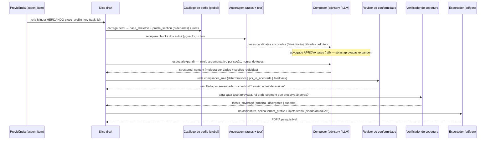

# Design — Geração de Peça (V1)

> **Companheiro do** *ERD — Tipos de Peça (perfis de geração)*, que traz o catálogo (moldura + perfil + formatação + regras de conformidade) e do *ERD — Peças* (a Minuta e o canvas). Este documento cobre a arquitetura do **subsistema que monta e redige a Minuta**: componentes, pipeline, fronteiras, contratos e as decisões que os justificam.
> **Stack e convenções** seguem o design geral: Go (Fiber, sqlc), vertical slice + Clean Architecture, eventos `{dominio}.{fato_ou_comando}`, monólito modular com workers, tenancy via Clerk + RLS, telemetria OTEL → New Relic, LLM desacoplado (OpenRouter) + embeddings (Voyage/pgvector).

---

## 1. Contexto e objetivo

A geração de peça é a maior aposta do produto — substituir 1-2 estagiários — e a que mais sofre quando é tratada como "um gerador de texto". O incômodo recorrente ("o gerador está fraco") tem uma causa estrutural: um LLM solto redige prosa plausível, mas **não sabe que uma contestação exige impugnação específica (art. 341), que um recurso não pode inovar, nem que a tese do advogado precisa sobreviver na saída.** A força do subsistema não está no modelo — está na **planta** que o cerca.

**Objetivo:** a partir de uma providência ("contestar", "recorrer") já classificada e das teses selecionadas, produzir uma Minuta que **segue o perfil do tipo de peça** (seções certas, na ordem imposta por lei), **honra as teses** ancoradas nos autos, **passa pela conformidade** antes de poder ser protocolada, e sai **formatada** — tudo auditável.

**Invariante mestre:** *a peça é composição, não texto avulso.* Toda seção existe porque o perfil a declara; toda tese aprovada é rastreável até o texto; toda regra bloqueante é verificada antes do Protocolar. O LLM preenche o miolo argumentativo — não define a estrutura, não escolhe o tipo, não decide a conformidade.

---

## 2. Princípios de design

1. **Composição, não duplicação.** Nunca um template por tipo. O padrão de geração é montado combinando três camadas independentes: `base_skeleton` (moldura invariante: endereçamento → preâmbulo → ⟦miolo⟧ → pedidos → fecho), `piece_profile` (o miolo e as regras por tipo) e `format_profile` (a aparência, só na exportação). Um tipo novo é **cadastro de dados**, não código.
2. **Tipo por precedência de fontes.** Qual `piece_profile` usar decide-se por hierarquia: **declarado** (o advogado escolheu) > **IA** (a análise da intimação inferiu) > **override** (regra do escritório). A hierarquia de origem é a hierarquia de confiança.
3. **Perfil herdado, não re-escolhido.** A Minuta **herda** o `piece_profile` da providência que a originou (via `task_id`), nunca o re-classifica na hora de gerar. O tipo é decidido uma vez, na análise; a peça obedece.
4. **IA só no miolo argumentativo.** A moldura (`origem = moldura`: endereçamento, qualificação, pedidos padronizados) é preenchida por **dados** — determinística, sem alucinação possível. O LLM redige apenas as seções `origem = argumentativa`, e só onde `aceita_teses`.
5. **Tese é contrato verificado, não sugestão.** Uma tese entra ancorada (fato nos autos + direito verificável) e filtrada pelo teor (pertinência); sai **cobrada** — cada tese aprovada deve virar texto que preserva suas âncoras. A IA pode fundir/omitir uma tese fraca, mas isso vira `thesis_coverage`, exposto ao advogado, nunca silencioso.
6. **Conformidade como entidade de primeira classe.** As regras (`compliance_rule`) não são prompt — são dados versionados que a peça é **verificada** contra. Severidade `bloqueante` trava o Protocolar; `aviso` alerta; `feedback` fica pro julgamento humano.
7. **Formatação é configuração, aplicada na saída.** Não existe padrão nacional obrigatório de formatação — é convenção (ABNT) + norma do tribunal + limite do PJe. Logo, fonte/margens/espaçamento são `format_profile` com default + override por tribunal, aplicados **na exportação**, jamais cravados na redação.

---

## 3. Arquitetura de componentes (o pipeline)

A geração é um pipeline de seis etapas: a **planta** (perfil) e as **teses** entram; a IA expande só o miolo argumentativo; a conformidade e a cobertura guardam a saída; a formatação fecha. Um único ponto de IA de redação (o expansor) e duas fronteiras de IA de leitura (embeddings de recuperação + verificação ancorada).

Componentes:

- **Resolvedor de tipo** — decide o `piece_profile_key` por precedência (declarado > IA > override). Roda na **análise da intimação** (o LLM de análise devolve `piece_profile_key` do catálogo), não na geração. A geração só **lê** o key já resolvido.
- **Carregador de perfil** — dado um `piece_profile_key`, carrega do catálogo global o `base_skeleton` (slots), as `profile_section` (miolo ordenado, com `obrigatoria`/`origem`/`aceita_teses`) e as `compliance_rule` vinculadas (`profile_rule` + `section_rule`). É o que transforma "DEFENSE" em "Preliminares → Impugnação Específica → Mérito → Pedidos → Provas".
- **Ancoragem de teses (RAG)** — recupera trechos dos autos (embeddings Voyage `input_type=query` + busca cosine no `chunk`/pgvector, com filtro de qualidade contra lixo de extração) e o teor da intimação. Produz teses **ancoradas** (fato → auto; direito → fonte) e **pertinentes** (o teor restringe o tipo de tese). Cada tese cita o trecho de origem — a fonte é lookup exato, não re-match frágil.
- **Composer de expansão (advisory/LLM)** — serviço desacoplado. Renderiza a **moldura** por dados e redige as seções `argumentativa` a partir das **teses aprovadas**, respeitando a ordem do perfil e as seções condicionais (só inclui Preliminares se houver matéria). Saída estruturada (`structured_content`: seções numeradas), não prosa livre. O fecho pára em "Pede deferimento." — a assinatura vem depois.
- **Revisor de conformidade** — roda as `compliance_rule` do perfil: `deterministica` (valor da causa presente), `por_ia_ancorada` (cada fato impugnado — IA sobre a peça), `feedback_usuario` (viés). Devolve resultado por severidade; alimenta o checklist "Revisão antes de assinar". Uma `bloqueante` não cumprida **trava o Protocolar**.
- **Verificador de cobertura** — para cada tese aprovada, checa se há `draft_segment` que preserva suas âncoras (`segment_anchor`) → grava `thesis_coverage` (`coberta`/`divergente`/`ausente`). Divergências entram no mapa de cobertura do canvas; **não** travam a geração.
- **Exportador** — aplica o `format_profile` (default do perfil ou override do tribunal) e injeta o bloco de fecho (cidade do foro + data por extenso + nome + OAB do titular do certificado) no momento da assinatura, via pdfgen (chromedp) → PDF/A.

---

## 4. O slice `draft` e a fronteira `advisory`

Seguindo a topologia do backend — cada slice tem tudo dentro de si; slices se comunicam só por evento; a IA vive num serviço desacoplado (`advisory`), como os conectores:

- **`draft` (a Minuta)** — `entity.go` (`Draft`, `SuggestedThesis`, `structured_content`, `content_html`), `domain.go` (casos de uso: `Create` — herda o `piece_profile_key`; `GenerateDraftTheses`; `TriggerGeneration`; `Iterate`; `AssumeAuthorship`; workflow assinatura/protocolo), `handler.go` (`/v1/pecas`, `/v1/pecas/:id/theses`, `/generate`, `/iterate`), `repository.go` (sqlc + RLS). É quem **lê o catálogo** e monta a `DraftContext`.
- **`advisory` (o cérebro)** — o composer de prompts (`ComposeDraft`, `ComposeTheses`, `analyze_intimation`) e o cliente LLM. Sem estado, versionado por prompt (`suggest_theses/vN`, `draft_minuta/vN`). Recebe uma `DraftContext` **já enriquecida com o perfil** (seções ordenadas, teses, partes, chunks) e devolve `structured_content`. Não conhece Postgres nem tenant — é fronteira pura.
- **`thesis` (o contrato)** — persiste `thesis`/`thesis_anchor`/`draft_segment`/`segment_anchor`/`thesis_coverage`. É onde a cobertura vive; hoje parcialmente materializado (ver §11).
- **Catálogo de perfis (global)** — `piece_profile`, `profile_section`, `base_skeleton`, `format_profile`, `compliance_rule`, `profile_rule`, `section_rule`, `piece_profile_version`, `matter`. **Sem `tenant_id`**: é planta compartilhada, não dado de tenant. Consultado por query dedicada no `draft` (leitura de catálogo, não agregado).

A geração **não é saga longa**: é criação transacional da Minuta + uma geração assíncrona (worker-ai) que preenche `structured_content`, seguida de reações independentes (revisão de conformidade, cobertura) — coreografia, não orquestração.

---

## 5. Fluxos principais

- **Feliz (contestação):** providência "contestar" (piece_profile `contestacao`) → Minuta herda o key → carrega o perfil (Preliminares → Prejudiciais → Impugnação Específica → Mérito → Pedidos → Provas) → RAG ancora teses nos autos, teor filtra pertinência → advogado aprova → IA expande as seções argumentativas honrando as teses → conformidade OK → cobertura `coberta` → Protocolar liberado.
- **Cobertura divergente:** a IA fundiu duas teses ou diluiu uma âncora → `thesis_coverage = divergente/ausente` → o mapa de cobertura do canvas sinaliza; o advogado aceita a fusão ou corrige. A peça existe; a revisão expõe.
- **Conformidade bloqueante:** falta impugnação específica de um fato (art. 341) → regra `bloqueante` não cumprida → checklist marca em vermelho e o **Protocolar fica travado** até resolver.
- **Seção condicional ausente:** não há preliminares no caso → a seção `Das Preliminares` (`obrigatoria = condicional`) simplesmente não entra; a ordem legal (preliminares antes do mérito) é respeitada quando entra.
- **Tipo re-decidido pelo advogado:** o advogado troca o tipo no canvas (declarado > IA) → o perfil muda → regeneração explícita com o novo esqueleto.

---

## 6. Fronteiras externas

- **LLM de redação (OpenRouter)** — a fronteira de custo. Desacoplado (`advisory`), com prompt versionado, temperatura baixa na estruturação, saída em `json_schema` estrito. Falível: erro/timeout degrada para o estado anterior (nunca peça pela metade em silêncio).
- **Embeddings + busca (Voyage / pgvector)** — a recuperação dos autos. `input_type=query` na busca (assimétrico), piso de similaridade e **filtro de qualidade** que descarta chunks de extração quebrada — lixo nunca vira fundamento. Degrada para ungrounded (sem âncora) em vez de citar ruído.
- **pdfgen (chromedp)** — a exportação. Aplica o `format_profile` e injeta o fecho/assinatura a partir do certificado. WYSIWYG real: o mesmo HTML do editor gera o PDF.
- **Certificado / assinatura** — o bloco de fecho (nome + OAB) vem do **titular do certificado** usado no Sign, não da IA — por isso o fecho da IA pára em "Pede deferimento.".
- **Catálogo de perfis** — dado versionado interno (não externo), consultado pela geração. A lei muda editando dados (`piece_profile_version`), sem tocar o gerador.

---

## 7. Contratos de evento

- **Consome:** `costura.providencia_aprovada` (nasce a Minuta, herdando o perfil), `documento.autos_ingeridos` (habilita RAG), `assinatura.minuta_assinada` (dispara exportação/protocolo).
- **Emite:** `minuta.criada`, `minuta.teses_sugeridas`, `minuta.esbocada` (structured_content pronto), `minuta.revisada` (resultado de conformidade), `minuta.cobertura_verificada` (thesis_coverage), `minuta.exportada`.
- **Assinantes:** o canvas (via read model + polling/stream), a Central de Alertas (bloqueante pendente), o protocolo (só com conformidade limpa).

Nomes seguem `{dominio}.{fato_ou_comando}`; roteamento por wildcard `minuta.*`. A expansão em si é síncrona-assíncrona (worker-ai preenche `structured_content`), não um evento por seção.

---

## 8. Decisões arquiteturais

**AD-1 · Composição (skeleton + profile + format), não template por tipo.** Alternativa: um template redigido por tipo de peça. Escolha: montar de três camadas independentes. Consequência: um tipo novo é linha de catálogo, não código; a lei muda editando dados versionados. Perde-se o controle fino de um template artesanal — compensado pelas `compliance_rule` como verificação.

**AD-2 · Perfil herdado da providência (task_id), não re-escolhido na peça.** Alternativa: a geração re-classifica o tipo. Escolha: a Minuta lê o `piece_profile_key` já resolvido na análise (precedência declarado > IA > override) e obedece. Elimina a divergência "a análise disse contestação, a peça gerou petição inicial" — que é exatamente o bug de raiz observado (Minuta via `source=intimation` nascendo com key vazio → esqueleto genérico).

**AD-3 · IA só no miolo argumentativo; moldura por dados.** Alternativa: IA redige tudo. Escolha: `origem = moldura` (endereçamento, qualificação, pedidos padronizados) é preenchida deterministicamente por dados estruturados; só `origem = argumentativa` passa pelo LLM. Reduz superfície de alucinação e torna a moldura auditável.

**AD-4 · Conformidade como entidade de primeira classe, bloqueante trava o Protocolar.** Alternativa: conformidade como instrução de prompt. Escolha: regras são dados (`compliance_rule`), verificadas contra a peça, com severidade que **gate**eia o protocolo. É o que separa "gerador de texto" de "assessor" — a peça é checada, não só escrita.

**AD-5 · Tese é meta verificada (cobertura), não lei absoluta.** Alternativa: forçar cada tese a virar exatamente um parágrafo. Escolha: modelo espalhado + `thesis_coverage` — a IA pode fundir/omitir, mas `divergente`/`ausente` aparecem no mapa de cobertura para o advogado decidir. Honra a inteligência do redator sem perder a rastreabilidade.

**AD-6 · Formatação na exportação, assinatura pelo certificado.** Alternativa: cravar fonte/margens e o nome do advogado na redação. Escolha: `format_profile` aplicado no pdfgen; o fecho (cidade/data/nome/OAB) injetado do certificado no Sign. A mesma Minuta exporta com formatações diferentes por tribunal, e a assinatura é sempre a de quem assina.

**AD-7 · Perfis e regras são dados versionados.** Alternativa: hardcode das seções e regras. Escolha: catálogo global versionado (`piece_profile_version` congela seções+regras vigentes numa data). Uma peça de março é auditável contra o perfil daquele momento — a lei muda sem redeploy.

---

## 9. Tenancy, segurança e operação

- **Catálogo global sem `tenant_id`:** `piece_profile` e família são planta compartilhada (a lei é a mesma para todos). `draft`, `suggested_thesis`, `thesis_coverage` são por tenant, com filtro na aplicação + RLS (`SET LOCAL app.tenant_id`). `tenant_id` sempre do token, nunca do body.
- **Conformidade bloqueante é gate de segurança:** o subsistema não deixa protocolar uma peça que falha uma regra `bloqueante` — é o análogo, na peça, do "sistema nunca causa perda de prazo" do Motor de Prazos.
- **Herança do perfil na fronteira de criação:** o `piece_profile_key` é resolvido a partir do `action_item`/providência (com fallback determinístico por `piece_type` → perfil-semente quando a análise não fixou key), garantindo que nenhuma Minuta nasça sem esqueleto.
- **Idempotência:** regenerar teses/minuta é substituição limpa (delete + regenera), não acúmulo; a seleção de teses persiste por estado, não por índice de array.

---

## 10. Observabilidade e métricas

Telemetria OTEL → New Relic, focada em provar o invariante (a peça é composição correta, não texto plausível):

- **% de Minutas que seguem o perfil correto** — seções geradas × `profile_section` do tipo. A métrica que expõe o bug de esqueleto genérico.
- **Taxa de cobertura de teses** — `coberta` / (aprovadas). Quanto a peça honra o que o advogado escolheu.
- **Taxa de bloqueante pendente na revisão** — quantas peças chegam ao Protocolar com conformidade não cumprida.
- **Grounding das teses** — % de teses com âncora verificada (fonte casada) vs. doutrinária/não-verificada.
- **Custo de LLM por Minuta** (via `ai_usage_event`) e tempo esboço → pronta.
- **Taxa de descarte por lixo de extração** — quanto o filtro de qualidade do RAG barra (proxy da qualidade dos autos).

---

## 11. Questões em aberto e estado de implementação

O modelo (ERD — Tipos de Peça) e a arquitetura acima estão propostos; a implementação está **parcial**. O que já existe e o que falta, honestamente:

**Já implementado:** catálogo de perfis (migração 0085, com `contestacao`/`peticao_inicial`/`apelacao` semeados); geração de teses ancoradas (RAG com `input_type=query`, piso de similaridade, filtro de lixo, `source_ref` = citação direta do trecho, grounding verdadeiro exposto no wire); persistência das teses com estado (proposta/aprovada) e seleção que sobrevive; a moldura invariante e o fecho v6 no prompt de geração.

**Lacunas conhecidas (roadmap):**
1. **Geração consumir o perfil.** Hoje `composeDraftMinuta` hardcoda "Fatos → Direito → Pedidos" para qualquer tipo, e a `DraftContext` não carrega `profile_section`/`base_skeleton` — em correção (resolver `piece_profile_key` na criação via partida + injetar as seções do perfil no prompt). É a lacuna nº 1: sem ela, a peça não segue o ERD.
2. **Conformidade materializada.** As `compliance_rule` existem como catálogo, mas o revisor que as roda por severidade e trava o Protocolar ainda não está ligado ao checklist "revisão antes de assinar".
3. **Cobertura de teses.** `draft_segment`/`segment_anchor`/`thesis_coverage` estão no ERD; a materialização (rastrear qual tese virou qual trecho, preservar âncoras) e o mapa de cobertura no canvas são fatia futura.
4. **`format_profile` na exportação.** Hoje só o default; o override por tribunal (seleção manual vs. inferência pelo tribunal da Tramitação) é questão aberta.
5. **Precedência do tipo completa.** O ramo `override` (regra do escritório) e o `tenant_profile_override` (customização de perfil por escritório) não existem — só declarado > IA.
6. **`matter` como eixo.** Só cível semeado; trabalhista/penal como perfis distintos sob o mesmo skeleton, a confirmar contra duplicação.
7. **Granularidade da `section_rule`** — vincular regra a seção (não só a perfil) ajuda a localizar o erro no checklist, ao custo de a revisão mapear resultado→seção. Vale na v1?
