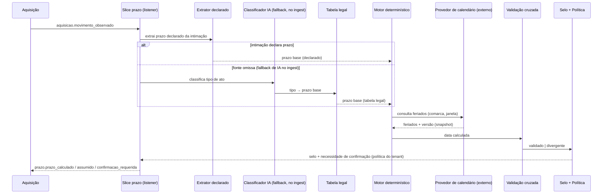

# Design — Motor de Prazos (V1)

> **Companheiro do** *ERD — Motor de Prazos*, que traz o modelo de dados e os diagramas de estado. Este documento cobre a arquitetura do subsistema: componentes, fronteiras, contratos e as decisões que os justificam.
> **Stack e convenções** seguem o design geral: Go (Fiber, sqlc), vertical slice + Clean Architecture, eventos `{dominio}.{fato_ou_comando}`, monólito modular com workers, tenancy via Clerk + RLS, telemetria OTEL → New Relic.

---

## 1. Contexto e objetivo

O Motor de Prazos é o coração da V1 e a maior divergência frente à V0: a V0 guarda um prazo simples; a V1 guarda a **precedência de fontes**, a **validação cruzada**, a **proveniência** de cada número e o **selo de confiança** — sem trocar o cálculo determinístico existente por IA.

**Objetivo:** a partir de uma Intimação capturada, produzir automaticamente o Prazo (`deadline`) correto — termo inicial, prazo fatal, prazo interno — com precisão jurídica, de forma auditável, e sinalizar quando um humano precisa assumir a data.

**Invariante mestre:** *o sistema nunca é a causa de uma perda de prazo.* Todo o resto do design é subordinado a isso.

---

## 2. Princípios de design

1. **Determinístico com fallback estreito de IA.** O cálculo é sempre determinístico (extração + regra + tabela legal + feriados). IA só faz **classificação semântica do tipo de ato**, e só quando a intimação é omissa. IA nunca calcula uma data nem opera aritmética.
2. **Precedência de fontes.** Declarado na intimação > calculado por regra > inferido por IA. Desce de nível só quando o de cima não resolve. A hierarquia de origem é a hierarquia de risco.
3. **Ativo desde o cálculo.** O prazo conta, entra na agenda e alerta assim que a data existe — não espera confirmação nem alguém olhar. (Estado operacional ⟂ selo de confiança — ver ERD §3–4.)
4. **Selo separado de estado.** Confiança (`confiavel` / `a_apurar`) é dimensão própria, não um passo do relógio.
5. **Confiança seletiva com piso.** Confiável nasce assumido pelo sistema (default); IA e divergência **sempre** exigem humano (piso inegociável). A política do tenant só aumenta o rigor, nunca reduz abaixo do piso.
6. **Fallback de prazo no ingest; análise on-demand.** Toda intimação nasce com prazo — declarado (determinístico) ou omisso (fallback de IA), ambos no ingest, porque prazo não pode esperar. O que é diferido é o *"Analisar"* (resumo + providências), não o prazo. Paga-se IA de classificação de prazo na entrada para nunca haver prazo cego.
7. **Proveniência em tudo.** Cada número carrega de onde veio; o snapshot de feriados fica congelado no cálculo. É o que responde "por que essa data?" e o que torna a data defensável.

---

## 3. Arquitetura de componentes (o pipeline)

O motor é um pipeline determinístico com um único ponto de IA (o fallback de classificação, no ingest, só para intimações omissas) e uma única fronteira externa (o calendário licenciado).

Componentes:

- **Extrator de prazo declarado** — determinístico. Lê a `notification`, extrai `prazo_declarado` quando presente. É a fonte primária.
- **Classificador de tipo (IA)** — o único ponto de IA do motor. Desacoplado (serviço próprio, como no resto da arquitetura). Roda **só** quando a fonte é omissa, **no ingest** (não espera o "Analisar" — prazo não pode esperar). Saída: tipo de ato + confiança. Nunca uma data.
- **Tabela legal de prazos** — determinística. Mapeia tipo de ato → prazo base (ex.: contestação = 15 dias úteis). Versionada (a lei muda).
- **Motor de cálculo determinístico** — o núcleo, herdado da V0. Termo inicial (regra) + contagem (dias úteis/corridos) + feriados (do provedor) + dobra (a partir da Pasta, não da intimação).
- **Cliente do provedor de calendário** — fronteira externa licenciada. Consulta feriados/suspensões por comarca; devolve snapshot + versão. Assíncrono e falível (ver §6).
- **Validação cruzada** — quando há declarado *e* calculado, compara. Convergente → alta confiança; divergente → escala.
- **Selo + política** — atribui `confiavel`/`a_apurar` pela origem e resolve, pela `deadline_policy` do tenant, se exige confirmação. Aplica o piso.
- **Scheduler de alertas** — worker que promove `ATIVO → EM_RISCO` e emite `prazo.prazo_em_risco` conforme o prazo interno se aproxima.
- **Reconciliador de recálculo** — reage a movimento superveniente que altera a base; recalcula gerando novo evento, nunca sobrescrevendo.

---

## 4. O slice `prazo` (vertical slice)

Seguindo a topologia do backend — cada slice tem tudo dentro de si, slices se comunicam só por evento:

- **`entity.go`** — `Deadline`, `CalcMemory`, `AppliedHoliday`, `CrossValidation`, `DeadlinePolicy`, `DeadlineEvent` + regras (contagem, dobra, atribuição de selo, aplicação de política) + validação + mapper.
- **`domain.go`** — casos de uso: `CalcularPrazo`, `ClassificarTipo` (chama o serviço de IA), `ValidarCruzado`, `AtribuirSelo`, `ConfirmarPrazo`, `ApurarPrazo` (resolve divergência/IA), `OverridePrazo`, `RecalcularPrazo`, `CumprirPrazo`.
- **`listener.go`** — porta assíncrona: escuta `aquisicao.movimento_observado` (nasce o prazo) e `protocolo.peticao_protocolada` (cumpre). Chama os mesmos casos de uso que o handler.
- **`handler.go`** — porta síncrona HTTP: listar prazos (fila do Inbox), confirmar (individual/lote), apurar divergência, override, forçar recálculo. Versionado em `/v1`, paginação por cursor, sempre combinado com `tenant_id`.
- **`repository.go`** — interface + impl sqlc. RLS por `tenant_id` no Postgres.

O cálculo **não é saga** — é transação (cálculo) + coreografia de reações independentes (agenda, tarefa, alerta), conforme decisão de arquitetura já registrada.

---

## 5. Fluxos principais

Detalhados no ERD (§3 estados operacionais, §4 selo/política). Resumo dos caminhos:

- **Feliz (declarado):** intimação declara → extrai → calcula (consulta calendário) → valida cruzado → `confiavel` → política seletiva assume → `ATIVO`, conta e alerta. Zero IA, zero fricção.
- **Fallback IA (omissa):** sem declarado → (quando processo ativa) IA classifica tipo → tabela legal dá o prazo → calcula → `a_apurar` → confirmação individual obrigatória.
- **Divergência:** declarado ≠ calculado → `a_apurar` → advogado escolhe a data (decisão persistida em `cross_validation`).
- **Calendário indisponível:** provedor cai → retry; se persiste, o prazo declarado segura o relógio (fallback) enquanto o cálculo não completa; se não há declarado, alerta crítico + cálculo manual.
- **Recálculo:** movimento superveniente → recalcula, novo `deadline_event`, memória anterior preservada.

---

## 6. Fronteiras externas

- **Provedor de calendário (licenciado)** — a fronteira crítica. Contrato mínimo: consulta por comarca/tribunal + janela → feriados, suspensões, recesso, com versão. **Assíncrono e falível**: o cálculo depende dele, logo herda latência e disponibilidade do fornecedor. Mitigações: retry com teto, fallback pelo declarado, e cache local por comarca (candidato — ver questões). O snapshot da resposta é persistido em `applied_holiday`; a base **não** é entidade do domínio.
- **Serviço de classificação (IA)** — desacoplado do resto, como os conectores. Interface: intimação/teor → tipo de ato + confiança. Sem estado, idempotente, e acionado sob demanda. Se indisponível, o prazo omisso permanece `a_apurar` sem data inferida (nunca chuta).
- **Tabela legal** — dado versionado interno (não externo), consultado pelo cálculo.

---

## 7. Contratos de evento

- **Consome:** `aquisicao.movimento_observado`, `protocolo.peticao_protocolada`.
- **Emite:** `prazo.prazo_calculado`, `prazo.prazo_assumido` (confiável, política seletiva), `prazo.confirmacao_requerida` (a apurar ou política estrita), `prazo.prazo_confirmado`, `prazo.divergencia_detectada`, `prazo.prazo_alterado` (recálculo), `prazo.prazo_em_risco`, `prazo.prazo_cumprido`.
- **Assinantes do prazo:** Agenda (`agenda`), geração de Tarefa, Central de Alertas.

Nomes seguem `{dominio}.{fato_ou_comando}`; roteamento de fila por wildcard `prazo.*`.

---

## 8. Decisões arquiteturais

**AD-1 · Calendário licenciado, não construído.** Alternativa: manter base própria de feriados por comarca. Escolha: licenciar. Consequência: nenhuma tabela `holiday` no domínio; o motor consulta um serviço externo e persiste o *snapshot* aplicado. Ganha-se velocidade de V1 e perde-se controle da fonte — compensado guardando proveniência, não a base.

**AD-2 · IA só na classificação, nunca no cálculo.** Alternativa: prazo end-to-end por IA. Escolha: determinístico com fallback classificatório. O cálculo da V0 permanece o motor; IA entra apenas onde a fonte é omissa, e produz um *tipo*, não uma data. Reduz risco e custo.

**AD-3 · Ativo desde o cálculo; selo separado do estado.** Alternativa: prazo só "vale" após confirmação humana. Escolha: o relógio corre desde o cálculo; confiança é dimensão ortogonal. Honra "prazo não pode esperar" sem confundir contar com confirmar.

**AD-4 · Confiança seletiva com piso, configurável por tenant.** Alternativa: confirmar tudo (universal) ou confirmar nada. Escolha: default seletivo (sistema assume o confiável), piso fixo (IA/divergência sempre humano), e `deadline_policy` que só aumenta o rigor. Confirmação universal dessensibiliza e protege menos.

**AD-5 · Fallback de prazo no ingest; só a análise é on-demand.** Alternativa: diferir também o fallback de IA do prazo até o processo ser trabalhado (economiza IA, mas deixa a intimação omissa sem prazo até alguém abrir). Escolha: o fallback roda **no ingest** — toda intimação nasce com prazo, porque prazo cego é inaceitável. O on-demand fica só no "Analisar" (resumo + providências). Paga-se IA de classificação para as omissas na entrada; em troca, nunca há prazo real que o sistema desconhece.

---

## 9. Tenancy, segurança e operação

- **Tenancy:** `tenant_id` sempre do token (Clerk org → tenant interno), nunca do cliente. Duas barreiras: filtro na aplicação + RLS no Postgres (`SET LOCAL app.tenant_id`). `deadline_policy` é por tenant.
- **`applied_holiday` e `calc_memory`** herdam o `tenant_id` do `deadline` e o RLS.
- **Idempotência:** o listener de `movimento_observado` é idempotente por `(notification_id, providencia)` — reprocessar um movimento não duplica prazos.
- **Recálculo aditivo:** nunca destrutivo; sempre novo `deadline_event`.

---

## 10. Observabilidade e métricas de segurança

Telemetria OTEL → New Relic, com foco nas métricas que provam o invariante mestre:

- **Zero perdas de prazo atribuíveis ao sistema** — a métrica de segurança (não de vaidade).
- **% automático vs. manual** — quanto o motor resolve sozinho.
- **Taxa de fallback IA** — proxy de quanto as fontes declaram; se baixa, o custo de IA é pequeno.
- **Taxa de divergência por fonte** — saúde da extração declarada × cálculo.
- **Disponibilidade e latência do provedor de calendário** — é caminho crítico; alertar quando degrada.
- **Idade dos prazos `a_apurar`** — pendências que envelhecem são risco.
- **Tempo captura → prazo ativo** — a promessa de velocidade.

---

## 11. Questões em aberto

Consolidadas no ERD §7. As de maior impacto para este design:

1. **Fração de intimações omissas** — é o que se paga de IA de classificação no ingest. Mensurável no que já foi importado; se for alta demais, revisitar se o fallback dessas deveria ser diferido (aceitando prazo cego até o "Analisar").
2. **Provedor de calendário no ingest** — como o fallback roda na entrada, o cálculo em massa depende do provedor no ingest; definir retry/fila quando ele degrada, sem marcar prazo sem data em silêncio.
3. **Cache local do calendário** vs. consulta a cada cálculo — trade-off entre acoplar disponibilidade do fornecedor ao caminho crítico e reaproximar-se do "construir".
4. **Reflexo da política no Inbox** — a mesma linha "não confirmado" significa coisas opostas nos modos seletivo e estrito.
