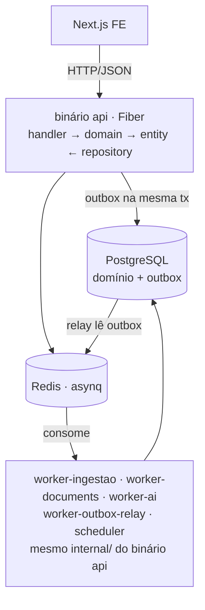
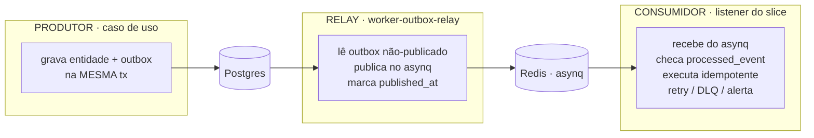

# ERD do Backend — Go

> A solução técnica do backend. Responde ao PRD da fundação (`fundacao-prd-erd.md`), agora aprofundado por camada, do controller ao repositório.
> **Stack:** Go (Fiber, sqlc, pgx), PostgreSQL, asynq + Redis, OTEL → New Relic. Monólito modular, workers como binários separados, Clean Architecture.
> O ERD do frontend está em `erd-frontend.md`.

> **Nota de nomenclatura:** identificadores de código são em **inglês** (ver `erd-modelo-de-dados.md`, a fonte de verdade do schema). Exemplos neste documento que ainda usam nomes em português (`Minuta`, `RevisarMinuta`, `tramitacao`) são ilustrativos do *padrão de camada*, não do nome final — o equivalente em inglês é `Draft`, `ReviewDraft`, `court_record`, conforme o vocabulário do catálogo.

---

# 1. Componentes e binários

Um `internal/` compartilhado, compilado em vários `cmd/`. O mesmo domínio roda na API e nos workers — muda só o entrypoint.



| Binário | Papel |
|---|---|
| `api` | HTTP (Fiber) |
| `worker-ingestao` | jobs DataJud, DJEN |
| `worker-documents` | extração, OCR, chunking |
| `worker-ai` | revisão por LLM |
| `worker-outbox-relay` | lê `outbox`, publica no asynq |
| `scheduler` | tick que enfileira sincronizações vencidas |

---

# 2. Estrutura — Slice Architecture vertical

Três pastas de topo:

```
/cmd        entrypoints das aplicações (um binário por pasta)
/internal   os slices — cada entidade tem TUDO que precisa dentro de si
/lib        infraestrutura compartilhada entre slices
```

`cmd` e `lib` são a casca; `internal` é onde o produto vive. **Cada slice é vertical: entidade, caso de uso, handler, listener e repositório — tudo dentro dele.** Um slice não importa o interior de outro; quando precisam se falar, é por evento (o listener de um reage ao fato emitido por outro).

## 2.1 Topo

```
/cmd
  /api/main.go               monta Fiber, registra os handlers de cada slice
  /worker-ingestao/main.go   monta asynq server, registra os listeners de ingestão
  /worker-documents/main.go
  /worker-ai/main.go
  /worker-outbox-relay/main.go
  /scheduler/main.go

/internal
  /processo/         slice
  /tramitacao/       slice
  /movimento/        slice
  /intimacao/        slice
  /minuta/           slice
  /revisao/          slice
  /integracao/       slice
  ...

/lib                 compartilhado, não é domínio
  /database          conexão pgx, pool, helper de transação (Unit of Work)
  /events            barramento: publish (outbox) + subscribe (asynq)
  /httpx             middleware base, WriteError, formato de erro, request-id
  /telemetry         setup OTEL (tracer, meter, slog handler)
  /validation        helpers ozzo compartilhados
  /storage           cliente de object storage
  /config            env struct por ambiente
```

## 2.2 Anatomia de um slice

Cada entidade vive num slice com a mesma forma. Exemplo, `internal/minuta`:

```
/internal/minuta
  entity.go        a entidade + suas regras
  errors.go        os erros DESTA entidade (tipados)
  validation.go    validações da entidade (invariantes de domínio)
  mapper.go        entity ⇄ row (sqlc) ⇄ DTO
  domain.go        o CASO DE USO — orquestra a lógica
  handler.go       controller SÍNCRONO (HTTP) — chama o caso de uso
  listener.go      consumer ASSÍNCRONO (evento) — chama o MESMO caso de uso
  repository.go    interface + implementação sqlc do acesso a dados
  events.go        os fatos que este slice emite
  /queries         .sql do sqlc deste slice
  *_test.go
```

Papel de cada arquivo:

| Arquivo | Responsabilidade |
|---|---|
| `entity.go` | o dado + comportamento. `Minuta`, seus campos, métodos de estado (`Assinar()`) |
| `errors.go` | `ErrMinutaJaAssinada`, `ErrTipoPecaInvalido` — tipados, agnósticos de HTTP |
| `validation.go` | invariantes: não assina com finding BLOQUEIA aberto |
| `mapper.go` | traduz entre entidade, linha do banco (sqlc) e DTO de entrada/saída |
| `domain.go` | **o caso de uso.** `RevisarMinuta(ctx, cmd)` — a lógica que orquestra entidade + repo + eventos |
| `handler.go` | recebe HTTP, valida request, chama `domain`, mapeia resposta/erro |
| `listener.go` | recebe evento do asynq, chama o **mesmo** `domain` |
| `repository.go` | `Repository` interface + impl sqlc; acesso a dados **deste** slice |
| `events.go` | `MinutaRevisada`, `MinutaAssinada` — o que o slice publica |

## 2.3 As duas portas de entrada: handler e listener

A arquitetura é event-driven, então cada slice tem **duas** portas para o mesmo caso de uso:

```
                  ┌──────────── handler.go  (SÍNCRONO, HTTP)
request HTTP ────▶│
                  └─────┐
                        ▼
                   domain.go  (o caso de uso — regra única)
                        ▲
                  ┌─────┘
evento (asynq) ──▶│
                  └──────────── listener.go (ASSÍNCRONO, evento)
```

- **handler** = controller síncrono. Segue o padrão da seção 4 (bind → valida → mapeia → chama caso de uso → mapeia saída/erro).
- **listener** = consumer assíncrono. Extrai o evento, monta o command, chama o **mesmo** caso de uso. Idempotente (checa `processed_event`), tolerante a retry.
- **os dois convergem no mesmo `domain.go`.** A regra existe uma vez; muda só quem a aciona. Um `RevisarMinuta` disparado por um POST e outro disparado por um evento `MinutaCriada` executam o mesmo código.

```go
// minuta/handler.go — porta síncrona
func (h *Handler) RevisarMinuta(c *fiber.Ctx) error {
    var req RevisarMinutaRequest
    if err := c.BodyParser(&req); err != nil { return httpx.WriteError(c, ...) }
    if err := req.Validate(); err != nil { return httpx.WriteValidationError(c, err) }
    out, err := h.uc.RevisarMinuta(c.UserContext(), req.ToCommand(httpx.TenantFromCtx(c)))
    if err != nil { return httpx.WriteError(c, err) }
    return c.Status(200).JSON(toResponse(out))
}

// minuta/listener.go — porta assíncrona, MESMO caso de uso
func (l *Listener) OnMinutaCriada(ctx context.Context, t *asynq.Task) error {
    ev, err := events.Decode[MinutaCriada](t)
    if err != nil { return err }
    if l.seen(ctx, "revisao", ev.EventID) { return nil } // idempotência
    _, err = l.uc.RevisarMinuta(ctx, ev.ToCommand())
    return err // asynq faz retry se falhar
}

// minuta/domain.go — a regra, única
func (uc *UseCase) RevisarMinuta(ctx context.Context, cmd RevisarMinutaCommand) (RevisarMinutaResult, error) {
    // valida, carrega entidade, aplica regra, persiste, emite evento — em uma tx
}
```

## 2.4 Como slices se comunicam

Nunca por import direto do interior um do outro. Só por **evento**:

```
slice ingestao          emite  MovimentoObservado
                                     │ (outbox → asynq)
                                     ▼
slice prazo             listener reage: é intimação? calcula prazo
slice consolidacao      listener reage: é remessa? cria vínculo
```

Um slice pode importar o **contrato de evento** de outro (`internal/ingestao/events.go`), nunca sua entidade ou repositório. Isso mantém o acoplamento no nível do fato publicado, que é o que a arquitetura event-driven promete.

## 2.5 Regra de dependência dentro do slice

Slice vertical não abandona Clean Arch — ela vive **dentro** do slice:

```
handler / listener  ──▶  domain (caso de uso)  ──▶  entity
                              │                        ▲
                              └──▶ repository (interface) ──┘
                                        ▲
                                   impl sqlc (mesmo slice)
```

- `entity.go` não importa `repository`, `handler` nem `lib/database`
- `domain.go` depende de `entity` e da **interface** `Repository`, não da impl
- `handler`/`listener` dependem de `domain`
- a impl sqlc do repositório é detalhe, trocável, e vive no próprio slice (`repository.go` + `/queries`)

Ou seja: a regra de dependência aponta para a entidade (o centro do slice), e a infra compartilhada de `lib` é injetada, nunca importada pelo núcleo.

---

# 2b. Camadas e regra de dependência (resumo)

```
handler/listener ──▶ domain(caso de uso) ──▶ entity ◀── repository(impl sqlc)
```

- **entity** — dado + regras + erros + validações + mapeamento. Centro do slice, zero dependência externa.
- **domain** — o caso de uso. Orquestra entidade, repositório e eventos.
- **handler** — porta síncrona (HTTP, padrão da seção 4). **listener** — porta assíncrona (evento). Ambos chamam o mesmo `domain`.
- **repository** — interface + impl sqlc, dentro do slice.
- **lib** — infra compartilhada (db, eventos, httpx, telemetry), injetada nos slices.

Fora de `/internal`, dois diretórios de apoio: `/migrations` (SQL versionado, go-migrate) e `/pkg` (utilitários genuinamente genéricos, sem regra de negócio).

---

# 3. ERD — modelo persistente

O modelo de dados canônico (tabelas, colunas, índices, diagrama de entidades) vive em `erd-modelo-de-dados.md` — fonte de verdade, em inglês. Este documento não repete o schema; foca no que muda por camada.

O DDL completo (17 tabelas de domínio + 3 de infra, com as colunas que carregam decisão: `occurred_at`/`observed_at`, `observed_result`, índice parcial `WHERE lifecycle='ACTIVE'`, `outbox`, `processed_event`, `backfill_job`) está no catálogo.

| Necessidade (PRD) | Resposta |
|---|---|
| N1 modelo evolutivo | migration versionada; `tenant_id` em toda tabela de usuário |
| N2 event-driven | `outbox` na mesma tx; `processed_event` p/ idempotência; `aggregate_id` ordena |
| N-ASYNC | asynq + Redis; `worker-outbox-relay` |
| N7 observabilidade | `sync_run`; trace atravessa o outbox via payload |

---

# 4. O padrão de handler (obrigatório)

**Todo handler segue exatamente esta estrutura. Sem exceção.** É o contrato da porta síncrona do slice — o `handler.go` da seção 2.2.

## 4.1 Anatomia de uma rota

Três artefatos por rota, no mesmo slice (`handler.go` ou arquivos vizinhos):

1. o `/path` e o registro no router
2. a **struct de Request**, com método de validação
3. a **struct de Response**

```go
// internal/revisao/handler.go  (+ request/response no mesmo slice)
package handlers

// --- Request ---
type RevisarMinutaRequest struct {
    TipoPeca   string  `json:"tipo_peca"`
    ProcessoID *string `json:"processo_id"` // opcional na v0
    Conteudo   string  `json:"conteudo"`
}

// Validate — ozzo-validation. Toda Request tem este método.
func (r RevisarMinutaRequest) Validate() error {
    return validation.ValidateStruct(&r,
        validation.Field(&r.TipoPeca,
            validation.Required,
            validation.In("CONTESTACAO", "INICIAL", "RECURSO", "MANIFESTACAO", "OUTROS")),
        validation.Field(&r.ProcessoID, is.UUIDv4),
        validation.Field(&r.Conteudo, validation.Required, validation.Length(1, 0)),
    )
}

// --- Response ---
type RevisarMinutaResponse struct {
    ReviewID  string          `json:"review_id"`
    Findings  []FindingDTO    `json:"findings"`
    Cobertura CoberturaDTO    `json:"cobertura"`
}
```

## 4.2 O fluxo, na ordem exata

Todo request atravessa a mesma sequência:

```
Request
  │
  ▼ Middleware de Autenticação        valida token → injeta tenantID e userID no ctx
  │                                   falha → 401 (não chega no handler)
  ▼ Middleware de Log                 abre span, loga método+rota+request_id
  │
  ▼ Handler (função principal)
  │   1. bind do body            → RevisarMinutaRequest
  │   2. req.Validate()          → erro de validação? → 400 com detalhes
  │   3. map Request → Command   (DTO de domínio)
  │   4. usecase.Execute(ctx, cmd) → (result, error)
  │   5a. sucesso: map result → Response, serializa
  │   5b. erro:    map erro de domínio → status HTTP
  ▼
Response
```

Em código, o handler é sempre este esqueleto:

```go
func (h *AssessoriaHandler) RevisarMinuta(c *fiber.Ctx) error {
    // 1. bind
    var req RevisarMinutaRequest
    if err := c.BodyParser(&req); err != nil {
        return WriteError(c, apperr.NewInvalid("corpo inválido"))
    }

    // 2. validação (ozzo)
    if err := req.Validate(); err != nil {
        return WriteValidationError(c, err) // 400 estruturado
    }

    // 3. Request → Command de domínio
    cmd := assessoria.RevisarMinutaCommand{
        TenantID:   TenantFromCtx(c),   // veio do middleware de auth
        TipoPeca:   domain.TipoPeca(req.TipoPeca),
        ProcessoID: req.ProcessoID,
        Conteudo:   req.Conteudo,
    }

    // 4. use case
    result, err := h.usecase.RevisarMinuta(c.UserContext(), cmd)
    if err != nil {
        return WriteError(c, err) // 5b — mapeia domínio→HTTP
    }

    // 5a. result → Response
    return c.Status(200).JSON(toRevisarMinutaResponse(result))
}
```

O handler **não tem regra de negócio**. Ele faz: bind, valida, mapeia entrada, chama use case, mapeia saída ou erro. Nada mais.

## 4.3 Mapeamento de erro de domínio → HTTP

O domínio devolve erros **tipados e agnósticos de HTTP**. A tradução para status acontece **só na borda**, num único lugar.

```go
// lib/httpx/errors.go (Kind) — erros de entidade referenciam estes Kinds
type Kind string
const (
    KindInvalid       Kind = "DOMAIN_ERROR_INVALID"
    KindNotFound      Kind = "ENTITY_NOT_FOUND"
    KindUnauthorized  Kind = "AUTHENTICATION_ERROR"
    KindForbidden     Kind = "AUTHORIZATION_ERROR"
    KindConflict      Kind = "CONFLICT"
    KindInfra         Kind = "INFRA_ERROR"
)

type AppError struct {
    Kind    Kind
    Message string
    Details any
    cause   error // envolvido, não exposto ao cliente
}
```

```go
// lib/httpx/errors.go — o ÚNICO lugar que conhece status HTTP
var statusByKind = map[shared.Kind]int{
    shared.KindInvalid:      400,
    shared.KindUnauthorized: 401,
    shared.KindForbidden:    403,
    shared.KindNotFound:     404,
    shared.KindConflict:     409,
    shared.KindInfra:        500,
}

func WriteError(c *fiber.Ctx, err error) error {
    var ae *shared.AppError
    if !errors.As(err, &ae) {
        // erro não-tipado = bug. 500 e loga com stack.
        ae = shared.NewInfra("erro interno", err)
    }
    status := statusByKind[ae.Kind]
    if status == 0 {
        status = 500
    }
    if status >= 500 {
        // 5xx: loga o cause com trace_id; NÃO vaza ao cliente
        log.ErrorCtx(c.UserContext(), "erro interno", "kind", ae.Kind, "cause", ae.Unwrap())
    }
    return c.Status(status).JSON(ErrorBody{
        Kind:    string(ae.Kind),
        Message: ae.Message,   // seguro de expor
        Details: ae.Details,
    })
}
```

Tabela de tradução, que a seção acima implementa:

| Erro de domínio | HTTP |
|---|---|
| `DOMAIN_ERROR_INVALID` | 400 |
| `AUTHENTICATION_ERROR` | 401 |
| `AUTHORIZATION_ERROR` | 403 |
| `ENTITY_NOT_FOUND` | 404 |
| `CONFLICT` | 409 |
| `INFRA_ERROR` | 500 |
| erro não-tipado (bug) | 500 + log com stack |

**Regras que isso impõe:**
- o domínio **nunca** importa `net/http` nem sabe o que é status code
- o mapa `statusByKind` é o único ponto de tradução — adicionar um `Kind` novo é uma linha
- 5xx sempre loga o `cause` real com `trace_id`; o cliente recebe mensagem genérica (não vaza stack nem SQL)
- erro de validação (400) tem corpo estruturado com os campos que falharam, para o front destacar

## 4.4 Formato único de erro (o front trata um só shape)

```json
{
  "kind": "DOMAIN_ERROR_INVALID",
  "message": "tipo de peça inválido",
  "details": { "tipo_peca": "valor deve ser um dos: CONTESTACAO, INICIAL, ..." }
}
```

## 4.5 Middlewares, na ordem de execução

```go
app.Use(middleware.RequestID())      // gera/propaga X-Request-ID
app.Use(middleware.Telemetry())      // abre span raiz, injeta trace_id no ctx
app.Use(middleware.Recover())        // panic → 500 tipado, nunca derruba o processo
app.Use(middleware.Auth())           // valida token → tenantID/userID no ctx; 401 se falhar
app.Use(middleware.RequestLogger())  // loga método, rota, status, duração, trace_id
```

Ordem importa: `Telemetry` antes de tudo para o `trace_id` existir no log; `Auth` antes do `RequestLogger` para o log já sair com `tenant_id`; `Recover` cedo para capturar panics dos middlewares seguintes.

---

# 4b. Camada de Repositório (obrigatório)

Duas regras de topo, cada uma com sua precisão:

1. **Toda escrita roda dentro de uma transação** — mas quem **abre** a transação é o caso de uso, não o repositório. O repositório *participa* de uma tx que recebe. É isso que permite gravar entidade e outbox atomicamente.
2. **O repositório sempre devolve a entidade mapeada** — `*Minuta`, nunca `sqlc.MinutaRow`. O sqlc é detalhe; o `mapper.go` do slice traduz nos dois sentidos.

## 4b.1 A interface, no slice

```go
// internal/minuta/repository.go

// Interface — é o que domain.go depende. Recebe a tx, não a abre.
type Repository interface {
    Save(ctx context.Context, tx db.Tx, m *Minuta) error
    FindByID(ctx context.Context, tenantID, id string) (*Minuta, error) // leitura: sem tx
}

// Impl sqlc — detalhe, o caso de uso nunca a referencia por tipo concreto
type pgRepository struct{ q *sqlc.Queries }

func NewRepository(q *sqlc.Queries) Repository { return &pgRepository{q} }
```

`domain.go` recebe `Repository` por injeção, nunca `*pgRepository`. Trocável e mockável em teste.

## 4b.2 Unit of Work — a transação que abraça entidade + outbox

A atomicidade que a arquitetura event-driven exige (gravar o fato e o outbox juntos) vive aqui. `lib/database` expõe a unidade; o caso de uso a usa.

```go
// lib/database/uow.go
type Tx interface {          // o que repositórios e outbox recebem
    // handle da tx pgx por baixo; métodos internos
}

type UnitOfWork interface {
    Do(ctx context.Context, fn func(tx Tx) error) error
}

// impl: abre tx no pool pgx, chama fn, commita se fn retorna nil,
// faz rollback em erro ou panic. Uma tx, um commit.
func (u *uow) Do(ctx context.Context, fn func(Tx) error) error {
    tx, err := u.pool.Begin(ctx)
    if err != nil { return db.WrapInfra(err) }
    defer tx.Rollback(ctx)            // no-op se já commitou
    if err := fn(&pgTx{tx}); err != nil {
        return err                     // rollback pelo defer
    }
    return tx.Commit(ctx)
}
```

O caso de uso orquestra:

```go
// internal/minuta/domain.go
func (uc *UseCase) RevisarMinuta(ctx context.Context, cmd RevisarMinutaCommand) (Result, error) {
    m, err := uc.repo.FindByID(ctx, cmd.TenantID, cmd.MinutaID) // leitura, fora da tx
    if err != nil { return Result{}, err }

    review, err := uc.assessor.Revisar(ctx, m, cmd.Contexto)    // lógica de domínio
    if err != nil { return Result{}, err }

    // ESCRITA: entidade + outbox na MESMA tx
    err = uc.uow.Do(ctx, func(tx db.Tx) error {
        if err := uc.repo.SaveReview(ctx, tx, review); err != nil { return err }
        return uc.outbox.Publish(ctx, tx, MinutaRevisada{
            MinutaID: m.ID, ReviewID: review.ID, TenantID: cmd.TenantID,
        })
    })
    if err != nil { return Result{}, err }
    return toResult(review), nil
}
```

Ponto central: `SaveReview` e `Publish` recebem o **mesmo** `tx`. Ou os dois commitam, ou nenhum. O relay (`worker-outbox-relay`) publica o evento depois; se o commit falhou, não há linha no outbox para publicar — sem evento fantasma.

## 4b.3 O mapper — onde os tipos de banco morrem

O `mapper.go` é a fronteira. Tipos feios de driver (`pgtype.Timestamptz`, `pgtype.UUID`) são absorvidos aqui e nunca entram na entidade.

```go
// internal/minuta/mapper.go
func rowToEntity(r sqlc.MinutaRow) *Minuta {
    return &Minuta{
        ID:         r.ID.String(),
        TenantID:   r.TenantID.String(),
        ProcessoID: nullUUID(r.ProcessoID),        // *string
        TipoPeca:   TipoPeca(r.TipoPeca),
        Status:     Status(r.Status),
    }
}

func entityToParams(m *Minuta) sqlc.SaveMinutaParams {
    return sqlc.SaveMinutaParams{ /* entidade → tipos do sqlc */ }
}
```

Sem essa camada, `pgtype.*` vaza para dentro do domínio e a Clean Arch furou. Custo: é boilerplate. Ganho: a entidade fica limpa e o sqlc é trocável.

## 4b.4 Escrita via agregado, leitura especializada

A regra de "devolver a entidade mapeada" vale para **escrita e para leitura do agregado**. Não vale para **read models**.

```
ESCRITA           sempre pela entidade/agregado, dentro de tx
                  repo.Save(ctx, tx, minuta)

LEITURA de 1      repo.FindByID → *Minuta (agregado montado)
agregado

LEITURA de tela   query dedicada → DTO direto, PULA a entidade
(read model)      pastaRepo.LoadPasta(ctx, processoID) → PastaDTO
                  (JOINs, projeção; não monta Processo+Tramitacao+Movimento como agregado)
```

Por que a exceção: montar o agregado `Processo` completo (com N tramitações, cada uma com ~200 movimentos) para renderizar uma tela é o gargalo clássico deste estilo. A `Pasta` é read model — uma query de projeção que devolve exatamente o que a tela precisa, sem passar pela entidade. Escrita nunca faz isso; leitura de tela sempre pode.

## 4b.5 "Não existe" é erro tipado, não `nil, nil`

```go
func (r *pgRepository) FindByID(ctx context.Context, tenantID, id string) (*Minuta, error) {
    row, err := r.q.GetMinuta(ctx, sqlc.GetMinutaParams{TenantID: ..., ID: ...})
    if errors.Is(err, pgx.ErrNoRows) {
        return nil, ErrMinutaNotFound      // Kind = ENTITY_NOT_FOUND → 404 na borda
    }
    if err != nil {
        return nil, db.WrapInfra(err)      // Kind = INFRA_ERROR → 500 + log
    }
    return rowToEntity(row), nil
}
```

`nil, nil` empurra a checagem para o caso de uso e gera nil-panic mais tarde. Erro tipado desde o repositório fecha o buraco — e já casa com o `statusByKind` da seção 4.3.

## 4b.6 Os tradeoffs (assumidos de propósito)

| Tradeoff | Custo | Por que aceitamos |
|---|---|---|
| Dupla estrutura entidade + row + mapper | boilerplate por slice | domínio nunca vê `pgtype`; sqlc trocável; testável |
| Agregado completo em `FindByID` | às vezes carrega demais | simples e consistente na v0; leitura de tela usa read model dedicado |
| Mapper esconde nº de queries | custo real invisível no código | otelpgx faz cada query virar span — o custo aparece no trace |
| Erro tipado no repo | mais verboso que `nil` | sem nil-panic; casa com o mapa de status |
| tx orquestrada pelo caso de uso | domain conhece `db.Tx` | é o preço da atomicidade entidade+outbox; a alternativa (tx no repo) impossibilita o outbox transacional |

O tradeoff a vigiar é o do agregado: se `FindByID` sempre montar o agregado inteiro e alguém usar isso para telas, vira o gargalo. A defesa é a regra 4b.4 — leitura de tela nunca passa pelo agregado.

## 4b.7 Repositório e telemetria

O repositório não instrumenta query à mão. O pool pgx é embrulhado com **otelpgx**, que abre um span por query com o SQL como atributo. O `ctx` que desce do caso de uso carrega o span pai — então `db.minuta.save` aparece como filho de `usecase.RevisarMinuta`, que é filho de `http.request`. É o que torna o custo do 4b.3 (queries escondidas no mapper) visível no trace.

---

# 4c. Emissão e consumo de eventos (o pipeline)

Como o evento **anda** — não o que ele contém. Três estágios: produtor, relay, consumidor. Cada um resolve um problema: atomicidade, entrega, idempotência.



## 4c.1 Produtor — grava, não publica

O caso de uso **nunca** publica direto no asynq. Ele escreve na tabela `outbox`, na mesma transação da entidade (visto em 4b.2). Ponto final do lado do produtor.

```go
uc.uow.Do(ctx, func(tx db.Tx) error {
    uc.repo.Save(ctx, tx, entidade)
    return uc.outbox.Publish(ctx, tx, MinutaRevisada{...}) // grava LINHA no outbox
})
```

O `outbox.Publish` monta o envelope e insere a linha:

```go
func (o *Outbox) Publish(ctx context.Context, tx db.Tx, ev Event) error {
    return tx.Exec(ctx, `INSERT INTO outbox
        (aggregate_type, aggregate_id, type, payload, idempotency_key, trace_context)
        VALUES ($1,$2,$3,$4,$5,$6)`,
        ev.AggregateType(), ev.AggregateID(), ev.Type(),
        mustJSON(ev), ev.IdempotencyKey(), traceContextFromCtx(ctx))
}
```

Dois campos do envelope que carregam a mecânica toda: `idempotency_key` (dedup no consumidor) e `trace_context` (o hop distribuído da telemetria). Ambos preenchidos aqui, no nascimento.

Se a tx faz rollback, não há linha. Sem evento fantasma. Se commita, o evento **existe e será entregue** — o relay garante.

## 4c.2 Relay — o único que publica no asynq

`worker-outbox-relay` roda um loop curto. Lê o que não foi publicado, publica no asynq, marca. `FOR UPDATE SKIP LOCKED` permite rodar N réplicas do relay sem publicar em duplicidade.

```go
func (r *Relay) tick(ctx context.Context) error {
    return r.uow.Do(ctx, func(tx db.Tx) error {
        rows, err := tx.Query(ctx, `
            SELECT id, type, payload, idempotency_key, trace_context, aggregate_id
            FROM outbox
            WHERE published_at IS NULL
            ORDER BY id
            LIMIT 200
            FOR UPDATE SKIP LOCKED`)          // ← concorrência sem duplicar
        if err != nil { return err }

        for _, row := range rows {
            task := asynq.NewTask(row.Type, row.Payload,
                asynq.Queue(queueFor(row.Type)),        // fila por tipo de trabalho
                asynq.TaskID(row.IdempotencyKey),       // dedup no enqueue (best-effort)
                asynq.MaxRetry(maxRetryFor(row.Type)),
                withTraceContext(row.TraceContext))     // continua o trace
            if _, err := r.asynq.EnqueueContext(ctx, task); err != nil {
                return err   // não marca published_at → tenta de novo no próximo tick
            }
            tx.Exec(ctx, `UPDATE outbox SET published_at = now() WHERE id = $1`, row.ID)
        }
        return nil
    })
}
```

Garantias e limites:

- **at-least-once, não exactly-once.** O relay pode publicar no asynq e morrer antes do `UPDATE`. No próximo tick, republica. Por isso o consumidor **tem** que ser idempotente — não é opcional, é a contraparte obrigatória.
- **`asynq.TaskID(idempotency_key)`** faz o asynq deduplicar no enqueue quando dá — mas é best-effort (janela de retenção), então não substitui a idempotência do consumidor.
- **ordem por agregado:** `ORDER BY id` no relay + `aggregate_id` como base da fila preservam ordem dentro do agregado. Ordem global não existe e não é necessária.
- **filas por tipo:** `queueFor(type)` roteia — `ingestao`, `documents`, `ai`, `default`. Um OCR de 10 min não trava a ingestão.

## 4c.3 Consumidor — idempotência primeiro, sempre

O `listener.go` do slice recebe a task. **Antes de qualquer efeito**, checa se já processou este evento. É o que fecha o at-least-once.

```go
func (l *Listener) OnMinutaRevisada(ctx context.Context, t *asynq.Task) error {
    ctx = extractTrace(ctx, t)          // continua o trace do produtor

    ev, err := events.Decode[MinutaRevisada](t)
    if err != nil {
        return fmt.Errorf("%w: %v", asynq.SkipRetry, err)  // payload inválido: NÃO retenta
    }

    // IDEMPOTÊNCIA — a primeira coisa, sempre
    done, err := l.dedup.SeenOrMark(ctx, "revisao-listener", ev.EventID)
    if err != nil { return err }        // erro de infra: deixa retentar
    if done {
        return nil                       // já processado: no-op, sucesso
    }

    // efeito real — chama o MESMO caso de uso do handler
    _, err = l.uc.NotificarRevisao(ctx, ev.ToCommand())
    return err                           // erro → asynq agenda retry
}
```

O `SeenOrMark` grava em `processed_event (consumer, event_id)`:

```go
func (d *Dedup) SeenOrMark(ctx context.Context, consumer, eventID string) (bool, error) {
    tag, err := d.pool.Exec(ctx, `
        INSERT INTO processed_event (consumer, event_id)
        VALUES ($1, $2) ON CONFLICT DO NOTHING`, consumer, eventID)
    if err != nil { return false, db.WrapInfra(err) }
    return tag.RowsAffected() == 0, nil    // 0 linhas = já existia = já processado
}
```

Dois pontos finos:

- **`consumer` faz parte da chave.** O mesmo evento é consumido por vários listeners (prazo, risco, notificação). Cada um tem seu registro de "já vi" — a chave é `(consumer, event_id)`, não só `event_id`. Um marcar como processado não impede os outros de processarem.
- **marca vs efeito não são atômicos.** Se o efeito é uma escrita no banco, o ideal é gravar `processed_event` na **mesma tx** do efeito — aí idempotência e efeito commitam juntos. Se o efeito é externo (chamar LLM, mandar e-mail), não há tx que os una: aceita-se marcar depois do efeito e conviver com a chance rara de reprocessar um efeito externo — que por isso também deve ser idempotente na origem quando possível.

## 4c.4 Retry, backoff e DLQ

O asynq cuida do retry; a política é por tipo de tarefa.

```
listener retorna erro
   ↓
asynq reenfileira com backoff exponencial   (ex: 30s, 2min, 10min, 1h)
   ↓
esgotou MaxRetry?
   ↓ sim
task vai para a fila :dead (DLQ do asynq)
   ↓
alerta dispara
```

Regras:

- **erro retryável vs não-retryável.** Payload corrompido, tipo desconhecido, regra de negócio que nunca vai passar → `asynq.SkipRetry`, vai direto para a DLQ (retentar é desperdício). Erro de infra (banco fora, LLM 503) → deixa retentar.
- **`MaxRetry` por tipo.** Sincronização tolera mais tentativas (tribunal instável é comum); revisão de LLM tolera menos (custa dinheiro por tentativa).
- **backoff exponencial com jitter** — o padrão do asynq, para não martelar um recurso que já está sofrendo.
- **DLQ é fila terminal, não lixeira.** Task na DLQ é inspecionável e re-enfileirável manualmente (via asynqmon ou comando). Nunca some sozinha.

## 4c.5 Alertas — os quatro sinais que importam

Alerta não é "algo falhou" — é "algo parou de se auto-corrigir". Quatro gatilhos:

| Sinal | O que significa | Severidade |
|---|---|---|
| **Idade do outbox não-publicado** | `max(now - created_at) WHERE published_at IS NULL` cresce → o **relay travou**. Eventos estão sendo gravados mas não entregues. | crítico — o pipeline parou silenciosamente |
| **Profundidade da DLQ** | tasks morrendo além do retry → um consumidor está quebrado ou uma dependência caiu | alto |
| **Taxa de retry por fila** | subiu → uma dependência está degradada (tribunal, LLM) antes de virar DLQ | médio — alerta precoce |
| **Lag de processamento** | tempo entre enqueue e processamento cresce → worker sem capacidade | médio |

O primeiro é o mais importante e o menos óbvio: **um relay parado não gera erro** — os casos de uso continuam commitando, o produto parece funcionar, mas nada é consumido. A idade do outbox é o único sinal que pega isso. É a métrica que eu colocaria no primeiro dashboard.

Todos vêm da telemetria (§6): métricas OTEL exportadas para o New Relic, com alerta configurado lá.

## 4c.6 O ciclo completo, ponta a ponta

```
1. caso de uso: entidade + linha no outbox  (1 tx, atômico)
2. relay: SELECT ... SKIP LOCKED → publica no asynq → UPDATE published_at
3. asynq: entrega ao listener (at-least-once), fila por tipo
4. listener: extrai trace → SeenOrMark → efeito → sucesso/erro
5. erro → backoff → retry → (esgotou) → DLQ → alerta
6. o tempo todo: idade do outbox, DLQ, retry, lag → New Relic → alerta
```

Cada estágio tem uma garantia e uma contraparte: o produtor garante atomicidade **porque** o consumidor é idempotente; o relay garante entrega **porque** aceita duplicar; o consumidor absorve a duplicação **porque** checa `processed_event`. Nenhuma peça é confiável sozinha — o conjunto é.

---

# 4d. Autenticação e Tenancy (via Clerk)

O princípio que organiza tudo: **Clerk é a fonte de identidade; o banco é a fonte de autorização.** O backend não guarda senha, não faz login, não gerencia sessão — isso é do Clerk. O backend confia num token assinado, extrai quem é a pessoa e a qual escritório pertence, e a partir daí garante isolamento.

**Decisão de modelo:** `Clerk Organization = Tenant`, e `1 usuário = 1 escritório`. Não há vínculo múltiplo, então não há tabela de membership com N relações — o `org_id` do Clerk É o `tenant_id`.

## 4d.1 Divisão de responsabilidade

| Responsabilidade | Quem |
|---|---|
| Login, senha, MFA, reset, sessão | **Clerk** |
| Organizations (o escritório) e convites | **Clerk** |
| Emissão do JWT assinado | **Clerk** |
| Verificar o JWT em toda request | backend |
| Mapear `org_id` → `tenant_id` e isolar dados | backend |
| Papel dentro do escritório (admin/advogado) | backend (autorização), Clerk opcional (claim) |

O front usa o SDK do Clerk (login, troca de org). O backend nunca vê credencial — só o token que o front envia no `Authorization: Bearer`.

## 4d.2 O que o backend guarda

Clerk é a verdade da identidade, mas o backend precisa de uma **projeção local** — para dar FK, para consultar sem chamar a API do Clerk a cada request, e para carregar dados que são seus (papel no produto, preferências).

```sql
-- tenant: espelha a Clerk Organization
CREATE TABLE tenant (
  id          uuid PRIMARY KEY DEFAULT gen_random_uuid(),
  clerk_org_id text NOT NULL UNIQUE,       -- "org_2abc..." — a ponte com o Clerk
  nome         text NOT NULL,
  created_at   timestamptz NOT NULL DEFAULT now()
);

-- app_user: espelha o Clerk User, já vinculado ao tenant
CREATE TABLE app_user (
  id            uuid PRIMARY KEY DEFAULT gen_random_uuid(),
  clerk_user_id text NOT NULL UNIQUE,      -- "user_2xyz..."
  tenant_id     uuid NOT NULL REFERENCES tenant(id),
  email         text NOT NULL,
  nome          text,
  papel         text NOT NULL DEFAULT 'ADVOGADO',  -- ADMIN | ADVOGADO
  created_at    timestamptz NOT NULL DEFAULT now()
);
CREATE INDEX ON app_user (tenant_id);
```

Repare: `tenant.id` continua sendo o UUID interno usado em **todas** as FKs do sistema (`processo.tenant_id`, etc.). O `clerk_org_id` é só a ponte. Assim, se um dia trocar de provedor de auth, muda a ponte, não o schema inteiro.

## 4d.3 Como o backend recebe a identidade — duas vias

**Via 1 — verificação do JWT (toda request).** O front manda o token do Clerk; o middleware verifica a assinatura contra as chaves públicas do Clerk (JWKS, cacheadas) e extrai os claims.

```go
// lib/httpx/middleware/auth.go
func Auth(clerk *clerkclient.Client, users UserLookup) fiber.Handler {
    return func(c *fiber.Ctx) error {
        raw := bearerToken(c)
        claims, err := clerk.VerifyToken(raw)          // valida assinatura + expiração (JWKS)
        if err != nil {
            return httpx.WriteError(c, shared.NewUnauthorized("token inválido"))
        }
        // claims.Subject = clerk_user_id ; claims.OrgID = clerk_org_id
        principal, err := users.Resolve(c.UserContext(), claims.Subject, claims.OrgID)
        if err != nil {
            return httpx.WriteError(c, err)            // usuário não provisionado → 401/403
        }
        c.Locals("principal", principal)               // { UserID, TenantID, Papel }
        return c.Next()
    }
}
```

O `principal` (com `TenantID` **interno**, já resolvido do `org_id`) fica no contexto. É de lá que `TenantFromCtx(c)` — usado em todo handler da seção 4 — extrai o tenant. **Nenhum handler lê `org_id` do Clerk direto**; ele lê o `tenant_id` já resolvido.

**Via 2 — webhooks do Clerk (provisionamento).** Quando alguém cria uma organização ou é convidado, o Clerk chama um webhook do backend. É como `tenant` e `app_user` nascem — sem isso, o primeiro login teria um token válido de um usuário que o backend não conhece.

```
Clerk: organização criada    → webhook organization.created → cria tenant
Clerk: usuário entra na org   → webhook organizationMembership.created → cria app_user
Clerk: usuário atualizado     → webhook user.updated → sincroniza email/nome
```

```go
// internal/identity/webhook.go
func (h *ClerkWebhook) Handle(c *fiber.Ctx) error {
    if err := verifySvixSignature(c); err != nil {   // webhook assinado — verificar SEMPRE
        return httpx.WriteError(c, shared.NewUnauthorized("assinatura inválida"))
    }
    ev := decode(c.Body())
    switch ev.Type {
    case "organization.created":
        h.uc.ProvisionTenant(ctx, ev.Data.ID, ev.Data.Name)
    case "organizationMembership.created":
        h.uc.ProvisionUser(ctx, ev.Data.UserID, ev.Data.OrgID, ev.Data.Email)
    // ...
    }
    return c.SendStatus(200)
}
```

As duas vias se complementam: o **webhook** cria o registro local (fluxo assíncrono, eventual); a **verificação de JWT** usa o registro a cada request (síncrono). Se um token chegar antes do webhook ter processado (corrida rara), o `Resolve` faz um fallback: consulta a API do Clerk uma vez, cria o registro na hora, e segue — assim o primeiro login nunca falha por timing.

## 4d.4 Tenancy — o isolamento, em duas barreiras

Um escritório **nunca** pode ver dado de outro. Com os dois lados de um mesmo processo potencialmente na plataforma, isso é requisito de segurança e de LGPD, não conforto. Duas barreiras independentes:

**Barreira 1 — filtro na aplicação.** Todo método de repositório recebe `tenantID` e filtra por ele. Não é opcional na assinatura:

```go
func (r *pgRepo) FindByID(ctx context.Context, tenantID, id string) (*Processo, error)
//                                              ^^^^^^^^ sempre presente
```

O `tenantID` vem do `principal` no contexto, que veio do token verificado. O handler nunca aceita `tenant_id` do body ou da query — só do token. (Aceitar do cliente seria o buraco clássico: trocar o id e ver dado alheio.)

**Barreira 2 — Row-Level Security no Postgres.** A aplicação pode ter bug; o banco não deveria confiar cegamente nela. RLS garante no nível da linha:

```sql
ALTER TABLE processo ENABLE ROW LEVEL SECURITY;

CREATE POLICY tenant_isolation ON processo
  USING (tenant_id = current_setting('app.tenant_id')::uuid);
```

A cada transação, o backend seta a variável de sessão:

```go
// no início de cada request/uow, depois de resolver o principal
tx.Exec(ctx, `SET LOCAL app.tenant_id = $1`, principal.TenantID)
```

Agora, mesmo que um `WHERE tenant_id` seja esquecido num query novo, o Postgres **não retorna** linhas de outro tenant. Duas barreiras porque uma falha: filtro na app é a regra, RLS é a rede de segurança.

## 4d.5 Autorização (papel)

Autenticação responde "quem é você"; autorização responde "você pode isto". O papel (`ADMIN` | `ADVOGADO`) vive no `app_user` e é checado no caso de uso ou num middleware de guarda:

```go
func RequirePapel(p Papel) fiber.Handler { /* 403 se principal.Papel != p */ }

// rota que só admin acessa (ex: gerenciar integrações do escritório)
api.Post("/integracoes", middleware.RequirePapel(ADMIN), h.CriarIntegracao)
```

Na v0 os papéis são poucos (quem administra o escritório vs quem só usa). O modelo comporta crescer sem virar sistema de permissão completo antes da hora.

## 4d.6 O fluxo completo

```
Front (SDK Clerk)  →  login, escolhe org  →  recebe JWT
       │
       │  Authorization: Bearer <jwt>
       ▼
Middleware Auth  →  verifica assinatura (JWKS Clerk)
                 →  extrai clerk_user_id + org_id
                 →  Resolve → principal { UserID, TenantID interno, Papel }
                 →  injeta no ctx
       │
       ▼
Handler  →  TenantFromCtx(c)  →  caso de uso  →  repo (filtra por tenantID)
                                                  + SET LOCAL app.tenant_id (RLS)

Paralelo, assíncrono:
Clerk webhooks  →  provisiona tenant/app_user no banco local
```

## 4d.7 Decisões

| Decisão | Porquê |
|---|---|
| Clerk Org = Tenant, 1 user = 1 org | escolha do projeto; elimina tabela de membership múltiplo |
| `clerk_org_id`/`clerk_user_id` como ponte, UUID interno nas FKs | trocar de provedor muda a ponte, não o schema |
| Projeção local via webhook | FK, consulta sem bater no Clerk a cada request, dados que são do produto |
| `tenant_id` só do token, nunca do cliente | evita o buraco de trocar o id e ver dado alheio |
| Filtro na app **e** RLS | duas barreiras; RLS pega o `WHERE` esquecido |
| Verificar assinatura do webhook (Svix) | webhook é entrada pública; sem verificar, qualquer um provisiona tenant |
| Fallback de resolução no primeiro login | evita falha por corrida entre webhook e primeiro token |

---

# 4e. Convenções de API — versionamento, paginação, filtro, upload

Padrões que **toda** rota segue, para o front tratar tudo de forma uniforme.

## 4e.1 Versionamento — `/v1`

Todo endpoint mora sob um prefixo de versão:

```
/v1/processos
/v1/processos/:id
/v1/minutas
/v1/integracoes
```

```go
v1 := app.Group("/v1")
v1.Get("/processos", h.ListarProcessos)
```

Regras:
- **`/v1` desde o primeiro dia.** Adicionar versão depois é migração; começar com ela é grátis.
- **mudança compatível** (campo novo opcional, rota nova) fica em `/v1`. Não gera `/v2`.
- **mudança quebrável** (remover campo, mudar tipo, mudar semântica) → `/v2`, com `/v1` vivo em paralelo até o front migrar. Nunca quebrar o que está no ar.
- versão no **path**, não em header — visível, cacheável, trivial de rotear.

## 4e.2 Paginação — cursor, padrão único

Toda lista usa o mesmo contrato. **Cursor**, não offset — a carteira cresce e muda, e offset pula ou repete item quando algo é inserido entre páginas.

**Request:**
```
GET /v1/processos?limit=20&cursor=<opaco>
```

**Response — envelope padrão de toda lista:**
```json
{
  "data": [ /* itens */ ],
  "page": {
    "next_cursor": "eyJpZCI6...",   // null quando acabou
    "limit": 20
  }
}
```

```go
type Page[T any] struct {
    Data []T      `json:"data"`
    Page PageMeta `json:"page"`
}
type PageMeta struct {
    NextCursor *string `json:"next_cursor"`
    Limit      int     `json:"limit"`
}
```

Mecânica:
- o **cursor é opaco** — base64 de `{ last_id, last_sort_value }`. O cliente não interpreta, só devolve.
- query usa keyset: `WHERE (ordenado_por, id) < (:cursor_val, :cursor_id) ORDER BY ... LIMIT :limit+1`. O `+1` detecta se há próxima página sem contar o total.
- `limit` tem **teto** (ex: 100) — cliente não pede 10.000 e derruba o banco.
- sem `total_count` por padrão — contar exige varrer tudo, e a UI de cursor não precisa. Endpoint separado se algum dia precisar do número.

## 4e.3 Filtro e ordenação — contrato declarativo

Filtros são query params nomeados e explícitos, nunca um blob de query arbitrária:

```
GET /v1/processos?tribunal=TJMG&lifecycle=ACTIVE&sort=-atualizado_em&limit=20
```

- **filtros permitidos por endpoint** — uma allowlist por rota. `tribunal`, `lifecycle`, `cliente`. Filtro fora da lista → 400, não é ignorado silenciosamente.
- **`sort`** com `-` para desc (`-atualizado_em`), campo nu para asc. Só campos permitidos (têm índice).
- filtro sempre **combina com o `tenant_id`** do token — nunca substitui o isolamento.
- em Go, um `ListProcessosParams` tipado que o handler valida (ozzo) e passa ao caso de uso; o repo traduz para SQL parametrizado. Nada de string de query montada do input.

```go
type ListProcessosParams struct {
    Tribunal  *string
    Lifecycle *string
    Sort      string
    Limit     int
    Cursor    *string
}
func (p ListProcessosParams) Validate() error {
    return validation.ValidateStruct(&p,
        validation.Field(&p.Lifecycle, validation.In("ACTIVE","ARCHIVED","SUSPENDED")),
        validation.Field(&p.Sort, validation.In("atualizado_em","-atualizado_em","criado_em","-criado_em")),
        validation.Field(&p.Limit, validation.Max(100)),
    )
}
```

## 4e.4 Upload — sempre via presigned URL

Arquivo **nunca** sobe pelo backend. O cliente pede uma URL assinada, envia o arquivo **direto ao storage**, e depois confirma. Três motivos: o backend não vira gargalo de banda, não segura conexão longa durante upload grande, e não gasta memória com o arquivo.

Fluxo em três passos:

```
1. POST /v1/minutas/upload-url
     req:  { filename, content_type, size }
     backend valida (tipo permitido? tamanho no limite?)
     gera storage_key + presigned PUT URL (expira em minutos)
     res:  { upload_url, storage_key }

2. PUT <upload_url>            ← cliente → storage, DIRETO. Backend não vê o byte.

3. POST /v1/minutas
     req:  { storage_key, tipo_peca, processo_id? }
     backend confirma que o objeto existe no storage (HEAD)
     cria a Minuta com aquele storage_key
```

```go
func (h *MinutaHandler) GerarUploadURL(c *fiber.Ctx) error {
    var req UploadURLRequest
    // bind + Validate (content_type ∈ {pdf, docx}, size ≤ limite)
    key := storage.NewKey(TenantFromCtx(c), "minutas")   // {tenant}/minutas/{uuid}
    url, err := h.storage.PresignedPut(c.UserContext(), key, req.ContentType, 5*time.Minute)
    if err != nil { return httpx.WriteError(c, err) }
    return c.JSON(UploadURLResponse{UploadURL: url, StorageKey: key})
}
```

Regras que fecham os buracos:
- **valida antes de assinar** — tipo de conteúdo e tamanho conferidos no passo 1; a URL só é emitida para o que é aceito. (Defesa extra: política de bucket que rejeita tipo/ tamanho fora.)
- **`storage_key` inclui o `tenant_id`** — `{tenant}/minutas/{uuid}`. Isolamento também no storage.
- **URL expira em minutos** — janela curta; não é link permanente.
- **passo 3 confirma existência** (HEAD no objeto) antes de criar a `Minuta` — evita registro apontando para arquivo que nunca subiu.
- **download é simétrico:** presigned GET, com expiração curta, gerado só depois de checar que o `tenant_id` do solicitante bate com o do objeto. Nunca servir arquivo pelo backend.

## 4e.5 Onde isso vive

Tudo em `lib/httpx` (envelope de página, parser de cursor, helper de filtro) e `lib/storage` (presigned URL). Os slices usam; não reimplementam. Um `ListProcessos` e um `ListMinutas` compartilham exatamente o mesmo envelope e a mesma mecânica de cursor.

---

# 5. Bibliotecas (backend)

| Necessidade | Biblioteca | Nota |
|---|---|---|
| HTTP | **Fiber** | router e middleware |
| **Validação** | **ozzo-validation** | método `Validate()` em cada Request; regras declarativas em código, não em tag |
| Acesso a dados | **sqlc** + **pgx** | SQL type-safe, gerado para pgx |
| Migrations | **golang-migrate/migrate** | up/down, roda no boot do binário |
| Filas | **asynq** | jobs, retry, scheduler, DLQ |
| Config | **envconfig** | struct por ambiente |
| Auth | **Clerk** (SDK Go) + verificação JWT | identidade externa; backend só verifica token e resolve tenant |
| Webhook | **svix** (verificação de assinatura) | provisionamento via webhook do Clerk |
| Log | **slog** (stdlib) | handler injeta `trace_id`/`span_id` |
| Telemetria | **OpenTelemetry-Go** | OTLP → New Relic |
| UUID | **google/uuid** | v7 para `event_id` ordenável |
| Vetor | **pgvector-go** | embeddings no Postgres |
| Storage | **aws-sdk-go-v2** (S3-compatible) | presigned PUT/GET; funciona com R2/MinIO |

> Nota: a fundação sugeria `go-playground/validator`. **Trocado por ozzo-validation** por decisão do padrão de controller — a validação vive num método `Validate()` explícito na struct, não em tags, o que mantém a regra visível e testável.

---

# 5b. Ciclo de vida do binário, config, migrations

Cada binário (`api`, `worker-*`, `scheduler`) segue a mesma sequência de boot e shutdown. Simples de propósito — nada de orquestração elaborada na v0.

## 5b.1 Boot — a ordem importa

```
1. carrega config do .env               (falha rápido se faltar variável)
2. health check das dependências        (Postgres, Redis; Clerk JWKS no api)
       └─ alguma fora? → loga e sai com código != 0. NÃO sobe meio pronto.
3. roda migrations (up)                  (só o binário principal — ver 5b.3)
4. abre pool pgx, cliente asynq, tracer OTEL
5. readiness = OK                        (só agora aceita tráfego / puxa job)
```

O health check antes de tudo evita o pior modo de falha: subir, aceitar request, e só então descobrir que o banco está fora — respondendo 500 para o usuário em vez de nem ter subido. **Não sobe pela metade: ou todas as dependências estão de pé, ou o processo sai.**

```go
// cmd/api/main.go — esqueleto comum a todos os binários
func main() {
    cfg := config.Load()                       // 1. .env → struct; panic se faltar

    if err := health.CheckAll(ctx, cfg); err != nil {  // 2. deps de pé?
        log.Fatal("dependência indisponível", "err", err) // sai != 0
    }

    if err := migrate.Up(cfg.DatabaseURL); err != nil {   // 3. migrations
        log.Fatal("migration falhou", "err", err)
    }

    app := bootstrap(cfg)                       // 4. pools, asynq, otel
    runWithGracefulShutdown(app)                // 5. serve + trap de sinal
}
```

## 5b.2 Graceful shutdown

Ao receber `SIGTERM`/`SIGINT`, o processo **para de aceitar trabalho novo e termina o que está em andamento** antes de morrer. Sem isso, um deploy no meio de um job de OCR de 10 minutos perde o trabalho e força reprocessamento.

```go
func runWithGracefulShutdown(app *App) {
    ctx, stop := signal.NotifyContext(context.Background(), syscall.SIGTERM, syscall.SIGINT)
    defer stop()

    go app.Serve()          // Fiber, ou asynq server
    <-ctx.Done()            // chegou o sinal

    shutCtx, cancel := context.WithTimeout(context.Background(), 30*time.Second)
    defer cancel()
    app.Shutdown(shutCtx)   // api: para de aceitar conexão, drena as abertas
                            // worker: para de puxar job, termina os em execução
                            // fecha pool pgx, flush do tracer OTEL
}
```

- **api:** Fiber `ShutdownWithContext` — para de aceitar conexão nova, drena as em andamento
- **worker:** asynq `Server.Shutdown` — para de puxar da fila, deixa os handlers ativos terminarem (o retry cobre o que não couber no timeout)
- **timeout de drain** (30s): se estourar, mata mesmo — o at-least-once + idempotência cobrem o job interrompido

## 5b.3 Migrations — go-migrate, no boot, simples

Deliberadamente simples para ir rápido: **golang-migrate/migrate**, arquivos `up`/`down` versionados em `/migrations`, rodados no início do **binário principal**.

```
/migrations
  0001_init.up.sql      0001_init.down.sql
  0002_add_clerk.up.sql 0002_add_clerk.down.sql
  ...
```

Duas regras que evitam dor:

- **só um binário roda a migration** — o `api` (o principal). Os `worker-*` **não** rodam migration na subida; eles assumem o schema pronto. Se todos rodassem, teria corrida de N processos aplicando a mesma migration ao mesmo tempo. go-migrate usa lock no banco, então não corromperia — mas é ruído desnecessário. Um só roda; os outros esperam o deploy do `api` completar.
- **`down` existe, mas rollback em produção é raro** — a rede de segurança de verdade é o backup diário (não desfazer migration com dado dentro). `down` serve para desenvolvimento e para reverter um deploy ruim antes de dado novo entrar.

> Nota de crescimento: "roda no boot" é ótimo na v0. Quando o time crescer ou o downtime importar, migração vira etapa separada do deploy (expand/contract) — mudar coluna sem quebrar a versão antiga rodando em paralelo. Não é problema da v0; é o gatilho de sair desse modelo.

## 5b.4 Config — via .env

Toda config chega por variável de ambiente, carregada de um `.env` em dev e do ambiente real em produção (Railway injeta como env var). Uma struct tipada, validada no load:

```go
type Config struct {
    DatabaseURL   string `env:"DATABASE_URL,required"`
    RedisURL      string `env:"REDIS_URL,required"`
    ClerkSecret   string `env:"CLERK_SECRET_KEY,required"`
    AnthropicKey  string `env:"ANTHROPIC_API_KEY,required"`
    OTELEndpoint  string `env:"OTEL_EXPORTER_OTLP_ENDPOINT,required"`
    Env           string `env:"APP_ENV" envDefault:"development"`
}
```

`required` faz o binário falhar no boot (passo 1) se faltar — melhor morrer na subida do que quebrar num request três horas depois. Segredos (`ClerkSecret`, `AnthropicKey`) **nunca** no código nem no repositório; só no ambiente.

---

# 5c. Testes

Três níveis, cada um provando uma coisa. A disciplina de camadas do backend só vale se os testes a exercitam.

| Nível | O que testa | Como | Dependências |
|---|---|---|---|
| **Unitário** | entidade e caso de uso | `entity.go` puro; `domain.go` com repo **mockado** | nenhuma — roda em memória, rápido |
| **Integração** | repositório e pipeline | repo contra **Postgres real**; outbox→relay→listener | Postgres + Redis via docker compose |
| **E2E** | fluxos inteiros | sobe a stack toda, exercita do HTTP ao efeito | docker compose completo |

**Unitário** é o grosso e o mais rápido: a entidade não tem dependência, e o caso de uso recebe a interface `Repository` — então um mock basta. É aqui que se testa invariante ("não assina minuta com finding BLOQUEIA") sem tocar em banco.

**Integração** prova o que o mock não pega: que o SQL do sqlc casa com o schema, que o `ON CONFLICT` deduplica de verdade, que o outbox commita junto com a entidade. Roda contra um Postgres real subido via compose (ou testcontainers).

**E2E** exercita fluxo ponta a ponta — "conecta OAB → carteira popula", "sobe minuta → recebe ReviewResult" — com a stack inteira de pé via docker compose. São poucos, caros, e cobrem os caminhos que fecham venda.

---

# 5d. Docker — dev, teste e deploy

**Todo o desenvolvimento roda em docker compose.** O aplicativo é empacotado por Dockerfile; o compose sobe as dependências localmente para rodar e testar.

```
Dockerfile              build multi-stage: compila o binário Go, imagem final enxuta
                        (o MESMO Dockerfile vai para produção — Railway)

docker-compose.yml      dev local: postgres + redis + api + workers + scheduler
                        hot-reload opcional (air), volumes montados

docker-compose.test.yml sobe postgres + redis efêmeros para os testes de
                        integração e E2E; derruba tudo ao fim
```

O princípio: **a imagem que roda em produção é a que você builda localmente.** O compose não muda o artefato — só provê Postgres, Redis e afins ao redor dele. Isso elimina o "na minha máquina funciona": o binário é o mesmo, o ambiente ao redor é declarado.

```
dev      docker compose up          → stack local completa
teste    docker compose -f docker-compose.test.yml up → deps efêmeras + go test
deploy   docker build → push → Railway roda a imagem
```

---

# 5e. Infraestrutura como código — Terraform + Railway

**Toda infraestrutura é provisionada por Terraform. Nada é criado clicando no painel.** Serviço, banco, Redis, variável de ambiente, domínio — tudo é código versionado, revisado em PR e aplicado por pipeline. O painel do Railway é read-only na prática: serve para inspecionar, não para mudar.

## 5e.1 Por que IaC, mesmo na v0

O custo de "clicar no painel" não aparece no dia 1 — aparece quando você precisa recriar o ambiente, subir um staging idêntico, ou descobrir por que uma variável mudou. Três ganhos concretos:

- **reprodutível** — `terraform apply` recria o ambiente inteiro do zero; nada mora só na cabeça de quem clicou.
- **auditável** — mudança de infra é PR com diff e histórico. "Quem abriu essa porta?" tem resposta no git.
- **ambientes idênticos** — staging e produção saem do mesmo código, parametrizado por workspace. Some o "funciona em staging mas não em prod".

Na v0 a infra é pequena, então o Terraform é pequeno — mas começar com ele é barato e retrofitar depois é doloroso (você teria que **importar** recursos criados à mão, um a um).

## 5e.2 Railway via Terraform — como funciona

Railway tem um **provider Terraform** (baseado na API/GraphQL do Railway). Ele gerencia os recursos do Railway como qualquer outro provider gerencia AWS:

```hcl
# providers.tf
terraform {
  required_providers {
    railway = { source = "terraform-community-providers/railway" }
  }
  backend "s3" {                    # state remoto — NUNCA local
    bucket = "juridico-tfstate"
    key    = "railway/terraform.tfstate"
  }
}

provider "railway" {
  token = var.railway_token          # do ambiente, nunca commitado
}
```

O que o provider gerencia:

| Recurso Railway | Terraform |
|---|---|
| Project | `railway_project` |
| Environment (staging, prod) | `railway_environment` |
| Service (api, worker-*, scheduler) | `railway_service` |
| Postgres, Redis | `railway_service` (a partir dos templates/plugins) |
| Variáveis de ambiente | `railway_variable` |
| Domínio customizado | `railway_custom_domain` |

## 5e.3 A estrutura do código

```
/infra
  /terraform
    providers.tf         provider railway + backend do state
    variables.tf         inputs (token, região, tamanhos)
    project.tf           o projeto
    services.tf          api, worker-ingestao, worker-documents,
                         worker-ai, worker-outbox-relay, scheduler
    datastores.tf        postgres, redis
    variables_env.tf     as env vars de cada serviço (DATABASE_URL, etc.)
    domains.tf           domínio custom da api
    /environments
      staging.tfvars     tamanhos menores, réplicas = 1
      prod.tfvars        tamanhos de produção
```

Cada `worker-*` é um `railway_service` apontando para a **mesma imagem** (o Dockerfile único de 5d), com `start command` diferente — é o que roda o binário certo:

```hcl
# services.tf (esboço)
resource "railway_service" "api" {
  project_id = railway_project.main.id
  name       = "api"
  source_image = var.image_tag          # mesma imagem para todos
}

resource "railway_service" "worker_ingestao" {
  project_id   = railway_project.main.id
  name         = "worker-ingestao"
  source_image = var.image_tag          # MESMA imagem
  # start command sobrescreve o entrypoint → roda cmd/worker-ingestao
}
```

## 5e.4 A divisão: Terraform provisiona, deploy publica

Duas responsabilidades que **não se misturam**:

```
TERRAFORM (muda devagar)          DEPLOY DE APP (muda a cada commit)
cria/altera serviços               builda a imagem nova
define env vars                    publica a imagem nos serviços existentes
define tamanhos, réplicas          NÃO cria infra
`terraform apply` (manual/PR)      pipeline a cada merge
```

Terraform não roda a cada deploy de código — isso seria lento e arriscado. Ele roda quando a **forma** da infra muda (serviço novo, env var nova, escala). O deploy de aplicação (build + push da imagem) é o fluxo frequente, e só troca a tag da imagem que os serviços já existentes rodam.

O elo entre os dois é a **tag da imagem**: o pipeline de deploy builda `image:sha`, e ou o Terraform recebe a tag como variável (`var.image_tag`), ou o deploy atualiza o serviço via API do Railway apontando para a nova imagem. Na v0, o mais simples: pipeline builda e faz deploy da imagem; Terraform só é reaplicado quando a infra muda de forma.

## 5e.5 State e segredos — os dois cuidados que não são opcionais

- **State remoto, nunca local.** O `terraform.tfstate` guarda o mapa do que existe — e às vezes valores sensíveis. Fica num bucket versionado com lock (S3 + DynamoDB, ou equivalente), nunca no git, nunca na máquina de um dev. Sem isso, dois `apply` concorrentes corrompem o estado.
- **Segredos fora do Terraform em claro.** `railway_token`, `CLERK_SECRET_KEY`, `ANTHROPIC_API_KEY` entram como variáveis sensíveis, vindas de um cofre (variáveis do CI, ou um secret manager), nunca hardcoded no `.tf` nem no `.tfvars` commitado. O Terraform referencia; não armazena.

## 5e.6 O ciclo completo

```
mudança de INFRA (serviço novo, env var, escala)
   PR no /infra/terraform → review → terraform plan (no CI) → apply

mudança de CÓDIGO (feature, fix)
   merge → CI builda imagem :sha → deploy publica nos serviços existentes
   (Terraform intocado)

recriar ambiente do zero
   terraform apply com o tfvars do ambiente → infra idêntica → deploy da imagem
```

## 5e.7 Nota de saída do Railway

A arquitetura já é portável (containers, Postgres, Redis, bucket S3-compatible). Quando os gatilhos de saída do Railway dispararem (`system-design-consolidado`: réplica de leitura, residência de dados no Brasil, IP fixo para scraping), o Terraform **reduz o custo da migração**: troca-se o provider (`railway` → o novo), reescrevem-se os recursos, mas a topologia e as env vars já estão descritas como código. Migrar deixa de ser "recriar tudo na mão" e vira "reescrever os resources mantendo a mesma forma".

---

# 6. Telemetria (backend)

Três sinais correlacionados por `trace_id`, exportados via OTLP. New Relic é o destino, trocável por env.

- **Traces:** middleware abre o span raiz; **o trace atravessa o hop assíncrono** — ao enfileirar no asynq, injeta o trace context no payload; o worker extrai e continua. Sem isso, request→worker vira dois traces. Spans em handler, use case, query, connector, LLM.
- **Métricas:** RED por rota; por fila asynq (profundidade, latência, DLQ); de negócio (tramitações `DESCONHECIDO`, lag `observado_em−ocorrido_em`, custo/token); do outbox (idade do não-publicado).
- **Logs:** slog JSON com `trace_id`/`span_id`; nunca credencial, teor sigiloso ou PII desnecessária; erro de consumidor sempre com `event_id`.

Padroniza-se em OTEL agora; o destino é config. Trocar de backend OTLP não muda instrumentação.

---

# 7. Decisões que a stack força

| Decisão | Porquê |
|---|---|
| Outbox explícito | asynq não tem outbox nativo (≠ BullMQ). Tabela `outbox` + `worker-outbox-relay` com `FOR UPDATE SKIP LOCKED`. |
| sqlc, não ORM | type-safe em compile-time; domínio limpo de detalhe de ORM. |
| Validação em `Validate()`, não tag | regra visível, testável, no mesmo lugar da struct. ozzo. |
| Erro tipado no domínio, status só na borda | domínio agnóstico de HTTP; um único mapa traduz. |
| Trace no payload do job | única forma de trace ponta a ponta com fila no meio. Dia 1. |
| `processed_event` | asynq é at-least-once; idempotência é da aplicação. |
| tx orquestrada pelo caso de uso, não pelo repo | única forma de gravar entidade + outbox atomicamente. Repo participa da tx, não a abre. |
| Repo devolve entidade; read model devolve DTO | escrita passa pelo agregado; leitura de tela usa query dedicada, para não montar agregado gigante à toa. |
| Migration no boot, só no `api` | simples e rápido na v0; workers assumem schema pronto, sem corrida. Vira etapa separada quando downtime importar. |
| Mesma imagem em dev e prod | Dockerfile único; compose só provê deps ao redor. Elimina "na minha máquina funciona". |
| Health check antes de aceitar tráfego | não sobe pela metade — ou as deps estão de pé, ou o processo sai. |
| `/v1` no path desde o dia 1 | mudança quebrável vira `/v2` com `/v1` vivo; começar com versão é grátis. |
| Paginação por cursor, não offset | offset pula/repete item quando a lista muda; cursor é estável. |
| Upload sempre por presigned URL | backend não vira gargalo de banda; arquivo vai direto ao storage. |
| Toda infra por Terraform, nada no painel | reprodutível, auditável, ambientes idênticos; painel Railway é read-only na prática. |
| Terraform provisiona ≠ deploy publica | Terraform muda quando a forma da infra muda; deploy troca só a tag da imagem, a cada commit. |
| State remoto + segredos fora do .tf | state em bucket com lock; tokens vêm de cofre/CI, nunca commitados. |
