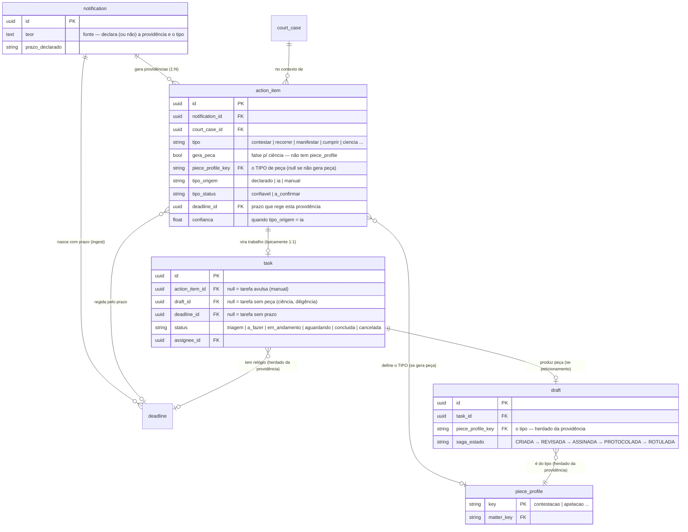
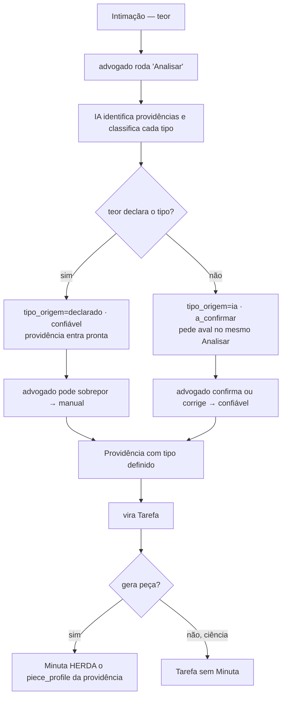

# ERD — Da Intimação à Peça: Providência, Tarefa e Minuta (a costura)

> **Objetivo.** Amarrar num só modelo de relações os três domínios que modelamos separados — **Providência** (`action_item`), **Tarefa** (`task`) e **Peça/Minuta** (`draft`) — e definir **como o tipo de peça é escolhido** a partir da intimação. Fecha o elo que os documentos anteriores tratavam solto: quem gera quem, e onde o `piece_type` nasce.
> **Vocabulário.** `notification` (Intimação), `action_item` (Providência), `task` (Tarefa), `draft` (Minuta), `deadline` (Prazo), `piece_profile` (tipo de peça).

---

## 1. A cadeia — e a desambiguação

"Cada intimação gera um tipo de peça" é impreciso em dois pontos, e desfazer isso define o modelo:

- Uma intimação gera **N providências** (contestar *e* impugnar valor = duas), não uma.
- Nem toda providência gera peça (ciência de despacho não vira peça).

Então a cadeia real é:

```
Intimação ──1:N──▶ Providência ──1:1──▶ Tarefa ──0..1──▶ Minuta
   │                    │                                    │
   └─ nasce com Prazo   └─ carrega o TIPO (se gera peça)     └─ é do tipo (herdado)
```

E o princípio que separa as três entidades: **Providência = diagnóstico** (o que precisa ser feito), **Tarefa = trabalho** (alguém assume e conclui), **Minuta = produto** (a peça em si). Três responsabilidades distintas — o erro seria colapsá-las. O **tipo de peça é atributo da Providência**, não da intimação, porque é a providência que sabe se exige peça e qual.

---

## 2. Modelo de dados (a costura)



### Cardinalidades que importam

- **`notification` 1:N `action_item`** — a intimação 1:N providências.
- **`action_item` 1:1 `task`** — cada providência vira uma tarefa (sub-tarefas via `parent_task_id`, no ERD de tarefas).
- **`action_item` 0..1 `piece_profile`** — a providência aponta o tipo **só se `gera_peca`**. Ciência não aponta.
- **`task` 0..1 `draft`** — a tarefa produz uma Minuta **só se for peticionamento**. Ciência/diligência: `draft_id` nulo.
- **`draft` N:1 `piece_profile`** — a Minuta é de um tipo, **herdado** da providência (não escolhido de novo).
- **`deadline`** é referenciado pela providência (que a rege) e pela tarefa (que a herda) — o prazo nasceu no ingest, ligado à `notification`; providência e tarefa apontam para o mesmo.

---

## 3. Como o tipo de peça é definido — precedência de fontes

Não é "assumir pela intimação" **ou** "deixar o usuário escolher". É a **mesma máquina de três camadas do prazo**, aplicada ao tipo. O `piece_type` vive na `action_item` com `tipo_origem` + `tipo_status`:

| Fonte | `tipo_origem` | `tipo_status` | Comportamento |
|---|---|---|---|
| Teor declara ("apresentar contestação") | `declarado` | `confiavel` | Sistema assume — sem fricção, como o prazo declarado |
| Teor omisso/ambíguo → IA classifica | `ia` | `a_confirmar` | Proposto no "Analisar"; **piso** — exige aval humano |
| Advogado sobrepõe | `manual` | `confiavel` | Override com registro (mesmo no caso declarado, pode discordar) |

Três coisas que isso reusa (não reinventa):

- **A precedência de fontes** — declarado > IA > override — é a mesma do Motor de Prazos. O tipo é só outro campo que segue a hierarquia origem = risco.
- **O piso** — tipo inferido por IA **nunca** vira confiável sozinho; passa por confirmação, como divergência/IA no prazo.
- **O momento de confirmar é o "Analisar".** Classificar o tipo *é* parte de identificar a providência. Quando o advogado roda "Analisar", vê algo como: *"2 providências: Contestação (da intimação) · Impugnação ao valor (sugerida — confirmar)"*. Um gesto: os declarados já aceitos, os inferidos pedindo aval. Não há tela separada de "escolha o tipo".

**A Minuta herda, não re-escolhe.** Quando a tarefa produz a Minuta, o `piece_profile_key` vem da providência. O tipo foi decidido (e confirmado, se preciso) uma vez, na providência; a peça só o consome.

---

## 4. As três entidades — o que cada uma carrega e por que é separada

| | Providência (`action_item`) | Tarefa (`task`) | Minuta (`draft`) |
|---|---|---|---|
| Natureza | Diagnóstico | Trabalho | Produto |
| Responsabilidade | *o que* fazer + o tipo | *quem* faz + estado | *a peça* + saga |
| Vida | Efêmera (vira tarefa e some do foco) | Persistente (ciclo próprio) | Editável (saga da Minuta) |
| Pode existir sem as outras? | — | **Sim** (avulsa: sem providência) | Não (sempre de uma tarefa) |

A prova de que são domínios separados, não um só registro: a **tarefa avulsa** existe sem providência (`action_item_id` nulo), e a **tarefa de ciência** existe sem Minuta (`draft_id` nulo). Se fossem uma entidade só, esses casos não caberiam.

---

## 5. Casos que o modelo acomoda

- **Intimação com N providências de tipos diferentes** → N `action_item`, cada uma com seu `piece_profile`, cada uma virando uma `task`, cada uma podendo gerar sua `draft`. (Contestação + Impugnação = duas peças distintas.)
- **Providência que não gera peça** (ciência) → `action_item.gera_peca = false`, `piece_profile_key` nulo, `task.draft_id` nulo. A tarefa existe (há o quê fazer: dar-se por ciente), mas não há peça.
- **Tarefa avulsa** → `task.action_item_id` nulo; se for peticionamento manual, tem `draft`; se for diligência, não.
- **Tipo declarado vs. a confirmar** → dois `action_item` da mesma intimação podem ter `tipo_status` diferentes; o declarado já entra no fluxo, o inferido espera confirmação — no mesmo "Analisar".

---

## 6. Fluxo — do teor ao tipo confirmado



---

## 7. Questões em aberto

1. **Confiabilidade do teor sobre o tipo.** No prazo, o declarado é bem determinístico (a data está lá). O tipo é mais escorregadio: "para se manifestar" pode ser manifestação, impugnação ou embargos. Se o teor for ambíguo com frequência, o `declarado/confiável` tem alcance menor aqui e mais casos caem no `a_confirmar`. Medir.
2. **Prazo compartilhado entre providências.** Contestar e impugnar valor costumam correr no mesmo prazo. Modelar como um `deadline` referenciado por N `action_item`, ou um `deadline` por providência? O diagrama permite compartilhar; confirmar a regra.
3. **Sub-tarefas vs. providência.** Uma providência complexa desdobra em sub-tarefas (`parent_task_id`) ou a saga da Minuta já cobre o passo-a-passo? (Decidido no design de tarefas: a saga governa; sub-tarefas para o que ela não cobre.)
4. **Reclassificação do tipo depois de gerada a peça.** Se o advogado percebe, com a Minuta pronta, que o tipo estava errado, ele troca o `piece_profile` da peça existente (regenera o miolo) ou descarta e recomeça?
