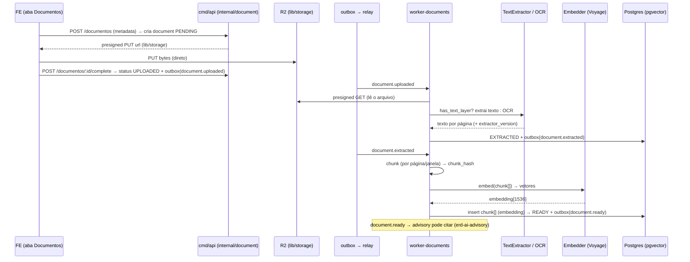

# ERD — Documentos (ingestão, extração, indexação)

> **Status:** desenho (v0 → habilita a aba **Documentos** do Processo e é o **pré-requisito nº1** do
> advisory). Hoje `worker-documents` é esqueleto (mux vazio); `document`/`chunk` têm zero linhas.
> **Fonte de verdade do schema:** `erd-modelo-de-dados.md §5` (`document`, `chunk`). Onde divergir, o
> schema vence. Detalha as **fatias 1–2** de `erd-ai-advisory.md` (ingestão + chunking/embeddings) —
> aquele doc é a arquitetura da IA; este é o **domínio de documentos**.

---

## 1. Contexto & objetivo

Sem documento ingerido, extraído e chunked, **não há o que citar** — e citação é o gate anti-alucinação
do advisory (`erd-ai-advisory.md §1`). Documentos é, portanto, o alicerce: transforma um PDF (dos autos
ou do upload do advogado) em **texto indexado por similaridade** (pgvector), pronto para retrieval.

O schema já codifica a filosofia: `document(origin COURT|UPLOAD, has_text_layer, extractor_version)` +
`chunk(text, embedding vector(1536))`. **Falta o código que preenche** — o pipeline de
ingestão→extração→chunking→embedding — e a superfície que a UI consome (listar, subir, baixar).

**Objetivo:** um slice `internal/document` (+ handlers no `worker-documents`) que (a) recebe um arquivo
por **upload presigned** (v0) ou **download dos autos** (futuro), (b) decide extração de texto vs OCR por
`has_text_layer`, (c) fatia em `chunk` e gera `embedding`, (d) expõe read models para a aba Documentos e
para o retrieval do advisory. Storage e presign já existem em `lib/storage`.

---

## 2. Reuse-check (Regra nº1)

| Procurei por | Achei | Decisão |
|---|---|---|
| storage / presigned URL | `lib/storage`: `PresignedPut(key,ct,ttl)`, `PresignedGet(key,ttl)`, `Exists(key)`, `NewKey(tenantID, prefix)` (S3/R2, aws-sdk-go-v2) | **REUSE** — upload/download direto do FE, sem proxiar bytes |
| worker de documentos | `cmd/worker-documents/main.go` (105 linhas, **mux vazio** — sem handler) | **EXTEND** — registrar handlers do pipeline |
| tabelas | `document` (0001, `origin`, `has_text_layer`, `storage_key` null-enquanto-PENDING, `extractor_version`) + `chunk` (0001, `embedding vector(1536)`, pgvector) | **REUSE** — schema pronto |
| decisão de OCR | coluna `has_text_layer` já existe como flag | **REUSE** — `false` → OCR |
| origem legal do doc | `origin COURT|UPLOAD` — auditor aceita "doc dos autos", não "cliente mandou" | **REUSE** |
| âncora no processo | `document.court_record_id` (nullable — upload avulso não tem) | **REUSE** |
| retrieval | índice pgvector (ivfflat/hnsw) **ainda não criado** — o catálogo diz "quando o retrieval entrar [v1]" | **CREATE** na fatia de embeddings |

Conclusão: **infra de storage pronta**; falta o pipeline (extração/OCR/chunk/embedding), os provedores
externos (OCR + embeddings) atrás de porta, o índice pgvector e os read models.

---

## 3. Princípios (decididos)

1. **O byte nunca passa pela API.** Upload = **presigned PUT** (FE → R2 direto); download = **presigned
   GET**. O BE só orquestra chaves e metadados. `lib/storage` já faz isso.
2. **Origem importa juridicamente.** `origin=COURT` (dos autos) tem peso probatório que `UPLOAD` não tem.
   O advisory cita preferindo COURT. Nunca confundir os dois.
3. **Extração barata antes de OCR caro.** PDF com camada de texto (`has_text_layer=true`) → extração
   direta (sem custo de OCR). Só o escaneado (`false`) vai para OCR. Decisão é por-documento e registrada.
4. **Provedor externo atrás de porta.** OCR e embeddings entram por interface (`TextExtractor`,
   `Embedder`) — o domínio não conhece o SDK. Troca de provedor não toca o slice.
5. **Idempotência + versão.** `extractor_version` e um `embedding_model`/`dim` registrados: reprocessar
   com extrator/modelo novo é rastreável e não duplica (dedup por `(document_id, page, chunk_hash)`).
6. **Isolamento de tenant no retrieval.** Todo `chunk` recuperado tem que pertencer a um `document` do
   `court_record` do tenant (barreira app + RLS). Vazamento aqui = vazamento de autos.
7. **Estado observável (saga).** O documento caminha por estados explícitos (`PENDING → UPLOADED →
   EXTRACTING → EXTRACTED → CHUNKED → READY` / `FAILED`), como a saga do draft. `storage_key` null = ainda
   não subiu.

---

## 4. Modelo de dados (referência ao catálogo)

Sem DDL novo estrutural — `document` e `chunk` (`erd-modelo-de-dados.md §5`) servem. Notas e **deltas
propostos** (a confirmar no catálogo):

- **`document`** — deltas para observabilidade do pipeline:
  - `status text` — `PENDING|UPLOADED|EXTRACTING|EXTRACTED|CHUNKED|READY|FAILED` (hoje o estado é
    inferido de `storage_key`/`extracted_at`; explicitar ajuda a UI e a retomada).
  - `mime_type text`, `size_bytes bigint`, `checksum text` (sha256) — para dedup de upload e integridade.
  - `title text` / `original_filename text` — o que a UI mostra.
  - `error jsonb` (nullable) — por que falhou a extração/OCR.
- **`chunk`** — deltas para retrieval versionado:
  - `embedding_model text` + `dim int` — qual modelo/versão gerou o vetor (o schema fixa `vector(1536)`;
    ver §5 sobre a escolha do provedor). `chunk_hash text` para dedup no reprocessamento.
  - **Índice de similaridade** (CREATE nesta fatia): `hnsw` (melhor recall/latência) ou `ivfflat` sobre
    `embedding vector_cosine_ops`. Decidir por volume (HNSW recomendado).
- **Chave de storage:** `NewKey(tenantID, "documents")` → `documents/{tenant}/{uuid}` — nunca nome do
  arquivo do usuário no path (evita colisão/entropia previsível).

---

## 5. Integrações necessárias

| Integração | Papel | Porta / recomendação |
|---|---|---|
| **Object storage (Cloudflare R2 / S3)** | guardar o arquivo; presigned PUT/GET | ✅ `lib/storage` pronto |
| **Extração de texto (PDF com camada)** | pegar texto sem OCR | 🟡 novo — `pdftotext`/`pdfcpu` (self-host, barato) atrás de `TextExtractor` |
| **OCR (PDF escaneado, `has_text_layer=false`)** | transcrever imagem → texto | 🟡 novo — **opções**: AWS Textract, Google Document AI, ou **Claude vision** (o SDK Anthropic já entra pelo advisory; Claude lê PDF/imagem nativamente). Recomendo começar com **Claude vision** (menos um provedor) e medir custo/qualidade; Textract/Doc AI como fallback de escala |
| **Embeddings** | vetor por chunk (pgvector) | 🟡 novo — ⚠️ **decisão real**: Anthropic **não** tem modelo de embedding. O schema fixa `vector(1536)`. Opções: **Voyage AI** (recomendado pela Anthropic; `voyage-3`/`voyage-law-2` — há um modelo **jurídico**), OpenAI `text-embedding-3-small` (1536), Cohere. **Recomendo Voyage `voyage-law-2`** (domínio jurídico) atrás de `Embedder`, ajustando `dim` no schema se ≠1536 |
| **Autos / inteiro teor (COURT)** | baixar os documentos do processo do tribunal | 🔴 **futuro/hard** — DATAJUD **não** entrega documentos; exige PJe/**MNI**, eSAJ, Projudi, ou o `source_url` do DJEN (link profundo, muitas vezes atrás de login/captcha). v0 vive de **UPLOAD**; COURT auto-download é uma fatia grande à parte |
| **Antivírus / validação de upload** | rejeitar arquivo malicioso/não-PDF | 🟡 recomendado — checar mime/tamanho no presign; scan opcional |

**Realidade do v0:** o caminho **UPLOAD** (advogado sobe o PDF) é o construível e destrava o advisory.
O caminho **COURT** (baixar os autos automaticamente) é integração pesada por-tribunal — projetar a porta
`DocumentSource`, mas entregar UPLOAD primeiro.

---

## 6. Arquitetura / pipeline

Escrita sempre em tx + outbox. Cada etapa idempotente (`processed_event`), retomável pelo `status`.

---

## 7. Eventos (contratos outbox)

**Produz:**
- `document.uploaded {document_id, tenant_id, court_record_id?, storage_key, mime_type}`
- `document.extracted {document_id, pages, has_text_layer, extractor_version}`
- `document.ready {document_id, chunk_count, embedding_model}` → **habilita o advisory** (grounding)
- `document.failed {document_id, stage, error}`

**Consome (futuro, caminho COURT):**
- `acquisition.court_record_observed` / um `acquisition.document_discovered` → dispara download dos autos
  quando a integração de inteiro teor existir.

Todos com `trace_context` + `event_id`.

---

## 8. API (borda) — o que a tela consome

Envelope `{data, page}`, `tenant_id` do principal + RLS:

- **`GET /v1/processos/:id/documentos`** — documentos de um processo (aba Documentos): `title`,
  `document_type`, `origin` (COURT/UPLOAD com selo), `pages`, `status`, `created_at`.
- **`POST /v1/documentos`** — inicia upload: cria `document` PENDING e devolve **presigned PUT** +
  `document_id`. Body: `{court_record_id?, document_type, title, mime_type, size_bytes}`.
- **`POST /v1/documentos/:id/complete`** — confirma o upload (valida `Exists` no storage) → `UPLOADED` +
  `document.uploaded`.
- **`GET /v1/documentos/:id/download`** — **presigned GET** (TTL curto) para visualizar/baixar.
- **`DELETE /v1/documentos/:id`** — remove (soft, com auditoria) — só `UPLOAD`, nunca apaga doc dos autos.
- **`GET /v1/documentos/:id`** — detalhe + status do pipeline (para o "processando…").
- (interno) retrieval de chunks para o advisory — **não é rota pública**; é chamada do worker-ai por
  similaridade + filtro de tenant/court_record.

---

## 9. Frontend

- **Aba Documentos do processo** (`/processos/:id`): tabela com `title`, tipo, **selo de origem**
  (COURT = "dos autos" / UPLOAD = "enviado"), páginas, data, status. Ações: **Enviar documento**
  (upload presigned com barra de progresso), **baixar/visualizar** (presigned GET, viewer inline),
  **excluir** (só upload). Estado "processando…" enquanto extrai/indexa (`document.ready` invalida a
  query — via notifications/SSE).
- **Upload:** botão → escolhe PDF → `POST /documentos` → PUT direto no R2 (progress) → `complete`. Sem
  bytes pela API. Validação de mime/tamanho antes do presign.
- **Estados:** empty ("nenhum documento — envie os autos ou uma peça para a IA fundamentar"), loading
  (skeleton), erro (`{kind,message,details}`), item FAILED com "reprocessar".
- **Ligação com Peças:** o editor de peça (`/pecas/:id`, `erd-pecas.md`) lê estes documentos como base
  do RAG; a citação da revisão aponta de volta para o `document`/`chunk` (deep-link para a página).

---

## 10. Pontos de falha & decisões em aberto

| Risco / gap | Ataque |
|---|---|
| Sem autos automáticos (COURT) | v0 vive de UPLOAD; porta `DocumentSource` pronta para MNI/eSAJ depois |
| OCR caro/lento na escala | Claude vision primeiro (menos provedor), medir; Textract/Doc AI como fallback; só escaneado vai a OCR |
| Embedding provider/dim | Voyage `voyage-law-2` recomendado; **confirmar `dim`** e alinhar `vector(N)` no schema |
| PDF gigante (milhares de páginas) | chunk por página + janela; sumarização em camadas no advisory (não despejar tudo) |
| Vazamento entre tenants | filtro `tenant_id` + RLS + citação tem que pertencer ao `court_record`; chave de storage por-tenant |
| Reprocessamento duplicando chunks | `chunk_hash` + `extractor_version`/`embedding_model` → dedup e regravação limpa |
| Upload malicioso | validar mime/tamanho no presign; scan opcional |

**Decisões em aberto:**
- **Embeddings:** Voyage (jurídico) × OpenAI × Cohere → fixa `dim` e ajusta `vector(N)` no catálogo.
- **OCR:** Claude vision × Textract × Document AI (custo × qualidade em escaneado ruim).
- **Índice pgvector:** HNSW × IVFFlat (recomendo HNSW) e parâmetros.
- **Deltas de `document`/`chunk`** (`status`, `mime_type`, `checksum`, `title`, `embedding_model`, `dim`,
  `chunk_hash`) — confirmar no catálogo.
- COURT auto-download: qual tribunal/protocolo primeiro (MNI? eSAJ?) — fatia própria, fora do v0.

---

## 11. Ordem de implementação (fatias verticais)

Cada fatia = slice pequeno, verde, `pm-plan → dev-qa (TDD) → code-review → merge`. É a **fatia 1–2** do
`erd-ai-advisory.md` — gargalo que destrava tudo do advisory.

1. **`internal/document` — upload + storage.** `POST /documentos` (presigned PUT), `complete`, `GET
   download`, `GET /processos/:id/documentos`, `DELETE`. Migration com os deltas de `document`. **FE: aba
   Documentos** com upload/download reais. *(Já entrega valor visível sem IA.)*
2. **worker-documents — extração de texto** (PDF com camada). Listener `document.uploaded` →
   `TextExtractor` → `document.extracted`. `extractor_version`.
3. **OCR** (`has_text_layer=false`) atrás da mesma porta (Claude vision v0).
4. **Chunking + embeddings + índice pgvector.** `Embedder` (Voyage) → `chunk` + `embedding` + HNSW →
   `document.ready`. Retrieval interno (top-k por similaridade, filtro tenant/court_record).
5. **Ligação com advisory** (`erd-ai-advisory.md`/`erd-pecas.md`): o `document.ready` é o gatilho de
   grounding; a citação da revisão deep-linka para `document`/página.
6. **COURT auto-download** (futuro): porta `DocumentSource` por-tribunal (MNI/eSAJ) — fatia grande à parte.
