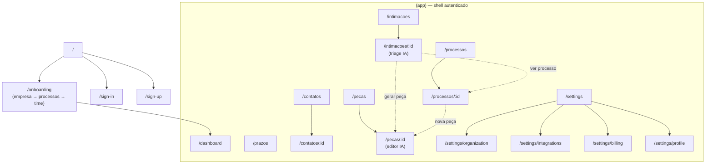
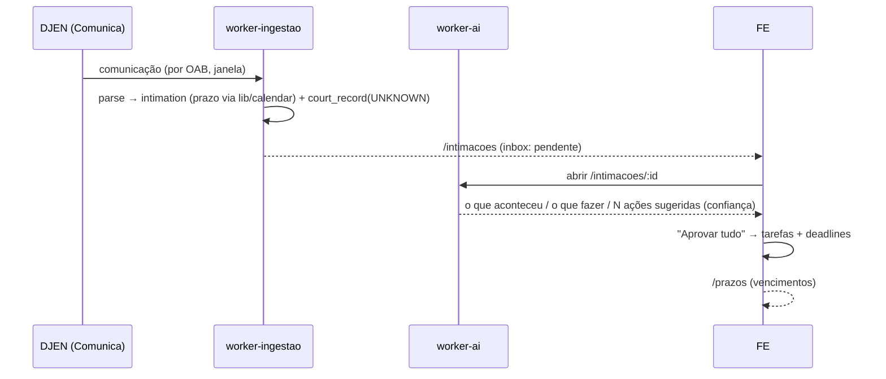

# ERD — Frontend (site map & fluxos)

Mapa da aplicação web (Next.js 16, App Router/RSC · Tailwind v4 · shadcn/ui ·
Clerk · React Query) do repo `jus-assessoria-automatizada-fe`: as rotas, a
navegação, os fluxos de usuário — o que cada fluxo faz, **quais páginas toca** e
como casa com o backend (endpoints/eventos/domínios de `docs/erd-backend.md` e
`docs/erd-modelo-de-dados.md`).

**Fonte de verdade da UI é este doc.** Onde o código e este doc divergirem, o doc
vence (mesma regra dos outros ERDs).

**Status das telas:** `✅ v0` = ligada ou a ligar no back-end desta fundação ·
`🟡 prévia` = layout de referência já scaffoldado, sem back-end (fatia futura).
A cadeia de valor do produto é: **capturar → triar (IA) → consolidar → prazo →
produzir peça**. A navegação segue essa ordem.

---

# 0. Anatomia do shell

- **Route groups**
  - `(auth)` — telas públicas do Clerk: `/sign-in`, `/sign-up`.
  - `onboarding` — fora do shell, exige só sessão (sem org): `/onboarding`.
  - `(app)` — tudo autenticado, dentro do `AppShell` (sidebar + header).
- **Gating** (`(app)/layout.tsx`, Server Component): verdade única é
  `GET /v1/identity/me → onboarding_completed_at`. Sem sessão → `/sign-in`; sem
  onboarding concluído → `/onboarding`. **Não** gateia por `auth().orgId` (ver
  [[onboarding-gating-orgid-loop]] no histórico: causava loop no refresh).
- **`EnsureActiveOrg`** (client): reidrata a org ativa do Clerk quando a sessão
  volta sem org (Membership optional), pras telas org-scoped e o Auth strict do BE.
- **`AppShell`**: sidebar sticky (identidade da org no topo · nav principal ·
  Configurações no rodapé) + header enxuto (UserMenu). Wordmark removido; rodapé
  "v0 · AtJud".

---

# 1. Site map

---

# 2. Navegação (sidebar)

Fonte única em `src/components/shell/nav-config.ts` (`NAV_ITEMS`). Ordem = cadeia
de valor. Configurações vive no **rodapé** (seção separada), não na nav principal.

| Ordem | Item | Rota | Ícone |
|---|---|---|---|
| 1 | Dashboard | `/dashboard` | LayoutDashboard |
| 2 | Intimações | `/intimacoes` | Inbox |
| 3 | Processos | `/processos` | FolderOpen |
| 4 | Prazos | `/prazos` | CalendarClock |
| 5 | Contatos | `/contatos` | Users |
| 6 | Peças | `/pecas` | FileText |
| rodapé | Configurações | `/settings` | Settings |

**Cortado do legado ADVBOX** (fora do foco do AtJud): CRM/funil de vendas,
gamificação (taskscore/pontos/metas), Parceiros, Agenda separada (virou Prazos).

---

# 3. Catálogo de páginas

| Rota | Tela | Status | Consome do BE (destino) |
|---|---|---|---|
| `/sign-in`, `/sign-up` | Auth (Clerk headless, menos o login) | ✅ v0 | Clerk |
| `/onboarding` | Wizard: empresa → processos → time | ✅ v0 | Clerk (org/convite) · `PUT /v1/organization/profile` · `POST /v1/acquisition/integrations` · webhook provisiona tenant |
| `/dashboard` | Visão geral (cards de resumo) | ✅ v0 | read models: processos, prazos, publicações |
| `/intimacoes` | Inbox das intimações capturadas | ✅ v0 | read model sobre `intimation` (saída do DJEN) |
| `/intimacoes/:id` | **Triage IA** (o que aconteceu / o que fazer / ações→tarefas com prazo) | ✅ v0 | `intimation` + análise `worker-ai` + `deadline` + link do processo (consolidação) |
| `/processos` | Lista + resumo | ✅ v0 | read model sobre `court_case`/`court_record` |
| `/processos/:id` | Detalhe (abas Resumo/Andamentos/Intimações/Prazos/Peças/Documentos) | ✅ v0 | `court_record` + `docket_entry` + `intimation` + `deadline` |
| `/prazos` | Agenda (calendário + próximos vencimentos) | ✅ v0 | read model sobre `deadline` |
| `/contatos` | Lista de contatos/partes | 🟡 prévia | `contact` (v1); hoje partes em `intimation.recipients` |
| `/contatos/:id` | Ficha da parte | 🟡 prévia | idem |
| `/pecas` | Biblioteca + iniciar peça | 🟡 prévia | domínio advisory (`draft`) |
| `/pecas/:id` | Editor de minuta com IA (revisão + citações + cobertura) | 🟡 prévia | `draft` → `review` → `petition` + `document`/`chunk` (RAG) |
| `/settings/organization` | Perfil fiscal da org (logo, CNPJ, endereço) | ✅ v0 | Clerk org · `GET/PUT /v1/organization/profile` |
| `/settings/integrations` | Fontes/monitoramento (OABs, DJEN/DATAJUD) | ✅ v0 | `POST /v1/acquisition/integrations` (scope.oab) · `GET /v1/acquisition/integrations` |
| `/settings/billing` | Assinatura | ✅ v0 | `billing` (Stripe) |
| `/settings/profile` | Conta/segurança (e-mails, sessões, 2FA) | ✅ v0 | Clerk (headless) |

---

# 4. Fluxos

Cada fluxo: **objetivo · páginas tocadas · passos · casamento com o BE.**

## F1 — Sign-up & Onboarding
**Objetivo:** nascer o tenant (escritório) e destravar o app.
**Páginas:** `/sign-up` → `/onboarding` → `/dashboard`.
**Passos:** cadastro (Clerk) → wizard **empresa** (logo/CNPJ com lookup/endereço) →
**processos** (nº ou OAB a monitorar) → **time** (convites em lote, "Concluir"
envia todos) → dashboard.
**BE:** Clerk `createOrganization`/`inviteMember`; webhook (svix) provisiona
`tenant`/`app_user`/`membership`; `PUT /v1/organization/profile`; ativa fonte via
`POST /v1/acquisition/integrations`. Gate libera quando
`/me.onboarding_completed_at` preenche. Ver [[onboarding-flow-v1]].

## F2 — Captura → Triage IA → Prazo  ⭐ (o coração)
**Objetivo:** transformar uma publicação do DJEN em ação com prazo, sem o
advogado vasculhar diário.
**Páginas:** `/intimacoes` (inbox) → `/intimacoes/:id` (triage) → `/prazos`.

**Passos:** inbox lista as intimações capturadas (Processo, Publicação, Tribunal,
nº, Situação) → abrir uma abre a **triage IA**: resumo, recomendação e **ações
sugeridas** (cada uma vira tarefa com início/fim calculados no calendário
forense, toggle dias úteis/corridos) → "Criar tarefa"/"Aprovar tudo" → os prazos
aparecem em `/prazos`.
**BE:** `intimation` (fatia DJEN) · datas via `lib/calendar` · análise do
`worker-ai` · `deadline` · o link intimação↔processo é a **consolidação**
("Desvincular processo"). Ver [[acquisition-connectors-design]].

## F3 — Consolidação & Processo
**Objetivo:** ver o processo unificado (todas as fontes/graus num só).
**Páginas:** `/processos` → `/processos/:id`.
**Passos:** lista os `court_case` → detalhe com abas: **Andamentos**
(`docket_entry`, DATAJUD), **Intimações** (`intimation`, DJEN), **Prazos**
(`deadline`), **Peças**, **Documentos**, + dados do tribunal (classe, órgão,
grau, sigilo).
**BE:** `court_case`/`court_record` (natural key tenant+cnj+grau) — o DATAJUD
reconcilia o `degree=UNKNOWN` deixado pelo DJEN (placeholder+merge).

## F4 — Peticionamento com IA
**Objetivo:** redigir a peça que a IA recomendou, fundamentada nos autos.
**Páginas (entradas):** de `/intimacoes/:id` (ação sugerida "gerar peça") **ou**
`/processos/:id` (aba Peças) **ou** `/pecas` → `/pecas/:id` (editor).
**Passos:** IA gera a minuta a partir dos autos → painel de **revisão** (achados
com **citação** dos autos + cobertura verificado/não-verificado) → assinar →
protocolar → acompanhar resultado.
**BE:** advisory `draft`→`review`→`petition`; `document`/`chunk` (RAG) via
`worker-ai`/`worker-documents`. **v1+** (depende da ingestão de documentos).

## F5 — Contatos
**Objetivo:** ficha das partes/clientes. **Páginas:** `/contatos` → `/contatos/:id`.
**BE:** `contact` first-class é **decisão de v1**; hoje as partes vivem em
`intimation.recipients` (jsonb). 🟡 prévia.

## F6 — Configurações & Monitoramento
**Objetivo:** perfil da org, fontes monitoradas, assinatura, conta.
**Páginas:** `/settings/{organization,integrations,billing,profile}`.
**Passos-chave:** **Integrações** ativa a captura — cadastra OABs (scope) e a
fonte (DJEN/DATAJUD) → `POST /v1/acquisition/integrations` → alimenta o F2. É o
"Termos monitorados" adaptado.
**BE:** `GET/PUT /v1/organization/profile`; `integration` (acquisition);
`billing` (Stripe); Clerk (conta/segurança headless).

---

# 5. Estados transversais (toda tela org-scoped)

- **Loading**: React Query `isPending`/`is<Campo>Loading`; skeletons; campos
  desabilitados durante fetch (ver [[fe-iteration-workflow]]).
- **Empty**: `ComingSoon`/empty-state explicando o gatilho ("ative uma fonte…",
  "aprove as ações de uma intimação…").
- **Erro**: shape único do BE `{kind,message,details}`; 5xx vira mensagem
  genérica, 4xx mostra `message`.
- **Máscaras**: CNPJ/CEP/telefone na apresentação; payload em dígitos.

---

# 6. Roadmap (por página)

- **v0 (fundação):** shell, onboarding, Configurações, Intimações (inbox +
  triage), Processos (lista + detalhe), Prazos, Dashboard — ligando ao BE
  conforme as fatias DJEN/DATAJUD/deadline aterrissam.
- **v1+:** Contatos first-class, Peças/peticionamento (advisory), produtividade
  (tarefas/agenda ricas).

As telas 🟡 prévia já existem scaffoldadas (navegáveis, com layout de referência)
pra alinhar o destino antes da implementação.
