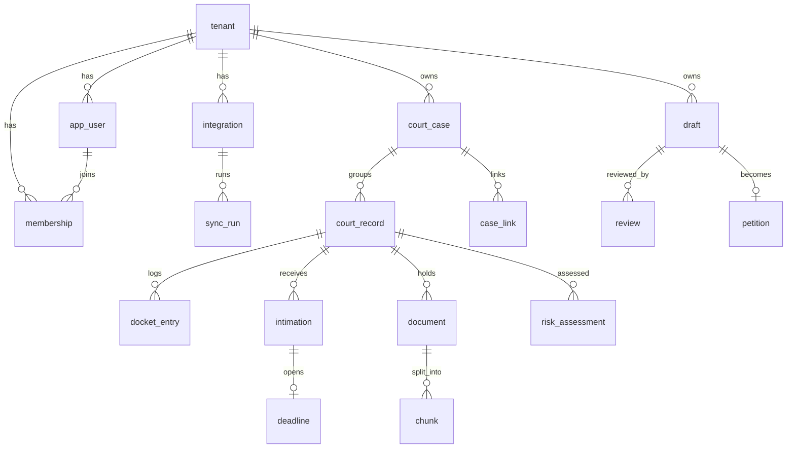

# ERD — Modelo de Dados (catálogo)

> A fonte única de verdade do schema. Toda tabela do sistema vive aqui, com colunas, tipos, índices e o porquê das decisões que carregam peso.
> **Identificadores de código em inglês** (tabelas, colunas, tipos, enums). O texto explicativo segue em português; os nomes técnicos, não.
> Os ERDs de bloco (Acquisition, Consolidation, Advisory, Support) **referenciam** este catálogo em vez de repetir DDL.
> Escopo: **[v0]** existe no lançamento · **[v1+]** tabela desenhada, criada quando o bloco entrar.

---

# 0. Vocabulário de domínio (PT → código EN)

| Domínio (PT) | Código (EN) |
|---|---|
| Processo (a lide) | `court_case` (tabela) · `Case` (tipo Go) |
| Tramitação | `court_record` |
| Movimento | `docket_entry` |
| Intimação | `intimation` |
| Prazo | `deadline` |
| Documento | `document` |
| Minuta | `draft` |
| Petição | `petition` |
| Revisão (parecer da IA) | `review` |
| Avaliação de risco | `risk_assessment` |
| Integração | `integration` |
| Pasta (read model) | `case_folder` |
| Vínculo entre tramitações | `case_link` |
| Execução de sync | `sync_run` |

`docket_entry` = termo técnico-jurídico em inglês para o registro cronológico de andamentos. `court_record` para tramitação (evita colidir com `filing`, o ato de protocolar).

---

# 1. Mapa das tabelas

```
IDENTITY        tenant · app_user · membership
ACQUISITION     integration · sync_run
CONSOLIDATION   court_case · court_record · docket_entry · intimation · case_link
DOCUMENTS       document · chunk
ADVISORY        draft · review · petition
DEADLINES       deadline · holiday
RISK     [v1+]  risk_assessment
INFRA           outbox · processed_event · backfill_job
```

Relacionamento das entidades de domínio:



Convenções globais:
- **PK** `uuid` com `gen_random_uuid()`, exceto `outbox` (bigserial — ordem de publicação).
- **`tenant_id`** em toda tabela que o usuário toca; FK para `tenant`. Base do isolamento (app filter + RLS).
- **timestamps** `timestamptz`; datas processuais puras (`date`) onde hora não importa.
- **enums como `text`** com CHECK/validação na aplicação, não `enum` nativo (migração de enum nativo é dolorosa; text evolui fácil).

---

# 2. Identity

## tenant [v0]
Espelha a Clerk Organization. É o escritório.

```sql
CREATE TABLE tenant (
  id                      uuid PRIMARY KEY DEFAULT gen_random_uuid(),
  clerk_org_id            text NOT NULL UNIQUE,   -- ponte com o Clerk
  name                    text NOT NULL,          -- nome da org no Clerk (sincronizado)
  -- perfil da empresa, preenchido no passo 2 do onboarding (todas nullable):
  cnpj                    text,
  legal_name              text,                   -- razão social
  trade_name              text,                   -- nome fantasia
  address                 jsonb,                  -- {cep,logradouro,numero,complemento,bairro,cidade,uf}
  phone                   text,                   -- telefone do escritório (opcional); é da empresa, não do user
  email                   text,                   -- e-mail do escritório (opcional); é da empresa, não do user
  onboarding_completed_at timestamptz,            -- setado ao concluir o passo 2 (gate do shell)
  created_at              timestamptz NOT NULL DEFAULT now()
);
```
`id` aparece em toda FK do sistema; `clerk_org_id` é só a ponte — trocar de provedor de auth muda a ponte, não o schema. Os campos fiscais (`cnpj`/`legal_name`/`trade_name`/`address`) vivem só aqui; o Clerk guarda apenas o `name`.

## app_user [v0]
Espelha o Clerk User, vinculado ao tenant (1 user = 1 escritório). `clerk_user_id UNIQUE` impõe fisicamente esse modelo no v0.

```sql
CREATE TABLE app_user (
  id            uuid PRIMARY KEY DEFAULT gen_random_uuid(),
  clerk_user_id text NOT NULL UNIQUE,
  tenant_id     uuid NOT NULL REFERENCES tenant(id),
  email         text NOT NULL,
  name          text,
  phone         text,                             -- opcional (onboarding via unsafe_metadata)
  role          text NOT NULL DEFAULT 'LAWYER',   -- ADMIN | LAWYER
  created_at    timestamptz NOT NULL DEFAULT now()
);
CREATE INDEX ON app_user (tenant_id);
```

## membership [v0]
O vínculo de um usuário a um escritório e seu ciclo de vida. Hoje `app_user` já carrega `tenant_id`+`role` (1 user = 1 org), mas `membership` reifica a relação para guardar o `clerk_membership_id` (reconciliação com o Clerk), o `status` (soft-remove) e preparar N membros/multi-org. `role` é espelhado em `app_user.role` (fonte de autorização do `ResolvePrincipal`).

```sql
CREATE TABLE membership (
  id                  uuid PRIMARY KEY DEFAULT gen_random_uuid(),
  tenant_id           uuid NOT NULL REFERENCES tenant(id),
  app_user_id         uuid NOT NULL REFERENCES app_user(id),
  clerk_membership_id text UNIQUE,                -- ponte com o organizationMembership do Clerk
  role                text NOT NULL,              -- ADMIN | LAWYER
  status              text NOT NULL DEFAULT 'ACTIVE',   -- ACTIVE | REMOVED (soft-delete)
  joined_at           timestamptz NOT NULL DEFAULT now(),
  removed_at          timestamptz,
  UNIQUE (tenant_id, app_user_id)
);
CREATE INDEX ON membership (tenant_id);
```
Fluxo: `organizationMembership.created` (Clerk) → upsert membership `ACTIVE` + `identity.member_joined`; `.deleted` → `status=REMOVED` + `member_removed`; `.updated` → sincroniza `role`.

---

# 3. Acquisition

## integration [v0]
Assinatura de uma fonte de dados para um tenant. Aponta para uma **fonte**, não um tribunal.

```sql
CREATE TABLE integration (
  id             uuid PRIMARY KEY DEFAULT gen_random_uuid(),
  tenant_id      uuid NOT NULL REFERENCES tenant(id),
  source         text NOT NULL,           -- DATAJUD | DJEN | UPLOAD  (v1+: MNI, ESAJ...)
  scope          jsonb NOT NULL,          -- { oab: [], taxId: [] }
  credential_ref text,                    -- ponteiro p/ cofre; null na v0
  status         text NOT NULL DEFAULT 'ACTIVE',  -- ACTIVE|DEGRADED|AUTH_FAILED|DISABLED
  created_at     timestamptz NOT NULL DEFAULT now(),
  UNIQUE (tenant_id, source)
);
```
`credential_ref` é ponteiro — segredo cifrado no cofre, nunca aqui em claro. `scope.oab` é lista (OAB pessoal + sociedade + suplementar).

## sync_run [v0]
Registro auditável de cada execução de sincronização. Responde "por que o processo não apareceu".

```sql
CREATE TABLE sync_run (
  id                uuid PRIMARY KEY DEFAULT gen_random_uuid(),
  tenant_id         uuid NOT NULL REFERENCES tenant(id),
  court_record_id   uuid REFERENCES court_record(id),   -- null em descoberta por OAB
  integration_id    uuid NOT NULL REFERENCES integration(id),
  connector_id      text NOT NULL,
  connector_version text NOT NULL,
  started_at        timestamptz NOT NULL,
  finished_at       timestamptz,
  status            text NOT NULL,        -- RUNNING | OK | FAILED
  items_new         int NOT NULL DEFAULT 0,
  items_deduped     int NOT NULL DEFAULT 0,
  raw_payload_refs  jsonb NOT NULL DEFAULT '[]',
  error             jsonb,
  window_from       date,                 -- janela da fatia sincronizada (null quando não há) [0019]
  window_to         date                  -- exibida na tela de reconciliações [0019]
);
CREATE INDEX ON sync_run (tenant_id, started_at);
```

---

# 4. Consolidation

## case [v0]
A lide. O que **nós** sabemos — sem dado de tribunal. Quase não muda.

```sql
CREATE TABLE court_case (
  id                    uuid PRIMARY KEY DEFAULT gen_random_uuid(),
  tenant_id             uuid NOT NULL REFERENCES tenant(id),
  label                 text,
  primary_court_record_id uuid,                  -- dica de UI, não verdade
  merged_into_id        uuid REFERENCES court_case(id),  -- fusão nunca deleta [v1+]
  created_at            timestamptz NOT NULL DEFAULT now()
);
CREATE INDEX ON court_case (tenant_id);
```
A tabela chama-se `court_case` (não `case`) porque `case` é palavra reservada em SQL — evita aspas em todo query. O código Go usa o tipo `Case` normalmente; só o nome da tabela leva o prefixo.

## court_record [v0]
`(cnj_number, degree, court)`. O que **o tribunal** sabe. Centro de gravidade técnico — quase toda escrita.

```sql
CREATE TABLE court_record (
  id             uuid PRIMARY KEY DEFAULT gen_random_uuid(),
  tenant_id      uuid NOT NULL REFERENCES tenant(id),
  case_id        uuid NOT NULL REFERENCES court_case(id),
  cnj_number     text NOT NULL,           -- sem máscara
  degree         text NOT NULL,           -- G1|G2|JE|SUPERIOR|UNKNOWN
  court          text NOT NULL,
  class          text,
  subject        text,
  filed_at       date,                    -- ajuizamento (DATAJUD dataAjuizamento) [0012]
  judging_body   text,                    -- órgão julgador (DATAJUD orgaoJulgador / DJEN nomeOrgao) [0012]
  claim_value    numeric(15,2),
  secrecy        text NOT NULL DEFAULT 'PUBLIC',    -- PUBLIC|RESTRICTED|SECRET
  lifecycle      text NOT NULL DEFAULT 'ACTIVE',    -- ACTIVE|SUSPENDED|ARCHIVED|SUPERSEDED
  completeness   real NOT NULL DEFAULT 0,
  sync_policy    jsonb NOT NULL DEFAULT '{}',
  next_sync_at   timestamptz,
  last_synced_at jsonb NOT NULL DEFAULT '{}',       -- Record<Source, Date>
  UNIQUE (tenant_id, cnj_number, degree)
);
CREATE INDEX ON court_record (next_sync_at) WHERE lifecycle = 'ACTIVE';  -- a query mais quente
CREATE INDEX ON court_record (tenant_id, case_id);
```
A chave é a tripla — nenhum campo sozinho identifica. O índice parcial serve o scheduler (roda a cada 60s).

**Descoberta por DJEN aterrissa `degree=UNKNOWN`** (o DJEN não informa o grau). Quando o DATAJUD revela o grau, a consolidação faz *placeholder+merge*: acha/cria o `court_record` do grau real no mesmo `court_case`, re-aponta `intimation`/`docket_entry` pra ele e marca o UNKNOWN `lifecycle=SUPERSEDED`. Como a unicidade de `intimation` é `(tenant, case_id, hash)`, trocar o `court_record_id` não quebra dedup. (decisão dos conectores DJEN/DATAJUD, 0012)

## docket_entry [v0]
A linha do log de andamentos. A tabela que mais cresce (~10M linhas/ano em escala).

```sql
CREATE TABLE docket_entry (
  id              uuid PRIMARY KEY DEFAULT gen_random_uuid(),
  court_record_id uuid NOT NULL REFERENCES court_record(id),
  hash            text NOT NULL,          -- sha256(court|number|degree|date|text)
  occurred_at     timestamptz NOT NULL,   -- quando o tribunal fez → cálculo de domínio
  observed_at     timestamptz NOT NULL,   -- quando descobrimos → ordem e idempotência
  source          text NOT NULL,
  fidelity        int NOT NULL,
  tpu_code        int,                     -- código da Tabela Processual Unificada
  complements     jsonb,
  text            text NOT NULL,
  retracted_at    timestamptz,            -- nunca deletar, só marcar
  UNIQUE (court_record_id, hash)
);
CREATE INDEX ON docket_entry (court_record_id, occurred_at);
CREATE INDEX ON docket_entry (tpu_code);
```
As **duas datas** são o ponto mais importante do schema. Particionar por range de `occurred_at` quando passar de ~20M linhas.

## intimation [v0]
Intimação — aviso judicial que abre prazo. Dedup no escopo do **case** (chega por várias fontes).
Criada como `notification` na 0001 e **renomeada para `intimation` na 0006** (o nome `notification`
passou a ser do domínio de avisos ao usuário — `internal/notifications`).

```sql
CREATE TABLE intimation (
  id                uuid PRIMARY KEY DEFAULT gen_random_uuid(),
  tenant_id         uuid NOT NULL REFERENCES tenant(id),
  case_id           uuid NOT NULL REFERENCES court_case(id),
  court_record_id   uuid NOT NULL REFERENCES court_record(id),
  hash              text NOT NULL,
  made_available_at date NOT NULL,        -- o que a API entrega (disponibilização)
  published_at      date NOT NULL,        -- derivado: 1º dia útil seguinte
  deadline_start_at date NOT NULL,        -- derivado: 1º dia útil após publicação
  content           text NOT NULL,        -- teor
  source            text NOT NULL,
  source_url        text,                 -- link profundo no tribunal (DJEN 'link') [0012]
  type              text,                 -- INTIMACAO|CITACAO|COMUNICACAO (DJEN tipoComunicacao) [0012]
  status            text NOT NULL DEFAULT 'ACTIVE',  -- ACTIVE|CANCELLED|SUPERSEDED [0012]
  cancelled_at      date,                 -- DJEN data_cancelamento [0012]
  cancel_reason     text,                 -- DJEN motivo_cancelamento [0012]
  recipients        jsonb NOT NULL DEFAULT '[]',
  UNIQUE (tenant_id, case_id, hash)
);
```
As três datas são derivadas no parser via `lib/calendar` (`published_at` = 1º dia útil após a disponibilização; `deadline_start_at` = 1º dia útil após a publicação, CPC 224). **`status` torna o upsert `DO UPDATE`**: quando o DJEN cancela/retifica (`data_cancelamento`), a intimação vira `CANCELLED` e emite `intimation.cancelled` para a slice de prazos **revogar** o `deadline` — sem isso, prazo fantasma. `type` alimenta a regra de contagem (citação × intimação). (conectores DJEN/DATAJUD, 0012)

## case_link [v0 (só DETERMINISTIC)]
Liga duas court_records da mesma lide. Registra **por que**; não é o mecanismo de agrupamento (isso é `court_record.case_id`).

```sql
CREATE TABLE case_link (
  id                    uuid PRIMARY KEY DEFAULT gen_random_uuid(),
  tenant_id             uuid NOT NULL REFERENCES tenant(id),
  from_court_record_id  uuid NOT NULL REFERENCES court_record(id),
  to_court_record_id    uuid NOT NULL REFERENCES court_record(id),
  type                  text NOT NULL,    -- APPEAL_OF|SUPERIOR_APPEAL_OF|REDISTRIBUTED_FROM|INCIDENT_OF|LETTER_ROGATORY_OF|RELATED_TO
  confidence            text NOT NULL,    -- v0: só DETERMINISTIC (v1+: DECLARED, INFERRED)
  source                text,
  evidence              text NOT NULL,
  confirmed_by          uuid,             -- app_user, quando confirmação humana [v1+]
  confirmed_at          timestamptz,
  UNIQUE (from_court_record_id, to_court_record_id, type)
);
```
O `type` controla o `lifecycle` da origem (appeal→SUSPENDED, redistribution→SUPERSEDED). `confidence` é ortogonal ao type.

---

# 5. Documents

## document [v0]
Um arquivo, dos autos ou do upload. Pendura na court_record (opcional — upload não tem).

```sql
CREATE TABLE document (
  id                uuid PRIMARY KEY DEFAULT gen_random_uuid(),
  tenant_id         uuid NOT NULL REFERENCES tenant(id),
  court_record_id   uuid REFERENCES court_record(id),   -- null em upload
  document_type     text NOT NULL,
  origin            text NOT NULL,        -- COURT | UPLOAD
  storage_key       text,                 -- null enquanto PENDING
  pages             int,
  has_text_layer    boolean NOT NULL DEFAULT false,     -- decide OCR
  extracted_at      timestamptz,
  extractor_version text,
  created_at        timestamptz NOT NULL DEFAULT now()
);
CREATE INDEX ON document (court_record_id);
```
`origin` importa na citação (auditor aceita "doc dos autos", não "cliente mandou"). `has_text_layer=false` é o único que vai para OCR.

## chunk [v0]
Pedaço de documento indexado para retrieval (pgvector).

```sql
CREATE TABLE chunk (
  id          uuid PRIMARY KEY DEFAULT gen_random_uuid(),
  document_id uuid NOT NULL REFERENCES document(id),
  page        int NOT NULL,
  text        text NOT NULL,
  embedding   vector(1536)
);
CREATE INDEX ON chunk (document_id, page);
-- índice de similaridade (ivfflat/hnsw) criado quando o retrieval entrar [v1]
```

---

# 6. Advisory

## draft [v0]
Minuta — rascunho de peça. `case_id` **opcional** — revisão por upload não precisa de case.

```sql
CREATE TABLE draft (
  id           uuid PRIMARY KEY DEFAULT gen_random_uuid(),
  tenant_id    uuid NOT NULL REFERENCES tenant(id),
  case_id      uuid REFERENCES court_case(id),           -- opcional
  piece_type   text NOT NULL,                        -- DEFENSE|COMPLAINT|APPEAL|...
  status       text NOT NULL DEFAULT 'DRAFT',        -- DRAFT|REVIEWED|SIGNED
  saga_state   text NOT NULL DEFAULT 'CREATED',      -- CREATED→EXTRACTING→REVIEWED→SIGNED→FILED→LABELED
  storage_key  text NOT NULL,
  created_at   timestamptz NOT NULL DEFAULT now()
);
CREATE INDEX ON draft (tenant_id, status);
```
`piece_type`: DEFENSE (contestação), COMPLAINT (petição inicial), APPEAL (recurso), etc. `saga_state` é a coluna da saga coreografada do Ciclo da Minuta.

## review [v0]
O parecer da IA. Versionado por modelo e regras.

```sql
CREATE TABLE review (
  id            uuid PRIMARY KEY DEFAULT gen_random_uuid(),
  draft_id      uuid NOT NULL REFERENCES draft(id),
  findings      jsonb NOT NULL,           -- Finding[] com citations
  coverage      jsonb NOT NULL,           -- { verified[], notVerified[] }
  model_version text NOT NULL,
  rules_version text NOT NULL,
  created_at    timestamptz NOT NULL DEFAULT now()
);
CREATE INDEX ON review (draft_id, created_at);
```
`coverage.notVerified` nunca vazio por conveniência — é o que sustenta a confiança.

## petition [v0]
Petição — minuta assinada e protocolada. Imutável. Atravessa a fronteira nas duas direções.

```sql
CREATE TABLE petition (
  id               uuid PRIMARY KEY DEFAULT gen_random_uuid(),
  draft_id         uuid NOT NULL UNIQUE REFERENCES draft(id),
  court_record_id  uuid NOT NULL REFERENCES court_record(id),
  filed_at         timestamptz NOT NULL,
  receipt          jsonb NOT NULL,
  observed_result  text                    -- OK|AMENDMENT|NOT_ADMITTED|UNTIMELY
);
CREATE INDEX ON petition (court_record_id) WHERE observed_result IS NULL;  -- casar o loop
```
`observed_result` nasce na v0 mesmo sem quem preencha — impossível reconstruir depois. O índice parcial acha petições aguardando o docket_entry de volta.

---

# 7. Deadlines

## deadline [v0]
Prazo legal — conta-regressiva derivada de intimation (1:1 via `notification_id UNIQUE`). Ancora na **court_record**. Os deltas de auditoria/produto (`tenant_id`, `kind`, `source`, `confirmed_by/at`, `doubled_reason`, `rules_version`) e o status fechado entram na **0024** (mapa: `docs/erd-prazos.md` §4/§8).

```sql
CREATE TABLE deadline (
  id               uuid PRIMARY KEY DEFAULT gen_random_uuid(),
  tenant_id        uuid NOT NULL REFERENCES tenant(id),               -- 0024: 1ª classe (agenda /prazos + RLS)
  court_record_id  uuid NOT NULL REFERENCES court_record(id),
  notification_id  uuid NOT NULL UNIQUE REFERENCES intimation(id),    -- coluna mantém o nome; FK aponta p/ intimation
  start_date       date NOT NULL,
  end_date         date NOT NULL,
  days             int NOT NULL,
  counting         text NOT NULL,                    -- BUSINESS | CALENDAR
  doubled          boolean NOT NULL DEFAULT false,
  doubled_reason   text,                             -- 0024: LITISCONSORCIO_229|FAZENDA_183|MP_180|DEFENSORIA_186
  holidays_applied jsonb NOT NULL DEFAULT '[]',      -- auditável
  kind             text,                             -- 0024: CONTESTACAO|RECURSO|MANIFESTACAO|GENERICO|...
  source           text NOT NULL DEFAULT 'RULE',     -- 0024: RULE|AI|MANUAL (de onde vieram os days)
  confirmed_by     uuid,                             -- 0024: quem aprovou no F2 (nullable: nasce sem aval)
  confirmed_at     timestamptz,                      -- 0024
  rules_version    text NOT NULL DEFAULT 'v0',       -- 0024: qual deadline_rule derivou este prazo
  status           text NOT NULL DEFAULT 'PENDING'   -- 0024: PENDING|OPEN|MET|MISSED|CANCELLED (+ CHECK)
    CHECK (status IN ('PENDING','OPEN','MET','MISSED','CANCELLED'))
);
CREATE INDEX ON deadline (end_date) WHERE status = 'OPEN';   -- varredura de vencimento
-- 0024: deadline é per-tenant → RLS tenant_isolation (mesma política de toda tabela de usuário).
```
**Status (0024):** o prazo derivado pela regra **nasce `PENDING`** (uma sugestão); só vira `OPEN` na **confirmação humana do F2** (fatia 2c). `CANCELLED` é a revogação quando a intimação é retificada (`intimation.cancelled`). O `CHECK` é cinto-e-suspensório sobre a validação na app, porque prazo é dado crítico. `holidays_applied` guardado porque quando o advogado discordar da data, a resposta tem que estar aqui.

## deadline_rule [v0 (referência)]
Camada de regras versionada (`docs/erd-prazos.md` §8): mapeia sinais baratos (`intimation.type` + `court_prefix` opcional) para um `{kind, days, counting}` **seguro**. Dado de **referência global** (sem `tenant_id`, como `holiday`; override por-tenant é fatia futura). A **resolução** (match mais específico / maior `priority` ganha) é da fatia **2c** — aqui só o schema + o seed v0. Entra na **0024**.

```sql
CREATE TABLE deadline_rule (
  id              uuid PRIMARY KEY DEFAULT gen_random_uuid(),
  rules_version   text NOT NULL,
  intimation_type text NOT NULL,                     -- CITACAO|INTIMACAO|COMUNICACAO|* ('*' = catch-all)
  court_prefix    text,                              -- ex.: 'TRT' p/ rito específico; NULL = qualquer tribunal
  kind            text NOT NULL,
  days            int  NOT NULL CHECK (days > 0),
  counting        text NOT NULL CHECK (counting IN ('BUSINESS','CALENDAR')),
  doubled         boolean NOT NULL DEFAULT false,
  priority        int  NOT NULL DEFAULT 0,           -- mais específico / maior ganha (2c resolve)
  active          boolean NOT NULL DEFAULT true,
  created_at      timestamptz NOT NULL DEFAULT now(),
  UNIQUE NULLS NOT DISTINCT (rules_version, intimation_type, court_prefix)  -- 1 regra por (versão,tipo,prefixo)
);
```
**`UNIQUE NULLS NOT DISTINCT`** (PG15+): as linhas catch-all (`court_prefix IS NULL`) não podem duplicar silenciosamente — o `UNIQUE` simples trataria cada NULL como distinto e deixaria entrar duas regras "qualquer tribunal" p/ o mesmo tipo. **Seed v0** (viés seguro, `counting=BUSINESS`, CPC art. 219; 2c pode sobrepor p/ CALENDAR conforme rito): `CITACAO→(CONTESTACAO,15)`, `INTIMACAO→(MANIFESTACAO,5)`, `COMUNICACAO→(GENERICO,5)`, e o catch-all `*→(GENERICO,5)`. Sem regra específica: GENERICO curto + a UI sinaliza "confirme" (nunca inventa data precisa).

## task [v0]
A **ação acionável** (o "criar tarefa" do F2): 1 prazo legal → N tarefas. O **responsável** vive aqui (não no `deadline`): o prazo é o fato, a task é quem o cumpre. Todas as FKs exceto `tenant_id` são nullable (task avulsa/manual). Per-tenant → RLS. Entra na **0024** (nenhuma linha escrita; a gravação é a confirmação do F2, fatia futura).

```sql
CREATE TABLE task (
  id               uuid PRIMARY KEY DEFAULT gen_random_uuid(),
  tenant_id        uuid NOT NULL REFERENCES tenant(id),
  court_record_id  uuid REFERENCES court_record(id),   -- contexto (nullable: avulsa)
  deadline_id      uuid REFERENCES deadline(id),        -- prazo legal que a originou (nullable)
  intimation_id    uuid REFERENCES intimation(id),      -- origem (nullable: task manual)
  title            text NOT NULL,
  description      text,
  kind             text,                                -- ação sugerida (peça, juntada, ciência…)
  due_date         date,                                -- data própria (≤ deadline.end_date, ou manual)
  status           text NOT NULL DEFAULT 'OPEN'
                     CHECK (status IN ('OPEN','DONE','DISMISSED')),
  source           text NOT NULL,                       -- AI|RULE|MANUAL
  assignee_user_id uuid,                                -- responsável ("meus prazos")
  created_by       uuid,
  created_at       timestamptz NOT NULL DEFAULT now(),
  completed_at     timestamptz
);
CREATE INDEX ON task (tenant_id, status);
CREATE INDEX ON task (due_date) WHERE status = 'OPEN';   -- varredura / agenda
-- 0024: task é per-tenant → RLS tenant_isolation.
```

## holiday [v0 (referência)]
Calendário de dias não úteis — insumo de `lib/calendar` para derivar `published_at`/`deadline_start_at` (intimation) e `end_date` (deadline). É dado de **referência** (não é por-tenant).

```sql
CREATE TABLE holiday (
  id       uuid PRIMARY KEY DEFAULT gen_random_uuid(),
  scope    text NOT NULL,          -- NATIONAL | STATE | COURT
  scope_id text,                   -- null p/ NATIONAL; UF p/ STATE; sigla do tribunal p/ COURT
  date     date NOT NULL,
  name     text NOT NULL
);
-- dedup por expressão: coalesce(scope_id,'') faz linhas NATIONAL (scope_id NULL)
-- deduparem por (scope, date). UNIQUE simples trataria cada NULL como distinto e
-- deixaria o seeder nacional inserir duplicatas. Também é o alvo do ON CONFLICT.
CREATE UNIQUE INDEX holiday_scope_scopeid_date_key ON holiday (scope, coalesce(scope_id, ''), date);
CREATE INDEX holiday_date_idx ON holiday (date);   -- hot path: lookup por date
```
Cobertura completa (Nacional + Estadual + Tribunal), **semeada progressivamente**: a estrutura já suporta os três níveis; as linhas entram por seed/carga sem mudar código. O **recesso forense (20/12–20/01, CPC 220)** é regra fixa em `lib/calendar`, não linhas. (conectores DJEN/DATAJUD, 0012)

Fontes por nível: **NATIONAL** — semeado em runtime no boot do api via BrasilAPI (`lib/calendar.SeedNational`), não fica em migration. **STATE** — seed estático na migration **0013**, gerado por `scripts/gen_state_holidays.py` (interseção `vacanza/holidays` ∩ `workalendar`; viés seguro p/ prazo: só datas corroboradas pelas 2 libs, senão o prazo poderia ficar longo demais). Divergências ficam em `scripts/holiday_state_review.txt` p/ revisão jurídica; refresh anual = re-rodar o script → nova migration. **COURT** — sem API oficial; pipeline futuro (portaria/manual) sob demanda, e é a autoridade real que refina o STATE.

---

# 8. Risk [v1+]

## risk_assessment [v1+]
Contingência (CPC 25). Append-only; cada versão supersedes a anterior.

```sql
CREATE TABLE risk_assessment (
  id              uuid PRIMARY KEY DEFAULT gen_random_uuid(),
  tenant_id       uuid NOT NULL REFERENCES tenant(id),
  court_record_id uuid NOT NULL REFERENCES court_record(id),
  classification  text NOT NULL,          -- PROBABLE | POSSIBLE | REMOTE
  estimated_value numeric(15,2),
  min_value       numeric(15,2),
  max_value       numeric(15,2),
  basis           jsonb NOT NULL,         -- Citation[] — não vazio
  trigger_hash    text,                   -- o docket_entry que provocou
  version         int NOT NULL,
  supersedes_id   uuid REFERENCES risk_assessment(id),
  reviewed_by     uuid,                   -- app_user (advogado assina)
  reviewed_at     timestamptz,
  created_at      timestamptz NOT NULL DEFAULT now()
);
CREATE INDEX ON risk_assessment (court_record_id, version);
```
Nada é apagado — o auditor pergunta "por que mudou no trimestre passado".

---

# 9. Infra

## outbox [v0]
Transactional outbox. Gravado na mesma tx do fato de domínio.

```sql
CREATE TABLE outbox (
  id              bigserial PRIMARY KEY,   -- ordem de publicação
  aggregate_type  text NOT NULL,
  aggregate_id    uuid NOT NULL,           -- chave de partição p/ ordem
  type            text NOT NULL,           -- id dotted: domain.fact
  payload         jsonb NOT NULL,
  idempotency_key text,
  trace_context   text,                    -- W3C traceparent — hop distribuído
  created_at      timestamptz NOT NULL DEFAULT now(),
  published_at    timestamptz
);
CREATE INDEX ON outbox (id) WHERE published_at IS NULL;  -- o relay lê isto
```
A idade do não-publicado é o alerta mais importante do sistema (relay travado = silencioso).

## processed_event [v0]
Idempotência do consumidor. Chave composta `(consumer, event_id)`.

```sql
CREATE TABLE processed_event (
  consumer     text NOT NULL,
  event_id     text NOT NULL,
  processed_at timestamptz NOT NULL DEFAULT now(),
  PRIMARY KEY (consumer, event_id)
);
```
`consumer` na chave: o mesmo evento é processado por vários listeners; um marcar não impede os outros.

## backfill_job [v0]
Estado da saga de onboarding (coreografada). Contadores; conclusão emerge de quem fecha.

```sql
CREATE TABLE backfill_job (
  id             uuid PRIMARY KEY DEFAULT gen_random_uuid(),
  tenant_id      uuid NOT NULL REFERENCES tenant(id),
  integration_id uuid NOT NULL REFERENCES integration(id),
  window_from    date NOT NULL,
  window_to      date NOT NULL,
  total_slices   int NOT NULL,
  slices_ok      int NOT NULL DEFAULT 0,
  slices_error   int NOT NULL DEFAULT 0,
  status         text NOT NULL DEFAULT 'RUNNING',  -- RUNNING|COMPLETED|PARTIAL
  created_at     timestamptz NOT NULL DEFAULT now()
);
```
O `UPDATE ... RETURNING` atômico sobre `slices_ok` é o que evita corrida na conclusão.

---

# 10. Tabela-resumo

| Tabela | Bloco | v0 | Cresce? | Nota-chave |
|---|---|---|---|---|
| `tenant` | Identity | ✅ | não | ponte Clerk |
| `app_user` | Identity | ✅ | não | 1 user = 1 tenant |
| `integration` | Acquisition | ✅ | não | source, não tribunal |
| `sync_run` | Acquisition | ✅ | **muito** | auditoria de sync |
| `court_case` | Consolidation | ✅ | não | a lide, magra |
| `court_record` | Consolidation | ✅ | sim | centro de gravidade |
| `docket_entry` | Consolidation | ✅ | **muito** | particionar em ~20M |
| `intimation` | Consolidation | ✅ | sim | dedup no case (era `notification` até a 0006) |
| `case_link` | Consolidation | ✅ | não | só DETERMINISTIC na v0 |
| `document` | Documents | ✅ | sim | origin COURT/UPLOAD |
| `chunk` | Documents | ✅ | **muito** | pgvector |
| `draft` | Advisory | ✅ | sim | saga_state |
| `review` | Advisory | ✅ | sim | coverage declarada |
| `petition` | Advisory | ✅ | sim | fecha o loop |
| `deadline` | Deadlines | ✅ | sim | ancora na court_record; deltas + status fechado na 0024 |
| `deadline_rule` | Deadlines | ✅ | não | referência global versionada (regra type→dias); seed v0 na 0024 |
| `task` | Deadlines | ✅ | sim | ação acionável (N por prazo); responsável mora aqui; 0024 |
| `holiday` | Deadlines | ✅ | não | referência (não por-tenant); insumo de lib/calendar |
| `risk_assessment` | Risk | ⛔ v1+ | sim | append-only |
| `outbox` | Infra | ✅ | **muito** | purgar publicados |
| `processed_event` | Infra | ✅ | **muito** | purgar antigos |
| `backfill_job` | Infra | ✅ | não | saga de onboarding |

**Atenção de crescimento:** `docket_entry` e `chunk` particionam; `outbox` e `processed_event` são purgáveis; `sync_run` vai para retenção curta (30-90 dias).

---

# 11. Decisões de schema que carregam peso

| Decisão | Por quê |
|---|---|
| `tenant_id` em toda tabela de usuário | isolamento: app filter + RLS. Uma barreira só não basta com dois lados na plataforma |
| Chave tripla em `court_record` | número repete (apelação), grau repete (cumprimento) — nenhum sozinho identifica |
| Duas datas em `docket_entry` | `occurred_at` = domínio, `observed_at` = ordem. Confundir = bug mais caro |
| `observed_result` desde a v0 | fecha o loop de avaliação; impossível reconstruir depois |
| enums como `text` + check | migração de enum nativo é dolorosa; text evolui fácil |
| `merged_into_id` / `supersedes_id` | fusão e reavaliação nunca deletam — auditoria |
| índices parciais (`WHERE`) | scheduler, vencimento de deadline, outbox não-publicado, loop de petition — queries quentes e seletivas |
| `saga_state` na `draft` | saga coreografada: estado observável, não orquestrador |
| `court_case` (não `case`) | `case` é reservada em SQL; o prefixo evita aspas em todo query. Tipo Go continua `Case` |
