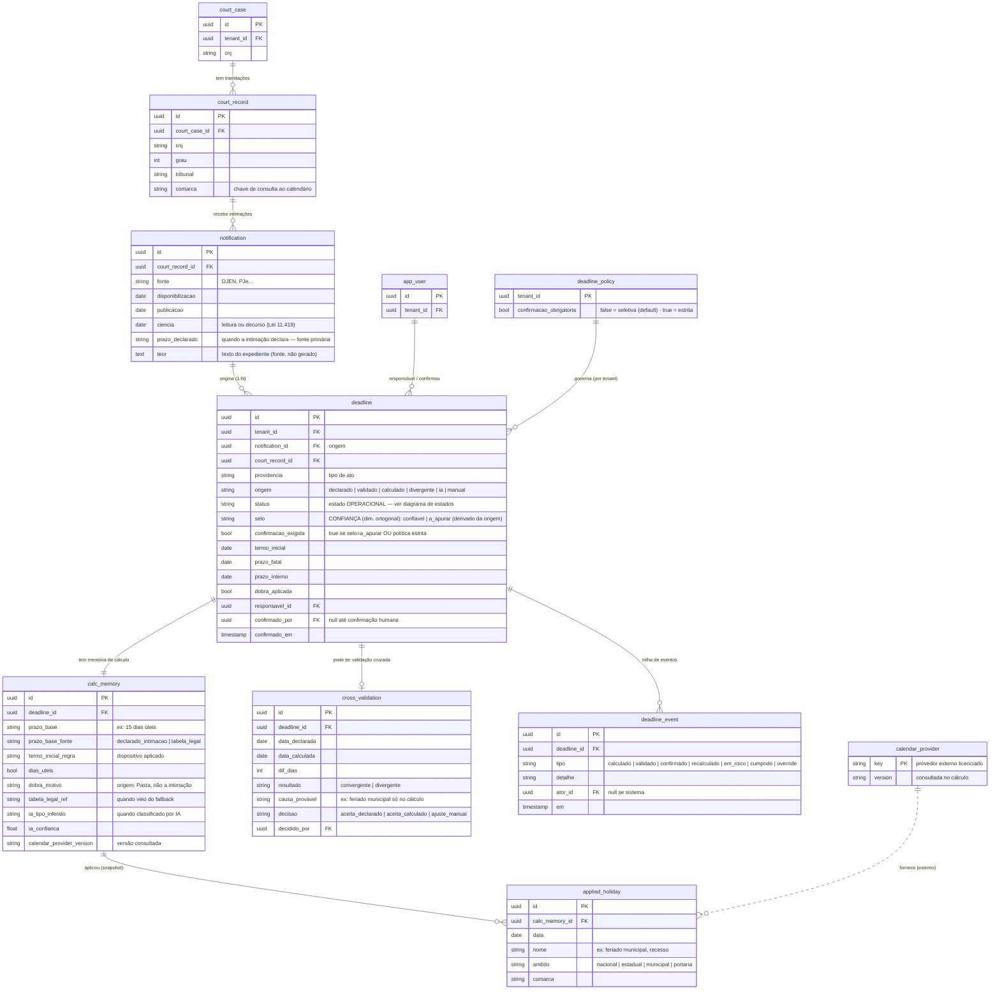
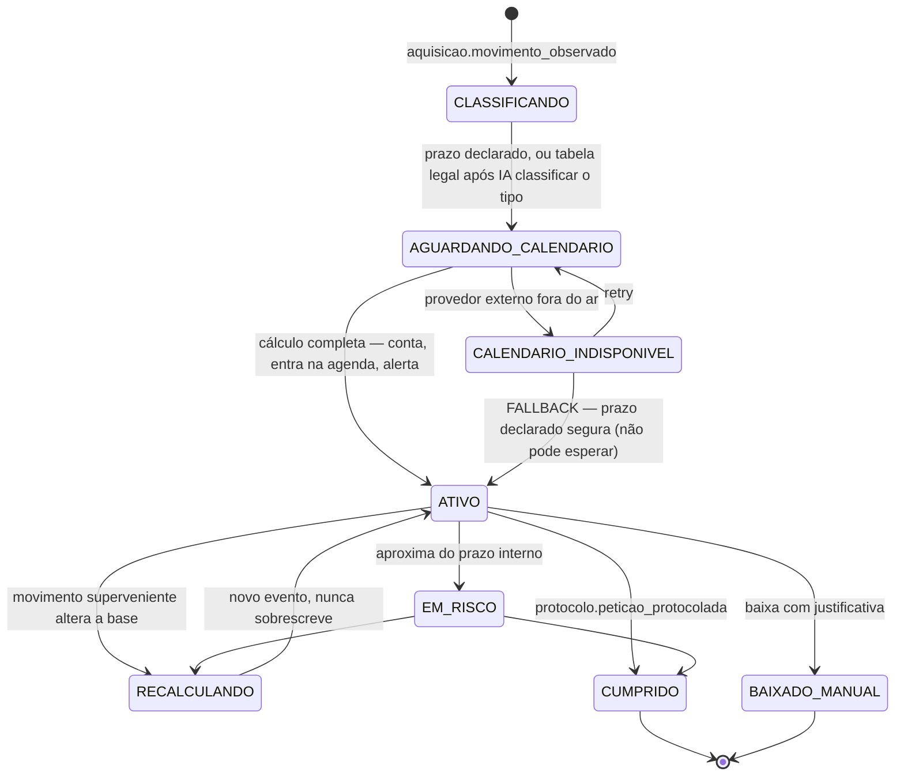
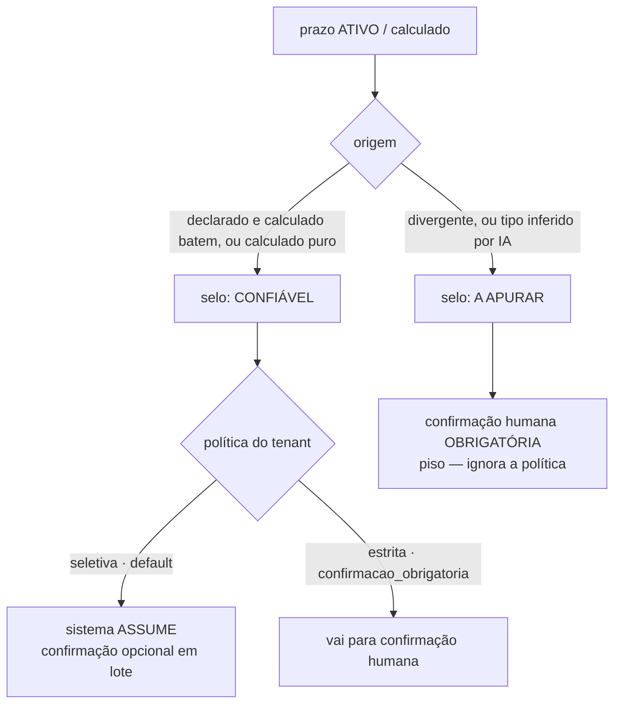

# ERD — Motor de Prazos (V1)

> **Escopo.** O subsistema de prazos é a maior divergência entre a V0 (que guarda um prazo simples) e a V1 (que guarda a precedência de fontes, a validação cruzada, a proveniência de cada número e o estado de confiança). Este documento traz o **modelo de dados** e o **diagrama de estados** do prazo, em Mermaid.
> **Decisão de base.** A base de feriados é **licenciada**, não construída. Consequência de modelagem: não existe tabela `holiday`/`court_calendar` no domínio — o calendário é um **serviço externo** consultado no cálculo; o que se persiste é o **snapshot dos feriados aplicados** dentro da memória de cálculo, com a versão do provedor. Guarda-se a proveniência, não a fonte.
> **Vocabulário.** `deadline` (Prazo), `notification` (Intimação), `court_record` (Tramitação), `court_case` (Processo). Termos de domínio em PT; identificadores em EN.

---

## 1. O que diverge da V0

| Aspecto | V0 | V1 |
|---|---|---|
| Origem do prazo | um valor | **precedência de fontes** (declarado > calculado > inferido) |
| Cálculo | implícito | determinístico e **auditável** (memória de cálculo persistida) |
| Feriados | — | **snapshot aplicado** de um provedor externo licenciado |
| Confiança | ausente | estado explícito (validado / a confirmar / divergente) |
| Validação | — | **cruzada** (declarado × calculado), com desfecho persistido |
| Proveniência | — | de cada número (prazo base, termo inicial, dobra, feriados) |
| Ciclo de vida | data fixa | estados + recálculo por movimento superveniente |

O modelo abaixo existe para suportar essas sete linhas.

---

## 2. Modelo de dados

### Notas de modelagem

- **`notification` 1:N `deadline`.** Uma intimação pode originar vários prazos (coerente com a providência 1:N). Cada prazo tem sua própria origem, memória e ciclo.
- **`calc_memory` é o coração da auditabilidade.** É o que responde "por que essa data?". Persistir a *memória*, não recomputar: o cálculo de hoje precisa continuar explicável amanhã, mesmo que o provedor de calendário mude.
- **`applied_holiday` é snapshot, não relação com tabela sua.** Como o calendário é licenciado, você guarda os feriados que *foram aplicados* àquele cálculo, congelados, com `calendar_provider_version`. Isso te dá proveniência sem ser dono da base — e protege prazos já calculados de mudanças posteriores do provedor.
- **`calendar_provider` é referência externa**, não fonte de dados sua: só identificador e versão. Não há tabela de feriados no seu domínio.
- **`origem` no `deadline` é a precedência de fontes materializada** — o mesmo enum que governa o badge de confiança no Inbox.
- **`cross_validation` é opcional** (só existe quando há data declarada *e* calculada). O desfecho da divergência fica persistido, com quem decidiu — proveniência da decisão humana.
- **`deadline_event` é a trilha** — recálculo por movimento superveniente nunca sobrescreve; adiciona evento. História é auditável.

---

## 3. Diagrama de estados — dimensão operacional (o relógio)

Um prazo tem **duas dimensões ortogonais**: o **estado operacional** (o relógio — conta, alerta, cumpre) e o **selo de confiança** (precisa de humano ou não). Grudar as duas foi o erro que geramos e desfizemos: um prazo pode estar *ativo e contando* sem estar *confirmado por humano*. Este diagrama é o operacional; o selo vem na §4.

O princípio que ele crava: **o prazo nasce ATIVO no cálculo** — conta, entra na agenda e alerta — independentemente de confiança ou confirmação. Prazo não espera ninguém olhar.

### O que o diagrama crava

- **ATIVO começa no cálculo, não na confirmação.** O relógio corre para todo prazo assim que a data existe — é o que honra "prazo não pode esperar" mesmo no modelo on-demand.
- **O cálculo é assíncrono** (consulta externa ao provedor licenciado), daí `AGUARDANDO_CALENDARIO` ser estado real.
- **`CALENDARIO_INDISPONIVEL → ATIVO (fallback)`** materializa "o sistema nunca é a causa de perda de prazo": provedor caiu, o prazo declarado na intimação segura o relógio enquanto o cálculo por regra não completa.
- **`RECALCULANDO`** gera novo `deadline_event`; a memória anterior fica na trilha.
- **`CUMPRIDO`** só vem de `protocolo.peticao_protocolada` — fecha o loop prazo↔protocolo.

---

## 4. Selo de confiança e política de confirmação (a segunda dimensão)

Ortogonal ao relógio, cada prazo carrega um **selo** que decide se um humano precisa assumir a data. É aqui que mora a decisão de responsabilidade — e ela é **configurável por escritório**, com um **piso inegociável**.

**A regra de responsabilidade, em uma frase:** o selo segue a origem, não é uniforme; o default assume o confiável e só manda o duvidoso ao escritório; a política pode aumentar o rigor, nunca reduzir abaixo do piso.

| Origem | Selo | Humano no default (seletiva) | Humano no modo estrito |
|---|---|---|---|
| Declarado + calculado batem | Confiável | Não — sistema assume | Sim |
| Calculado puro (sem declarado p/ cruzar) | Confiável | Não — sistema assume | Sim |
| Divergente (declarado ≠ calculado) | **A apurar** | **Sim (piso)** | Sim |
| Tipo inferido por IA (fonte omissa) | **A apurar** | **Sim (piso)** | Sim |

Três coisas que este modelo crava:

- **O piso é fixo.** IA e divergência **sempre** exigem humano, em qualquer política. `deadline_policy.confirmacao_obrigatoria` só abre *para cima* (leva os confiáveis ao portão); nunca fecha abaixo do piso. É o que sustenta a defensabilidade: nenhum palpite vira prazo confiável sozinho.
- **A confirmação seletiva protege mais que a universal.** Pedir confirmação de tudo dessensibiliza — o escritório clica em 300 e o duvidoso se perde no meio. Reservar o pedido de atenção para os poucos incertos faz do "a apurar" um sinal de verdade. Por isso o default é seletivo.
- **A política muda o significado de "não confirmado" na interface.** No modo seletivo, um prazo confiável não-confirmado é normal. No estrito, o mesmo prazo é pendência. O Inbox precisa refletir a política ativa — senão o advogado não sabe se um prazo não-confirmado é tarefa dele. A `deadline_policy` não é só um flag no cálculo; reconfigura o que o Inbox destaca.

**Defensabilidade mesmo no confiável assumido:** o prazo que o sistema assumiu carrega `calc_memory` e proveniência. Se questionado, a resposta é "seguimos o prazo declarado pelo tribunal na intimação X, conferido pela regra Y" — posição defensável. "A IA classificou e ninguém olhou" não seria; por isso esse caso está no piso, não no assumido.

---

## 5. Custo: o que roda no ingest (a economia, sem prazo cego)

Importar milhares de intimações custa — mas **prazo não pode esperar**, então a linha de corte não é "IA é sempre diferida". Toda intimação **nasce com prazo no ingest**; o que é diferido (on-demand) é a *análise* (resumo + providências), não o prazo.

| Etapa | Quando roda | Custo |
|---|---|---|
| Extrair prazo declarado + calcular data (determinístico) | **Ansioso** — toda intimação, no ingest | Barato |
| **Fallback de IA: classificar tipo → tabela legal → data** (fonte omissa) | **Ansioso** — no ingest, para as omissas | IA de classificação, só na fração omissa |
| Resumo + providências (o "Analisar") | **On-demand** — só quando o advogado entra | IA pesada, só na fração trabalhada |

A decisão-chave: **o fallback de IA para o prazo roda no ingest, não sob demanda.** Consequência — *nenhuma* intimação fica sem prazo materializado: declarada → prazo `confiavel`; omissa → prazo `a_apurar` (via IA no ingest). O relógio conta desde a entrada em todos os casos; nunca há prazo real correndo que o sistema desconhece.

A economia real fica em **desacoplar o prazo da análise**: o caro-caro (resumo + providências) é on-demand e só na fração trabalhada; o caro-barato (classificação de prazo por IA) roda ansioso porque prazo vale o custo. O trade-off consciente: paga-se IA de classificação para toda intimação omissa no ingest, em troca de nunca ter prazo cego — a troca certa para um produto cujo valor é não perder prazo. (Se a fração omissa for muito alta, revisitar; ver §7.)

---

## 6. Eventos (coreografia, não saga)

O prazo reage por coreografia — cálculo é transação + reações independentes, não orquestração central:

- Consome: `aquisicao.movimento_observado`, `protocolo.peticao_protocolada`.
- Emite: `prazo.prazo_calculado`, `prazo.prazo_assumido` (confiável, política seletiva), `prazo.confirmacao_requerida` (a apurar, ou política estrita), `prazo.prazo_confirmado`, `prazo.divergencia_detectada`, `prazo.prazo_alterado` (recálculo), `prazo.prazo_em_risco`, `prazo.prazo_cumprido`.
- Escutam o prazo: Agenda, geração de Tarefa, Central de Alertas.

---

## 7. Questões em aberto

1. **Fração de intimações que declara prazo.** É o que se paga de IA de classificação no ingest (roda para toda omissa). Se a maioria declara (provável no DJEN), o custo ansioso é pequeno; se a fração omissa for alta o bastante para doer, revisitar se o fallback dessas também deveria ser diferido — aceitando o risco de prazo cego até o "Analisar". Medir no que já foi importado.
2. **Provedor de calendário indisponível no ingest.** Como o fallback roda no ingest, o cálculo de milhares de intimações depende do provedor na entrada. Se ele cai, o declarado segura pelo próprio valor declarado; a omissa (que precisa do calendário para a data) fica pendente de cálculo — alertar e reprocessar, nunca marcar sem data silenciosamente.
3. **Fallback sem declarado.** Se o provedor cai e a intimação *não* declara prazo, não há o que segurar o relógio — o comportamento seguro é alertar como crítico e exigir cálculo/prazo manual. Confirmar a regra.
4. **SLA e retry do calendário.** Quantas tentativas e por quanto tempo antes de assumir indisponibilidade.
5. **Versão do provedor e recontagem.** Correção retroativa de feriado: prazos já calculados recalculam ou mantêm o snapshot? (O modelo permite manter; é decisão de produto.)
6. **Cache do calendário.** Consultar o provedor a cada cálculo acopla latência/disponibilidade ao caminho crítico. Um cache local por comarca reaproxima do "construir" em menor escala — vale contra a política de retry.
7. **Reflexo da política no Inbox.** Como a interface muda o destaque de "não confirmado" entre os modos seletivo e estrito, para o advogado não confundir prazo confiável com pendência.
