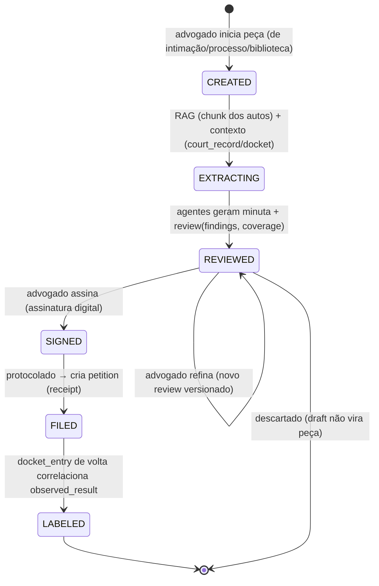

# ERD — Peças (advisory: minuta → revisão → petição)

> **Status:** desenho (v1 — depende de **Documentos** para grounding). Hoje `worker-ai` é esqueleto (mux
> vazio); `draft`/`review`/`petition` têm zero linhas. Este doc é o **domínio de peças** (ciclo de vida,
> integrações, UI, fatias). O **miolo de IA** (agentes, grounding, meta-prompting, tiering) vive em
> `erd-ai-advisory.md` — aqui referenciamos, não repetimos.
> **Fonte de verdade do schema:** `erd-modelo-de-dados.md §6` (`draft`, `review`, `petition`). Onde
> divergir, o schema vence.

---

## 1. Contexto & objetivo

É a ponta da cadeia de valor (capturar → triar → consolidar → prazo → **produzir peça**): redigir a peça
que a IA recomendou, **fundamentada nos autos**, com o advogado no controle. O schema já desenhou o
ciclo: `draft.saga_state CREATED→EXTRACTING→REVIEWED→SIGNED→FILED→LABELED`, `review.findings` (com
citação obrigatória) + `review.coverage` (verificado/não-verificado), `petition.observed_result` (o
desfecho real que fecha o loop). **Falta o código** — o cliente LLM, os agentes, o editor e o protocolo.

**Objetivo:** os slices `internal/draft` (+ `review`, `petition`) e os handlers do `worker-ai` que
orquestram o **Ciclo da Minuta**: gerar a minuta a partir dos `chunk` (RAG de Documentos), revisar com
achados citados e cobertura, deixar o advogado **aprovar/refinar/descartar**, assinar, protocolar e
**aprender com o resultado**. Human-in-the-loop sempre; **nunca auto-protocola**.

---

## 2. Reuse-check (Regra nº1)

| Procurei por | Achei | Decisão |
|---|---|---|
| worker de IA | `cmd/worker-ai/main.go` (esqueleto, mux vazio) | **EXTEND** — registrar os handlers dos agentes |
| tabelas do ciclo | `draft` (saga_state, piece_type, storage_key), `review` (findings/coverage/versions), `petition` (observed_result, receipt) — 0001 | **REUSE** — ciclo já modelado |
| grounding / RAG | `document`/`chunk` + retrieval (`erd-documentos.md`) | **REUSE** — pré-requisito nº1; sem chunk não há citação |
| arquitetura da IA | `erd-ai-advisory.md` (agentes, output estruturado, validação de cobertura, meta-prompting, tiering, prompt caching) | **REUSE** — este doc **não** reescreve; referencia |
| storage da minuta | `lib/storage` (presigned) para o arquivo da peça | **REUSE** |
| cliente LLM | **não existe** — `erd-ai-advisory.md §8 fatia 3` prevê `lib/<llm>` (anthropic-sdk-go) | **CREATE** |
| prazo da ação | `internal/deadline` (`erd-prazos.md`) — a peça responde a um prazo | **REUSE** — "gerar peça" nasce de um prazo/intimação |

Conclusão: o **ciclo e o schema estão prontos**; falta o cliente LLM (`/lib`), os agentes no `worker-ai`,
o editor no FE, e as integrações de **assinatura** e **protocolo** (as duas pontas "para fora do sistema").

---

## 3. Princípios (decididos)

1. **Advisory + human-in-the-loop.** A saída é sempre `draft`/sugestão. O advogado aprova, refina ou
   descarta. **Nunca protocola sozinho** (`erd-ai-advisory.md §1.6`). Risco jurídico manda.
2. **Grounding obrigatório.** Todo achado da revisão cita um `chunk`/`document` (ou `docket_entry` real).
   Sem lastro → `coverage.notVerified[]`, sinalizado, nunca exibido como certeza. Sem Documentos
   ingeridos, o advisory **não roda** — degrada para "envie os autos".
3. **A voz do escritório.** A minuta sai no estilo/precedentes do escritório (playbook derivado dos
   `draft`/`petition`/`observed_result` passados) — meta-prompting (`erd-ai-advisory.md §3`). Diferencial
   de produto, não enfeite.
4. **Saga coreografada, estado observável.** `draft.saga_state` é a coluna da saga; cada transição é um
   evento no outbox, não um orquestrador central. Retomável e auditável.
5. **Imutabilidade da petição.** `petition` é a minuta **assinada e protocolada** — imutável. `receipt`
   guarda o comprovante; `observed_result` nasce vazio e é preenchido quando o desfecho volta (impossível
   reconstruir depois — por isso existe desde a v0).
6. **Versionar tudo.** `model_version` + `rules_version` na `review` → correlação com `observed_result` →
   o playbook melhora com o resultado real (feedback loop, `erd-ai-advisory.md §6`).
7. **Determinístico onde dá.** Datas/prazos da ação vêm de `internal/deadline`, não do LLM. O LLM só onde
   há linguagem/julgamento.

---

## 4. O Ciclo da Minuta (saga)

Cada seta é um evento (`draft.created`, `draft.extracting`, `draft.reviewed`, `draft.signed`,
`petition.filed`, e o feedback). O agente que produz cada etapa está em `erd-ai-advisory.md §4` (fan-out:
análise, risco, extração de tarefas, geração de minuta) — aqui importa o **ciclo de domínio**.

---

## 5. Integrações necessárias

| Integração | Papel | Porta / recomendação |
|---|---|---|
| **LLM — Anthropic** | gerar minuta, revisar, extrair | 🟡 novo — `lib/<llm>` com **anthropic-sdk-go**, structured output (`output_config.format`), **prompt caching** do playbook/regras, retry, tokens/otel. Tiering: Opus (minuta/risco), Haiku (extração/validação) — `erd-ai-advisory.md §7` |
| **RAG (embeddings/retrieval)** | recuperar os `chunk` dos autos que fundamentam | ✅ desenhado em `erd-documentos.md` (Voyage + pgvector) |
| **Geração de arquivo (.docx/.pdf)** | materializar a peça editável/assinável | 🟡 novo — editor in-app (Tiptap/Lexical) guarda conteúdo estruturado; export **.docx** (advogado quer editar) e **.pdf** para assinar; `storage_key` no `draft` |
| **Assinatura digital (ICP-Brasil)** | assinar a peça (validade jurídica) | 🔴 **hard** — opções: certificado **em nuvem** (BirdID/VIDaaS/Serpro) via API, ou o advogado assina **fora** (v0). Porta `Signer`; v0 = "baixe e assine no seu assinador", registra `SIGNED` manualmente |
| **Protocolo / peticionamento** | dar entrada da peça no tribunal | 🔴 **hard, por-tribunal** — **PJe/MNI**, eSAJ, Projudi. v0 = **export + protocolo manual** pelo advogado; ele cola o comprovante → cria `petition` (`receipt`, `filed_at`). Porta `FilingGateway` para automação futura |
| **Feedback de desfecho** | `observed_result` (aceita? emenda? intempestiva?) | 🟡 do `docket_entry` de volta (índice "close the loop") + input manual; correlaciona com a versão |
| **`internal/deadline`** | a peça responde a um prazo; some da lista quando FILED | ✅ `erd-prazos.md` |

**As duas pontas "para fora" (assinar e protocolar) são o hard real.** O v0 entrega o **valor de IA**
(minuta fundamentada + revisão com citações) e deixa assinatura/protocolo **manuais** com export — sem
travar o produto na integração mais difícil do jurídico BR.

---

## 6. Modelo de dados (referência ao catálogo)

Sem DDL novo estrutural — `draft`/`review`/`petition` (`§6` do catálogo) servem. Notas/deltas propostos:

- **`draft`** — `piece_type` (DEFENSE/COMPLAINT/APPEAL/…), `saga_state`, `storage_key`, `case_id`
  (opcional — revisão por upload não precisa de case). Deltas úteis: `title`, `content jsonb` (conteúdo
  estruturado do editor, se não guardar só o arquivo), `created_by uuid`.
- **`review`** — `findings jsonb` (`Finding[]` com `citation.{document_id,chunk_id,quote,kind}`),
  `coverage jsonb` (`{verified[], notVerified[]}` — nunca vazio por conveniência), `model_version`,
  `rules_version`. Append-only por (re)revisão.
- **`petition`** — `draft_id UNIQUE`, `court_record_id`, `filed_at`, `receipt jsonb` (comprovante/protocolo),
  `observed_result` (OK|AMENDMENT|NOT_ADMITTED|UNTIMELY — nasce null; índice parcial acha as pendentes).
- **Playbook do escritório** (`erd-ai-advisory.md §9`): representação derivada dos `draft`/`petition`/
  `observed_result` — pode começar como **view/materialização**, não tabela nova. Decisão aberta.

---

## 7. Eventos (contratos outbox)

**Consome:** `deadline.opened` / `intimation.observed` (origem do "gerar peça"); `document.ready`
(grounding disponível).

**Produz:**
- `draft.created {draft_id, tenant_id, case_id?, piece_type, source}`
- `draft.extracting` / `draft.reviewed {draft_id, review_id, coverage_summary}`
- `draft.signed {draft_id}`
- `petition.filed {petition_id, draft_id, court_record_id, filed_at}`
- `petition.result_observed {petition_id, observed_result, model_version, rules_version}` → feedback loop

Todos com `trace_context` + `event_id`.

---

## 8. API (borda) — o que a tela consome

Envelope `{data, page}`, `tenant_id` do principal + RLS:

- **`GET /v1/processos/:id/pecas`** — peças de um processo (aba Peças): `piece_type`, `status`/`saga_state`,
  `coverage` resumida (X verificados / Y não), `filed_at`, `observed_result`.
- **`GET /v1/pecas`** — biblioteca do tenant (tela `/pecas`): filtros por tipo/status.
- **`POST /v1/pecas`** — iniciar peça `{case_id?, court_record_id?, piece_type, source:
  intimation|processo|blank, intimation_id?}` → `draft` CREATED → dispara a saga (worker-ai).
- **`GET /v1/pecas/:id`** — editor: o `draft` + o `review` mais recente (findings/citações/cobertura).
- **`POST /v1/pecas/:id/review`** — re-revisar após edição (novo `review` versionado).
- **`GET /v1/pecas/:id/export?format=docx|pdf`** — baixar a peça (presigned).
- **`POST /v1/pecas/:id/sign`** — marca SIGNED (assinatura externa v0; `Signer` API depois).
- **`POST /v1/pecas/:id/file`** — cria `petition` com `receipt`/`filed_at` (protocolo manual v0).
- **`PATCH /v1/pecas/:id/result`** — registrar `observed_result` (ou vem do docket automático).

---

## 9. Frontend

- **Aba Peças do processo** (`/processos/:id`): lista as peças, `piece_type`, status/saga, cobertura
  resumida, desfecho. Ação: **Nova peça** (abre o editor) e abrir peça existente. Estado vazio honesto
  enquanto o advisory não roda ("sem autos ingeridos, a IA não tem o que fundamentar → envie documentos").
- **Editor `/pecas/:id`** (hoje 🟡 prévia): editor de minuta (Tiptap/Lexical) à esquerda; **painel de
  revisão** à direita — **achados com citação** dos autos (deep-link para `document`/página) + **cobertura**
  (verificado / **não-verificado** destacado, é o que sustenta a confiança). Ações: **Refinar** (re-review),
  **Aprovar/Assinar**, **Exportar** (.docx/.pdf), **Protocolar** (registra petição). Loading em streaming
  enquanto a IA gera.
- **Entradas do fluxo (F4):** de `/intimacoes/:id` ("gerar peça" a partir da ação sugerida) **ou** da aba
  Peças do processo **ou** da biblioteca `/pecas`. A peça sempre carrega o contexto do prazo/intimação.
- **Estados:** citações clicáveis (a11y: teclado), cobertura sempre visível, banner "processando/gerando"
  com progresso, erro `{kind,message,details}`.

---

## 10. Pontos de falha & decisões em aberto

Modos de falha da IA e mitigação estão em `erd-ai-advisory.md §9` (alucinação → citação+coverage; drift →
versionar+eval; custo → tiering+caching; vazamento → tenant/RLS). Específicos deste domínio:

| Risco / gap | Ataque |
|---|---|
| Sem autos → sem grounding | degradar honesto: "envie documentos"; Documentos é pré-requisito |
| Assinatura ICP-Brasil | v0 manual (export + assinador externo); `Signer` em nuvem depois |
| Protocolo por-tribunal | v0 manual (advogado protocola, cola receipt); `FilingGateway` depois |
| Minuta errada protocolada | DRAFT + aprovação humana obrigatória; nunca auto-file |
| `observed_result` sem quem preencha | índice "close the loop" varre pendentes; input manual + docket automático |
| Formato do arquivo | .docx editável (advogado quer mexer) + .pdf para assinar |

**Decisões em aberto:**
- **Editor:** Tiptap × Lexical; guardar `content jsonb` no draft × só o arquivo no storage.
- **Assinatura:** certificado em nuvem (BirdID/VIDaaS/Serpro) × A1/A3 local × só externo (v0).
- **Protocolo:** qual tribunal automatizar primeiro (PJe/MNI?) — fatia grande, pós-v0.
- **Playbook:** view derivada × tabela materializada; quando o meta-prompting real entra (`§3`).
- Deltas de `draft` (`title`, `content`, `created_by`) — confirmar no catálogo.

---

## 11. Ordem de implementação (fatias verticais)

Cada fatia = slice pequeno, verde, `pm-plan → dev-qa (TDD) → code-review → merge`. **Depende de
Documentos** (grounding). Segue `erd-ai-advisory.md §8` (fatias 3–7):

1. **`lib/<llm>` — cliente Anthropic** (structured output, caching, retry, tokens/otel). Segredo por env.
2. **`internal/draft` — geração de minuta** (saga `CREATED→EXTRACTING→REVIEWED`): RAG dos `chunk` +
   contexto do `court_record`/`docket_entry` → minuta (`storage_key`). **FE: aba Peças + editor** lendo o
   draft (sem revisão ainda). *(Primeiro valor visível de IA.)*
3. **`internal/review` — análise + validação** (findings citados + coverage). Validador determinístico
   confere a `quote` no `chunk`. Painel de revisão no editor.
4. **Refino humano** (`POST /pecas/:id/review` versionado) + export .docx/.pdf.
5. **Assinatura + Protocolo (manual v0)** → `petition` (`receipt`, `filed_at`); some da lista de prazos.
6. **Feedback loop** (`observed_result` do docket + manual) → métricas por `model_version`/`rules_version`.
7. **Meta-prompting real** + assinatura/protocolo automatizados (`Signer`/`FilingGateway`) — futuro.
