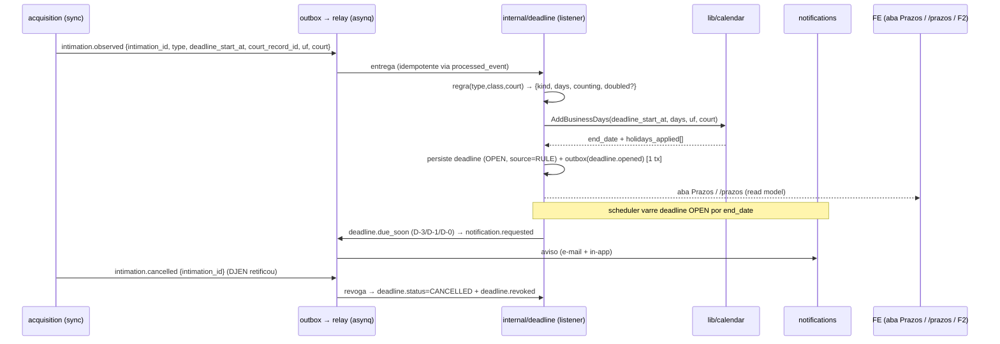

# ERD — Prazos (deadlines)

> **Status:** desenho (v0 → habilita a aba **Prazos** do Processo e a tela `/prazos`). Nenhuma linha
> de `deadline` é escrita hoje (tabela existe, zero linhas). Este doc é o mapa do subsistema que
> **deriva prazo de intimação** — determinístico, auditável, com confirmação humana.
> **Fonte de verdade do schema:** `erd-modelo-de-dados.md` (tabelas `deadline`, `holiday`, `intimation`).
> Onde divergir, o schema vence. Complementa `erd-frontend.md` (F2 é o coração) e `erd-notificacoes.md`
> (lembrete de prazo é `notification.requested`).

---

## 1. Contexto & objetivo

O prazo é **o produto**. A cadeia de valor (capturar → triar → consolidar → **prazo** → produzir peça)
converge aqui: a intimação vira uma conta-regressiva com data de fim confiável, e essa data é o que o
advogado não pode errar. Hoje a captura já entrega `intimation` com as três datas derivadas
(`made_available_at`, `published_at`, `deadline_start_at`) via `lib/calendar` no `djen_parser`. **Falta
o passo que transforma o `deadline_start_at` + o *tipo de ato* num `deadline` com `end_date`, contagem e
auditoria.**

**Objetivo:** um slice `internal/deadline` que consome o evento de intimação, calcula o prazo
**deterministicamente** (nunca LLM — dias úteis, feriados, recesso, dobro), persiste `deadline`
ancorado na `court_record`, e o mantém vivo (revoga quando a intimação é cancelada, marca MET/MISSED,
avisa antes de vencer). O mesmo slice possui a **`task`** (a ação acionável — o "Criar tarefa" do F2):
1 prazo legal + N tarefas. Ele alimenta três superfícies: a aba **Prazos** do processo, a tela
**`/prazos`** (agenda: prazos + tarefas + "meus") e os **lembretes** (notifications).

**O que este slice NÃO faz:** decidir *o que* peticionar (isso é advisory / `erd-pecas.md`) nem *quantos
dias* por julgamento de linguagem (a sugestão de dias vem da camada de regras + IA; aqui a regra entra
como **input versionado**, e o cálculo de datas é puro).

---

## 2. Reuse-check (Regra nº1)

| Procurei por | Achei | Decisão |
|---|---|---|
| motor de dias úteis / feriados / recesso | `lib/calendar`: `Calendar.AddBusinessDays(ctx, start, n, uf, court) → (time.Time, []time.Time{feriados}, err)`, `NextBusinessDay`, `IsBusinessDay`; `inRecess` (recesso forense 20/12–20/01, CPC 220, embutido) | **REUSE** — o cálculo de `end_date` e o `holidays_applied` saem daqui, sem reescrever |
| calendário de feriados | tabela `holiday` (NATIONAL/STATE/COURT) + `lib/calendar.Store.IsHoliday(day, uf, court)`; `SeedNational` (BrasilAPI) no boot; STATE seed migration 0013 | **REUSE** — o `court` vem da `court_record`; a **`uf` é derivada da sigla do tribunal** via `ufFromTribunal` (`internal/acquisition/tribunal.go`), pois `court_record` **não tem coluna `uf`** |
| datas da intimação já derivadas | `djen_parser` deriva `published_at`/`deadline_start_at`; `intimation.deadline_start_at` é o **anchor** do cálculo | **REUSE** — não recalcular a publicação, só o prazo a partir dela |
| gancho já previsto p/ o slice | `internal/acquisition/entity.go` já comenta *"a slice de deadline conta a partir de `type`"* e *"revoga o `deadline` no `intimation.cancelled`"* | **EXTEND** — falta emitir `intimation.observed`/`intimation.cancelled` no outbox |
| tabela `deadline` | existe (0001), `notification_id UNIQUE` FK → `intimation`; `holidays_applied jsonb`, `counting`, `doubled`, `status` | **REUSE** — schema já desenhado pra auditoria |
| lembrete/aviso | `internal/notifications` + contrato `notification.requested` | **REUSE** — prazo a vencer emite `notification.requested` |

Conclusão: **quase nada é novo em infra** — o slice é sobretudo *orquestração + regra + read model*. O
trabalho real é (a) o contrato de evento da intimação, (b) a **camada de regras** (tipo de ato → dias),
(c) o cálculo + persistência em tx, (d) a varredura de vencimento, (e) os read models.

---

## 3. Princípios (decididos)

1. **Determinístico, ponta a ponta.** Contagem de dias, feriados, recesso, dobro e status são **código**,
   não LLM. Mesmo input → mesmo `end_date`. Reprodutível e defensável (o advogado vai discordar da data;
   a resposta tem que estar em `holidays_applied` + `counting` + `doubled`).
2. **A intimação é o fato; o prazo é a derivação.** `deadline` é 1:1 com `intimation` (`notification_id
   UNIQUE`). Sem intimação não há prazo. Cancelou a intimação → revoga o prazo (nunca prazo-fantasma).
3. **Dias vêm de fora, datas nascem aqui.** *Quantos dias* e *qual contagem* são **input** (camada de
   regras determinística por `type`/classe, ou sugestão da IA no F2). O slice recebe `{days, counting,
   doubled}` e produz `{start_date, end_date, holidays_applied}`. Separar isso mantém o cálculo puro e
   testável, e deixa a regra evoluir (`rules_version`) sem tocar o motor.
4. **Confirmação humana no meio.** O prazo calculado nasce como **sugestão** no F2 (triage). O advogado
   aprova/ajusta (toggle dias úteis↔corridos, muda a quantidade, marca em dobro). Nada vira compromisso
   sem o aval — mas, uma vez aprovado, é um `deadline` OPEN de verdade.
5. **Viés seguro.** Na dúvida entre duas datas, escolher a **mais curta** (nunca "alongar" um prazo por
   feriado não corroborado). Mesma filosofia do seed estadual (`erd-modelo-de-dados.md`, holiday §7).
6. **Auditável por construção.** `holidays_applied` guarda cada feriado que empurrou a data; `counting`,
   `doubled`, `days` e a `rules_version` ficam na linha. "Por que dia 14 e não 12?" tem resposta no banco.

---

## 4. Modelo de dados (referência ao catálogo)

**Decisão de modelagem (validada):** separar **prazo legal** de **ação**. O `deadline` é o **único prazo
processual** derivado da intimação (1:1, `notification_id UNIQUE` — respeita o schema). As *"N ações
sugeridas"* do F2 (`erd-frontend.md §F2`, `erd-ai-advisory.md §4`) são **`task`** — uma tabela nova: cada
ação acionável, com data e responsável próprios, ligada ao mesmo `deadline`. Assim a agenda tem os dois:
o prazo legal (o que não pode ser perdido) e as tarefas (os passos até lá).

`deadline` de `erd-modelo-de-dados.md §7` já serve; `task` é **DDL novo** (a confirmar no catálogo).

- **`deadline`** — o prazo legal. Ancora na `court_record` (FK), 1:1 com `intimation`. Campos que o slice
  preenche: `start_date` (= `intimation.deadline_start_at`), `end_date` (calculado), `days`, `counting`
  (`BUSINESS|CALENDAR`), `doubled`, `holidays_applied` (do `AddBusinessDays`), `status` (`OPEN|MET|MISSED`).
  **Deltas propostos** (auditoria/produto):
  - `kind text` — tipo de prazo legível (`CONTESTACAO|RECURSO|EMBARGOS|MANIFESTACAO|CUMPRIMENTO|...`).
  - `source text` — `RULE|AI|MANUAL` (de onde vieram os `days`).
  - `confirmed_by uuid` / `confirmed_at timestamptz` — quem aprovou (nullable; regra conservadora pode
    nascer OPEN sem aval, mas o F2 marca).
  - `doubled_reason text` — `LITISCONSORCIO_229|FAZENDA_183|MP_180|DEFENSORIA_186` (`doubled` sozinho não
    se explica).
- **`task`** (nova) — a ação acionável. Uma intimação/prazo gera N. Esboço (DDL fina no catálogo):
  ```sql
  CREATE TABLE task (
    id               uuid PRIMARY KEY DEFAULT gen_random_uuid(),
    tenant_id        uuid NOT NULL REFERENCES tenant(id),
    court_record_id  uuid REFERENCES court_record(id),   -- contexto (nullable: task avulsa)
    deadline_id      uuid REFERENCES deadline(id),        -- prazo legal que a originou (nullable)
    intimation_id    uuid REFERENCES intimation(id),      -- origem (nullable: task manual)
    title            text NOT NULL,
    description      text,
    kind             text,                -- ação sugerida (peça, juntada, ciência…)
    due_date         date,                -- data própria (≤ deadline.end_date, ou manual)
    status           text NOT NULL DEFAULT 'OPEN',   -- OPEN|DONE|DISMISSED
    source           text NOT NULL,       -- AI|RULE|MANUAL
    assignee_user_id uuid,                -- responsável ("meus prazos")
    created_by       uuid,
    created_at       timestamptz NOT NULL DEFAULT now(),
    completed_at     timestamptz
  );
  CREATE INDEX ON task (tenant_id, status);
  CREATE INDEX ON task (due_date) WHERE status = 'OPEN';   -- varredura/agenda
  ```
  O **responsável** vive na `task` (não no `deadline`): o prazo legal é o fato; quem o cumpre é a tarefa.
- **`holiday`** (referência, não por-tenant) — insumo do `lib/calendar`. Escopo resolvido por
  NATIONAL (sempre) + STATE (por **UF derivada do tribunal**, `ufFromTribunal`, já que `court_record` não
  guarda `uf`) + COURT (quando semeado).

> **Regra de contagem CPC (o que o `counting` codifica):** processo **cível/CPC** conta em **dias úteis**
> (art. 219) → `AddBusinessDays`; **trabalhista/CLT** e alguns ritos contam em **dias corridos** →
> **caminho separado** (`time.AddDate`, não `AddBusinessDays`, que só sabe dias úteis), com tratamento
> próprio de recesso/suspensão. `counting` é decidido pela camada de regras a partir de `court`/`class`/
> rito, não adivinhado no motor. **`holidays_applied`** guarda feriados e dias de recesso pulados —
> **fins de semana não são auditados** (são a norma), conforme `calendar.go:105-112`.

---

## 5. Integrações necessárias

| Integração | Papel | Porta / estado |
|---|---|---|
| **`lib/calendar`** (interno) | motor de dias úteis + feriados + recesso; devolve `holidays_applied` | ✅ existe — só consumir |
| **Feriados NATIONAL — BrasilAPI** | seed anual nacional no boot | ✅ existe (`SeedNational`) |
| **Feriados STATE** | seed estático (migration 0013), por UF | ✅ existe; refresh anual = re-rodar script |
| **Feriados COURT** | portarias de tribunal (suspensão de expediente) — a autoridade real | 🟡 futuro: pipeline manual/portaria sob demanda; sem isso, STATE aproxima com viés seguro |
| **`internal/notifications`** | lembrete de prazo (D-3/D-1/D-0) e "prazo vencido" via `notification.requested` | ✅ contrato existe |
| **Camada de regras (`rules_version`)** | mapeia *tipo de ato/comunicação* → `{kind, days, counting}` sugeridos | 🟡 novo — tabela/arquivo versionado (§8) |
| **worker-ai (F2)** | sugestão rica de prazo a partir do *teor* (`suggested_deadline`) | 🟡 futuro — ver `erd-ai-advisory.md`; entra como `source=AI` |
| **Export de calendário (.ics / Google Calendar)** | jogar o prazo na agenda pessoal do advogado | 🟡 futuro — `.ics` por prazo é barato; OAuth Google Calendar depois |

**Sem dependência de tribunal/PJe para prazos** — tudo se deriva da intimação já capturada + calendário.
Essa é a força do slice: entrega valor **sem** ingestão de documentos.

---

## 6. Arquitetura / pipeline



Dois consumidores no slice: o **listener de intimação** (cria/revoga) e a **varredura de vencimento**
(scheduler → `due_soon`/`MISSED`). Ambos idempotentes (`processed_event`), escrita em tx + outbox.

---

## 7. Eventos (contratos outbox)

**Consome:**
- **`acquisition.intimation.observed {intimation_id, tenant_id, court_record_id, case_id, type, class,
  court, uf, deadline_start_at}`** — ⚠️ **novo**: hoje a intimação é upsertada mas **não emite evento
  próprio**. Preciso emitir este no mesmo tx do upsert de intimação (acquisition). Sem ele, o slice não
  tem gatilho.
- **`acquisition.intimation.cancelled {intimation_id, tenant_id, reason}`** — ⚠️ **novo**: quando o DJEN
  cancela/retifica (`data_cancelamento`) e a intimação vira `CANCELLED`. Dispara a revogação do prazo.

**Produz:**
- `deadline.opened {deadline_id, court_record_id, intimation_id, kind, end_date, counting}`
- `deadline.updated {deadline_id, ...}` (ajuste humano no F2)
- `deadline.due_soon {deadline_id, days_left}` → vira `notification.requested`
- `deadline.met {deadline_id}` / `deadline.missed {deadline_id}` / `deadline.revoked {deadline_id}`
- `task.created {task_id, deadline_id?, court_record_id, due_date, assignee_user_id?}` —
  a aprovação do F2 grava o `deadline` (1) **e** as `task` (N) na **mesma tx**; `task.revoked` acompanha
  `deadline.revoked` quando a intimação é cancelada.
- `task.completed {task_id}` / `task.dismissed {task_id}` / `task.due_soon {task_id, days_left}`

Todos carregam `trace_context` + `event_id` estável.

---

## 8. A camada de regras (o miolo do "quantos dias")

O motor de datas é trivial; o valor está em acertar `{kind, days, counting, doubled}`. Estratégia em
**duas velocidades**, ambas alimentando o MESMO cálculo determinístico:

1. **Regra conservadora (v0, sem IA).** Uma tabela versionada (`rules_version`) mapeia sinais baratos —
   `intimation.type` (CITACAO×INTIMACAO×COMUNICACAO), `court_record.class`/rito, e palavras-âncora do
   teor — para um `{kind, days, counting}` **padrão e seguro**. Ex.: `type=CITACAO` + rito comum →
   `CONTESTACAO, 15, BUSINESS`; `INTIMACAO` genérica → `MANIFESTACAO, 5, BUSINESS`. Quando a regra não
   tem confiança, cria o prazo com `kind=GENERICO` e **sinaliza "confirme o prazo"** na UI (nunca inventa
   uma data precisa como certa). `counting` (útil×corrido) sai do rito, não do teor.
2. **Sugestão da IA (F2, quando o advisory entrar).** O agente de extração de tarefas
   (`erd-ai-advisory.md §4`) lê o *teor* e devolve `suggested_deadline {kind, days, counting, anchor}` com
   confiança. Entra como `source=AI`. O motor calcula as datas igual.

Em ambos os casos, o **advogado confirma** no F2 (é o "Aprovar tudo / Criar tarefa"). `confirmed_by`
registra o aval. A regra melhora com o `observed_result` das peças (feedback loop do advisory).

**Dobro (`doubled`):** detectável com segurança só em parte — **Fazenda Pública/MP/Defensoria** (art.
183/180/186) por `class`/parte; **litisconsórcio com advogados distintos** (art. 229) exige sinal que
nem sempre temos → **default `false`, com toggle explícito** na UI e `doubled_reason`. Viés seguro:
nunca dobrar automaticamente sem evidência (dobrar = alongar, e alongar é o erro perigoso).

**Recesso e suspensões:** `lib/calendar.inRecess` já trata o recesso forense (20/12–20/01). Suspensões
pontuais por portaria são feriados COURT (§5) — entram sem código quando semeados.

---

## 9. API (borda) — o que a tela consome

Read models (envelope padrão `{data, page}`), todos `tenant_id` do principal + RLS:

- **`GET /v1/processos/:id/prazos`** — prazos de um processo (aba Prazos). Ordena por `end_date`; inclui
  `kind`, `end_date`, `days_left`, `counting`, `doubled`+`reason`, `status`, `holidays_applied` (para o
  "por quê"), `intimation_id` (link pro teor).
- **`GET /v1/prazos`** — agenda global do tenant (tela `/prazos`): filtros por `status` (OPEN/MET/MISSED),
  janela de datas, `assignee`. Keyset por (`end_date`, `id`).
- **`GET /v1/prazos/calendar?from=&to=`** — visão calendário (contagens por dia) para o mês.
- **`GET /v1/prazos/:id`** — detalhe/auditoria de um prazo (todos os feriados aplicados, a intimação de
  origem, a `rules_version`).
- **`GET /v1/processos/:id/tasks`** / **`GET /v1/tasks`** — tarefas do processo / agenda de tarefas
  (filtro por `assignee`, `status`, janela). Alimenta "meus prazos".
- **Ações:**
  - `POST /v1/prazos/confirm` — **"Aprovar tudo" do F2**: recebe `{intimation_id, deadline{kind, days,
    counting, doubled}, tasks[]}` e grava o `deadline` (1) **+ as `task` (N)** numa **única tx** (upsert
    idempotente por `intimation_id` — respeita o 1:1). É a rota central do coração do produto.
  - `PATCH /v1/prazos/:id` — ajustar o prazo legal (dias, contagem, dobro) → recalcula datas.
  - `POST /v1/prazos/:id/met` / `.../missed` — marcar cumprido/perdido (transição de `status`).
  - `POST /v1/tasks` / `PATCH /v1/tasks/:id` / `POST /v1/tasks/:id/done` — criar/ajustar/concluir tarefa
    (inclui atribuir `assignee`).
  - `GET /v1/prazos/:id/export.ics` — baixar o `.ics` do prazo (futuro).

---

## 10. Frontend

- **Aba Prazos do processo** (`/processos/:id`): lista os prazos daquele processo; cada card mostra
  `kind`, contagem regressiva (**gold** para urgente, `< 3 dias úteis`), data de fim, dias úteis/corridos,
  badge "em dobro", status. Ação inline: **marcar cumprido**, ver a intimação de origem, ver o "por quê"
  (popover com `holidays_applied`). O **próximo prazo** vira a faixa-herói do topo do processo.
- **Tela `/prazos`** (hoje 🟡 prévia): calendário (esquerda) + próximos vencimentos (direita). Passa a
  ligar no read model real. Filtro por responsável (`assignee`), status, e por processo.
- **F2 (triage `/intimacoes/:id`):** a tela mostra **um prazo legal** (o `deadline`, com início/fim
  calculados, **toggle dias úteis↔corridos**, dias editável, toggle "em dobro") **+ a lista de ações
  sugeridas** (as `task`, cada uma com data e responsável). "Aprovar tudo" grava o prazo (1) e as tarefas
  (N) numa tacada (`POST /v1/prazos/confirm`). É o coração do produto (`erd-frontend.md §F2`).
- **Distinção na UI:** o **prazo** é o item inegociável (faixa-herói, contagem regressiva); as **tarefas**
  são o checklist de passos até ele, atribuíveis e marcáveis como feitas. A agenda `/prazos` mostra os
  dois, com filtro "meus" (por `assignee`).
- **Estados:** loading (skeleton), empty ("nenhum prazo em aberto — os prazos nascem das intimações"),
  erro (shape `{kind,message,details}`). Números com `tabular-nums`.

---

## 11. Pontos de falha & decisões em aberto

| Risco / gap | Ataque |
|---|---|
| Prazo errado por `days` errado | camada de regras **conservadora** + sinal "confirme"; confirmação humana no F2; feedback via `observed_result` |
| **Termo inicial de citação ≠ intimação** | o `djen_parser` deriva `deadline_start_at` uniforme (publicação+1 dia útil); para **CITACAO** (CPC art. 231) o termo inicial pode ser outro → **sinalizar citação para confirmação**, nunca tratar como certo |
| Feriado local faltando (COURT) | STATE aproxima com **viés seguro** (data mais curta); pipeline de portaria COURT depois |
| Dobro falso-positivo | **nunca automático** para litisconsórcio (art. 229); só Fazenda/MP/Defensoria por classe; toggle explícito |
| Intimação retificada vira prazo-fantasma | `intimation.cancelled` → `deadline.revoked` (o design já pede) |
| `intimation.observed` inexistente | **pré-requisito nº1**: emitir o evento no upsert de intimação (acquisition) |
| Recesso/suspensão | `inRecess` no calendar; portarias como holiday COURT |

**Decisões travadas (nesta validação):**
- ✅ **Prazo × ação:** `deadline` = prazo legal (1:1); **`task` nova no v0** para as N ações do F2 (§4).
- ✅ **Camada de regras:** **conservadora + confirmação humana** no v0 (poucas regras seguras; genérico
  nasce "confirme"); enriquece com `observed_result`.

**Decisões em aberto:**
- Confirmar no catálogo os **deltas de `deadline`** (`kind`, `source`, `confirmed_by/at`, `doubled_reason`)
  **e a tabela `task`**.
- Formato da regra conservadora: tabela seed (`deadline_rule`, versionada, override por tenant depois) ou
  arquivo em `/lib`? (recomendo tabela seed global.)
- Marcar `MISSED` automaticamente na varredura (com carência) ou só manual? (recomendo automático D+1 com
  aviso, reversível.)
- Export `.ics` no v0 vs OAuth Google Calendar depois.

---

## 12. Ordem de implementação (fatias verticais)

Cada fatia = slice pequeno, verde, `pm-plan → dev-qa (TDD) → code-review → merge`.

1. **acquisition — emitir `intimation.observed` / `intimation.cancelled`** no tx de upsert de intimação
   (destrava o gatilho; sem isso nada nasce). Round-trip de contrato produtor∥consumidor
   ([[parallel-producer-consumer-roundtrip]]).
2. **`internal/deadline` — cálculo + persistência.** Listener de `intimation.observed` → **regra
   conservadora v0** (poucas regras seguras; genérico nasce "confirme") → `lib/calendar.AddBusinessDays`
   (uf via `ufFromTribunal`) → `deadline` OPEN + `deadline.opened`. Unit forte (feriados, recesso,
   contagem CPC 224, viés seguro). Migration com os deltas de `deadline` **+ a tabela `task`**.
3. **Read models + API** (`GET /v1/processos/:id/prazos`, `.../tasks`, `GET /v1/prazos`, `/tasks`,
   calendar) → aba Prazos + `/prazos` real no FE (prazo + tarefas + filtro "meus").
4. **Revogação** (`intimation.cancelled` → `deadline.revoked` + `task.revoked`) + **varredura de
   vencimento** (scheduler → `due_soon`/`missed`) → `notification.requested` (lembretes).
5. **F2 — confirmação/ajuste humano** (`POST /v1/prazos/confirm` grava deadline+tasks na mesma tx;
   `PATCH`, toggle dias úteis/corridos, dobro, responsável) na triage.
6. **IA (source=AI)** quando o advisory entrar: `suggested_deadline` do worker-ai alimenta o mesmo motor.
7. **Export `.ics` / Google Calendar** (futuro).
