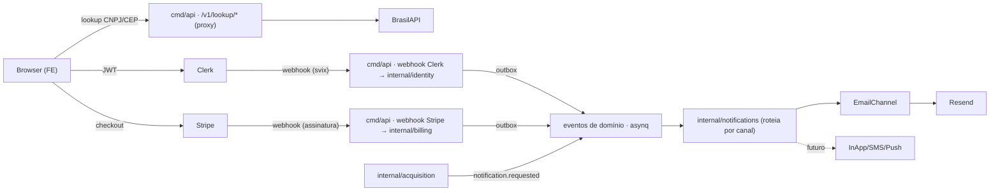

# ERD — Sistemas Auxiliares (jus-assessoria)

Como os sistemas de apoio da plataforma se encaixam na fundação: **Autenticação, Onboarding,
Convites, Billing e Notifications**. Complementa `docs/erd-backend.md` (arquitetura), `docs/erd-modelo-de-dados.md`
(schema, fonte de verdade do banco) e `docs/erd-frontend.md` (FE). Onde divergir dos ERDs de schema/arquitetura,
**aqueles vencem**. As chamadas concretas de SDK (Clerk/Stripe/Resend) devem ser confirmadas via **context7** na
implementação — aqui descrevemos o desenho, os contratos e os fluxos.

## 0. Provedores escolhidos
- **Autenticação + Organizações + Convites: Clerk.** `Clerk Org = tenant`, `1 user = 1 escritório` no v0. Convites usam
  **Clerk Organization Invitations** (nativo) — o Clerk envia o e-mail de convite; o BE só **reage por webhook**.
- **Billing: Stripe.** Assinatura por **Organization (tenant)**; `Stripe Customer = tenant`. (PIX/boleto nativos ficam
  como evolução futura — ver §6.6.)
- **Notifications (avisos ao usuário): domínio próprio `internal/notifications`** que despacha por **canais**. **E-mail é
  apenas um canal** (via **Resend** + React Email); in-app/SMS/push são canais futuros na mesma porta.
- **Consultas de cadastro (onboarding): BrasilAPI** (`/cnpj`, `/cep`) — auto-fetch de dados da empresa e endereço.
  Gratuita, sem chave; o BE faz de **proxy** (evita CORS, centraliza cache/rate-limit).

## 1. Princípios (herdados da fundação)
1. **Provedor externo atrás de porta.** Cada integração externa (Clerk, Stripe, Resend, BrasilAPI) entra por uma
   **interface** (webhook handler, `BillingGateway`, `Channel`, `RegistryLookup`); o domínio não conhece o SDK.
2. **Ingestão externa só por webhook assinado.** Clerk (svix) e Stripe (assinatura própria) — assinatura **sempre**
   verificada. Webhook → grava no `outbox`/processa idempotente; nunca regra de negócio inline sem dedup.
3. **Idempotência at-least-once.** Todo consumidor (webhook ou evento asynq) passa por `processed_event`
   (`SeenOrMark`). Chave estável: `svix-id` / Stripe `event.id`.
4. **tenant_id em tudo + RLS.** `tenant_id` sempre do contexto verificado (payload do webhook ou principal do JWT),
   nunca do body. `SET LOCAL app.tenant_id` por tx.
5. **Escrita em tx + transactional outbox.** Entidade + evento no `outbox` commitam juntos; `worker-outbox-relay`
   publica; consumidores reagem.
6. **Segredos só por env.** Chaves Clerk/Stripe/Resend e signing secrets nunca no código nem commitados.

## 2. Mapa de contexto

Slices novos: **`internal/identity`** (estende: org/tenant + **perfil da empresa** + membership + convites via webhook
Clerk), **`internal/billing`** (assinatura Stripe), **`internal/notifications`** (roteia eventos de notificação para
canais). Todos seguem a anatomia de slice vertical.

---

## 3. Autenticação (Clerk)
Já existe na fundação (Slice 11): middleware verifica JWT (JWKS), resolve `org_id→tenant_id` num
`principal{UserID, TenantID, Role}` no ctx; handler lê `tenant_id` já resolvido. Complementos:

- **Papéis.** Clerk org roles `org:admin` / `org:member` → `ADMIN` / `MEMBER` no `principal.Role`.
  `RequireRole(ADMIN)` guarda escritas sensíveis (integrações, billing, convites).
- **Sessão sem org.** Um user recém-criado pode não ter org (antes do onboarding). O middleware distingue
  **autenticado-sem-tenant** de **autenticado-com-tenant**; rotas de produto exigem tenant. O único caminho permitido
  sem tenant é o **onboarding** (§4).
- **Webhooks Clerk (svix).** `/webhooks/clerk`, assinatura verificada, `svix-id` = idempotência. Consome: `user.*`,
  `organization.created/updated/deleted`, `organizationMembership.*`, `organizationInvitation.accepted`.

## 4. Onboarding (wizard multi-step; a org nasce aqui)
**Decisão de produto:** a **organização (tenant) é criada durante o onboarding do primeiro usuário**; membros
adicionais entram por convite (§5). O onboarding é um **wizard de 3 passos** — o passo 3 é **pulável**.

### Passo 1 — Seus dados (pessoa)
Nome, sobrenome, e-mail, **telefone (opcional)**. Nome/telefone atualizam o perfil **Clerk** do usuário; o e-mail é o
identificador de auth (já vem do sign-up). Persistência: Clerk user → `app_user` sincroniza via webhook `user.updated`
(campo `phone` novo, opcional).

### Passo 2 — Dados da empresa (cria a org/tenant)
- **CNPJ com auto-fetch.** Ao digitar um CNPJ válido, o FE chama `GET /v1/lookup/cnpj/:cnpj` (BE → BrasilAPI) e
  **pré-preenche** razão social, nome fantasia e endereço.
- **Nome da empresa** — editável (default = nome fantasia; fallback razão social).
- **Endereço com auto-fetch** — vem do CNPJ; ajustes por CEP via `GET /v1/lookup/cep/:cep` (BE → BrasilAPI/ViaCEP).
- Ao concluir: o FE cria a **Clerk Organization** (`name` = nome da empresa) → webhook `organization.created`
  **provisiona o `tenant`**; em seguida o FE envia os **dados de empresa** ao BE
  (`PUT /v1/organization/profile`), que persiste em `tenant`/`organization_profile` (cnpj, razão social, nome
  fantasia, endereço).

### Passo 3 — Fontes (pulável)
Um **construtor de seletores** para DATAJUD/DJEN: um input de **OAB** no topo e uma **lista/tabela de cards** dos
seletores adicionados — **o mesmo componente da tela de Integrações**. Reusa `POST /v1/acquisition/integrations`
(dispara backfill + sync). **Pode ser pulado** e configurado depois em Integrações.

### Conclusão & gating
`tenant.onboarding_completed_at` é setado ao concluir o **passo 2** (empresa); o passo 3 é opcional e não bloqueia. O
FE libera o shell quando há org ativa + empresa preenchida. Os lookups de CNPJ/CEP passam **sempre pelo BE**
(proxy único: CORS, cache, rate-limit). **Race:** o FE cria a org e o webhook pode chegar depois → o BE faz **upsert
idempotente** do tenant; o FE mostra "preparando sua conta" até o provisionamento.

## 5. Convites (Clerk Organization Invitations)
**Mecanismo nativo do Clerk** — menos código, e-mail de convite entregue pelo Clerk.

1. Admin (FE, tela de Organização / `OrganizationProfile`) convida por e-mail, escolhendo o papel (`admin`/`member`).
2. Clerk registra o convite e **envia o e-mail** (não passa pelo domínio Notifications).
3. Convidado aceita → Clerk dispara `organizationInvitation.accepted` / `organizationMembership.created` (webhook).
4. `internal/identity` reage: upsert `app_user` + `membership` (papel), grava `identity.member_joined` (idempotência
   por `svix-id`).
5. `internal/notifications` (opcional) reage a `identity.member_joined` com boas-vindas de produto.

Revogar/remover → `organizationMembership.deleted` → desativa a membership.

## 6. Billing (Stripe)
Assinatura **por tenant**; `Stripe Customer = tenant`.

> ⚠️ **Atualizado (FLO-71).** A versão anterior desta seção descrevia entitlements
> granulares por recurso (`oab_limit`, `source_limit`, `seat_limit`, `retention`).
> Esse modelo **nunca foi implementado** — o que existe em produção (`internal/billing`)
> é precificação **por processo**, descrita abaixo. O card que propunha os 4 limites
> granulares (FLO-60) foi cancelado por divergir do que já estava em produção.

### 6.1 Modelo
Stripe continua fonte de verdade do **pagamento** (cobrança, fatura, ciclo de vida da
assinatura); o BE é fonte de verdade do **catálogo** — o que é um plano — e da
**política de trial**. Stripe só fornece, por plano, o `price_id` do Checkout.

- **`plan`** (catálogo local, migration 0037): `code`, `name`, `min_processes`,
  `max_processes` (nil = sem teto, plano Enterprise), `price_per_process_cents`,
  `stripe_price_id` (nil = plano ainda sem Checkout price vinculado), `active`.
- **`subscription`** espelha o Stripe (`status`: `trialing/active/past_due/canceled`,
  `stripe_customer_id`, `stripe_subscription_id`, `current_period_end`) **e** referencia
  o catálogo local: `plan_id` (FK pro `plan` resolvido a partir do `price_id` — nil até o
  próximo evento `customer.subscription.*` reprojetar, migration 0037),
  `custom_price_per_process_cents` (override negociado pra tenant fora da tabela padrão —
  nil = usa o preço do plano), `trial_ends_at` (fim da janela de trial, migration 0038).
- **O único entitlement do v0** é `active_process_limit` — o teto de processos ATIVOS
  do tenant, resolvido combinando `subscription` + `plan` via `effectiveEntitlement()`
  (`internal/billing/domain.go`): `activeProcessLimit = plan.MaxProcesses` (ou "sem
  limite" quando nil); o preço por processo é `subscription.CustomPricePerProcessCents`
  quando setado, senão `plan.PricePerProcessCents`.
- **Fail-closed por `Status`** (`internal/billing/entitlement.go`, `ActiveProcessLimit`):
  sem assinatura (`ErrSubscriptionNotFound`), `canceled`, `past_due`, ou `trialing` com
  `trial_ends_at` já vencido → limite **0**. Só `active` ou `trialing` dentro da janela
  resolvem o limite real via `effectiveEntitlement`.

### 6.2 Fluxo
1. Admin abre Billing → BE cria/reusa o Customer e abre **Checkout Session** (ou **Customer Portal**).
2. O BE **não confia no redirect de sucesso** — confia no webhook.
3. `internal/billing` consome (assinatura verificada, `event.id` = idempotência): `checkout.session.completed`,
   `customer.subscription.created/updated` → atualiza `subscription` (incl. `plan_id` resolvido do `price_id`) →
   `billing.subscription_activated` / `billing.subscription_updated`; `customer.subscription.deleted` →
   `billing.subscription_canceled`; `invoice.payment_failed` → grava `past_due` e emite `billing.payment_failed`
   na mesma tx.
4. Onboarding provisiona trial automaticamente (`identity.tenant_provisioned` → `billing` aplica a `trial_policy`,
   migration 0038); `billing.trial_ending_soon` é agendado via outbox `process_at` e vira aviso in-app.

### 6.3 Gating
`active_process_limit` lido na borda (via `EntitlementAdapter`, injetado em `acquisition`) para permitir/negar
a ativação de nova integração — acima do limite → erro tipado `FORBIDDEN`/`RATE_LIMITED`. O FE lê o plano/limite
para esconder/upsell. Fonte de verdade do entitlement é o BE.

### 6.4 Segurança
`/webhooks/stripe`, assinatura verificada com o signing secret (corpo raw), idempotência por `event.id`.

### 6.5 Trial / dunning
Trial via Stripe (`trialing`). Dunning a cargo do Stripe; o BE reflete o `status` e notifica no `payment_failed`.

### 6.6 PIX / boleto (futuro)
Stripe BR tem suporte limitado a PIX/boleto. O `BillingGateway` (porta) permite plugar um provedor BR
(Asaas/Iugu/Pagar.me) sem reescrever o domínio. Fora do v0.

## 7. Notifications (avisos ao usuário — e-mail é um canal)
Domínio auxiliar `internal/notifications` que **consome os eventos de notificação emitidos por outros domínios** e os
entrega por **canais**. **E-mail (Resend) é apenas um canal**; outros (in-app, e futuramente SMS/push/webhook) plugam
na mesma porta.

- **Contrato de entrada.** Domínios de negócio emitem `notification.requested {tenant_id, audience, type, channels?,
  payload}` no outbox. O produtor **não conhece canais nem templates** — só declara o *tipo* e o *público*. (O
  notifications também pode assinar eventos de negócio específicos via seus contratos, quando fizer sentido.)
- **Porta de canal.** `Channel{ Kind() ; Send(ctx, delivery) (providerMessageID, error) }`. v0: **`EmailChannel`**
  (Resend + React Email). Near-term: `InAppChannel` (persiste + FE lê um feed).
- **Roteamento por preferência.** `notification_preference` (por usuário/tenant e tipo) decide os canais; default
  sensato por tipo (ex.: prazo → e-mail + in-app).
- **Entrega & auditoria.** `notification` (o aviso lógico) + `notification_delivery` (por canal: status
  `QUEUED/SENT/FAILED/BOUNCED`, `provider_message_id`, `error`). Dedup por `processed_event` no listener. Webhooks do
  Resend (bounce/complaint) atualizam a `notification_delivery`.
- **Templates:** React Email, identidade "Ledger" (ver ERD FE).
- **Casos v0:** prazos / novas publicações (do `acquisition`), billing (`trial_ending_soon`, `payment_failed` — hoje
  só in-app, ver §12), `member_joined` (via e-mail, o único produtor no caminho genérico `notification.requested`
  hoje). **Convites continuam e-mail nativo do Clerk** (fora deste domínio).
- **Preferências (FLO-59, implementado):** `GET/PUT /v1/notifications/preferences` — o usuário liga/desliga o canal
  EMAIL por tipo de aviso (`notification_preference.channels`); ausência de override = todos os canais habilitados
  (default). Só o canal EMAIL é de fato verificado antes do envio hoje (`channelEnabled` em `domain.go`) — avisos
  IN_APP não respeitam preferência ainda.

> ⚠️ **Colisão de nome a resolver.** O slice `acquisition` já tem uma tabela **`notification` = intimação judicial**
> (conceito de domínio, não "aviso ao usuário"). Recomenda-se **renomear a judicial para `intimation`** e reservar
> `notification` / `notification_delivery` / `notification_preference` para este domínio auxiliar. Decisão a confirmar
> no `erd-modelo-de-dados.md` (migração + ajuste no slice acquisition).

---

## 8. Modelo de dados (detalhar em `erd-modelo-de-dados.md`)
Todas com `tenant_id` + RLS, exceto onde indicado. Enums = `text` + CHECK.
- **`app_user`** (existe) — + `phone` (opcional), + nome (sincronizado do Clerk).
- **`tenant` / `organization_profile`** — + `cnpj`, `legal_name` (razão social), `trade_name` (nome fantasia),
  `address` (jsonb: cep, logradouro, numero, complemento, bairro, cidade, uf), `onboarding_completed_at`.
- **`membership`** — `tenant_id`, `app_user_id`, `role` (`ADMIN|MEMBER`), `status`, `clerk_membership_id`, timestamps.
- **`plan`** (migration 0037) — `code`, `name`, `min_processes`, `max_processes` (nullable), `price_per_process_cents`,
  `stripe_price_id` (nullable), `active`.
- **`subscription`** — `tenant_id` (unique), `stripe_customer_id`, `stripe_subscription_id`, `status`, `plan_id` (FK
  `plan`, nullable), `custom_price_per_process_cents` (nullable), `trial_ends_at` (nullable, migration 0038),
  `current_period_end`. `active_process_limit` (o único entitlement do v0) não é coluna própria — é resolvido em
  runtime por `effectiveEntitlement(subscription, plan)` (§6.1), nunca persistido.
- **`notification`** (aux) — `tenant_id`, `audience`/`recipient_user_id`, `type`, `payload` (jsonb), `status`,
  `created_at`.
- **`notification_delivery`** — `notification_id`, `channel` (`EMAIL|IN_APP|SMS|PUSH`), `status`
  (`QUEUED|SENT|FAILED|BOUNCED`), `provider_message_id`, `error`, timestamps.
- **`notification_preference`** — `tenant_id`, `app_user_id`, `type`, `channels` (quais canais por tipo).
- **`processed_event`** (existe) — passa a guardar também `svix-id` / Stripe `event.id`.

## 9. Contratos de evento (outbox)
- `identity.tenant_provisioned {tenant_id, clerk_org_id, owner_user_id}`
- `identity.org_profile_updated {tenant_id, cnpj, trade_name}` (após passo 2 do onboarding)
- `identity.member_joined {tenant_id, app_user_id, role}` · `identity.member_removed {tenant_id, app_user_id}`
- `billing.subscription_activated {tenant_id, plan, current_period_end}` · `billing.subscription_updated {...}` ·
  `billing.subscription_canceled {tenant_id}` · `billing.payment_failed {tenant_id, invoice_id, amount_due}`
- **`notification.requested {tenant_id, audience, type, channels?, payload}`** — contrato genérico que qualquer
  domínio emite para pedir um aviso; consumido por `internal/notifications`.
- Reaproveitados: eventos de prazo/publicação do `acquisition` viram `notification.requested`.
Todos carregam `trace_context` e um `event_id` estável.

## 10. Fluxos ponta a ponta
**(A) Onboarding → tenant provisionado.** signup (Clerk) → **passo 1** (perfil pessoa) → **passo 2** (CNPJ auto-fetch
→ cria Clerk Org → webhook `organization.created` → `identity` upsert tenant + owner ADMIN → FE `PUT /organization/profile`
→ `identity.tenant_provisioned` + `org_profile_updated`) → **passo 3** opcional (`POST /acquisition/integrations`) →
FE libera shell.

**(B) Convite → membership.** Admin convida (Clerk) → Clerk envia e-mail → aceite → `organizationMembership.created`
→ `identity` upsert membership → `identity.member_joined` → notificação de boas-vindas.

**(C) Assinatura.** Admin abre Billing → Checkout Session → pagamento → `checkout.session.completed` +
`customer.subscription.updated` → `billing` atualiza subscription+entitlements → `billing.subscription_activated` →
gating liberado.

**(D) Evento → notificação → canal.** `acquisition` emite `notification.requested` (prazo) → `internal/notifications`
resolve preferências/audiência → cria `notification` + `notification_delivery` (EMAIL) → `EmailChannel.Send` (Resend)
→ atualiza delivery (+ dedup por `processed_event`).

## 11. Segurança & idempotência
- Webhooks: Clerk via **svix**, Stripe via **assinatura própria** (corpo raw). Chave: `svix-id` / Stripe `event.id`.
- Nunca confiar no redirect de sucesso do Checkout — a verdade vem do webhook.
- `tenant_id` sempre do contexto verificado; RLS por tx; segredos por env. Lookups CNPJ/CEP via proxy do BE (cache).

## 12. Decisões em aberto
- **Renomear a `notification` judicial → `intimation`** (§7) para liberar o nome ao domínio de avisos.
- Canais do Notifications no v0: e-mail garantido; in-app logo a seguir (feed que o FE lê).
- PIX/boleto (provedor BR) atrás do `BillingGateway` (§6.6).
- **Fan-out de e-mail do `payment_failed` por admin** (FLO-69, aberto): hoje o aviso é só in-app tenant-level —
  `billing` não tem (e não deveria ter, por regra de dependência de slice) acesso à lista de admins do tenant.
- Onboarding: viver em `internal/identity` ou slice próprio `internal/onboarding`? (v0: dentro de identity).

## 13. Ordem de implementação (fatias verticais)
1. **identity — onboarding (passo 1+2)**: perfil da pessoa (sync Clerk) + perfil da empresa (CNPJ/CEP lookup via
   proxy) + criação da org/tenant + `onboarding_completed_at`. **FE: wizard** (passo 1, passo 2, passo 3 = reusa
   Integrações, pulável).
2. **identity — convites**: webhooks membership/invitation → `membership` + `member_joined`; tela de convites (FE).
3. **notifications — domínio + EmailChannel (Resend)**: `notification.requested` + roteamento + `notification`/
   `notification_delivery`/`notification_preference` + templates; resolve a colisão `intimation`.
4. **billing — assinatura**: Customer + Checkout/Portal + webhooks → `subscription`/entitlements; tela Billing (FE).
5. **billing — gating**: entitlements na borda + upsell no FE.

Cada fatia segue o fluxo do projeto: **pm-plan → dev-qa (TDD) → code-review → merge**.
