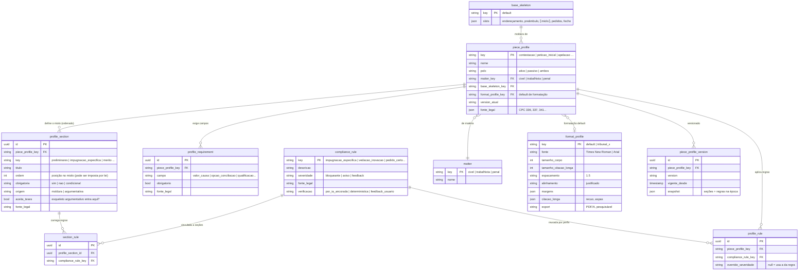
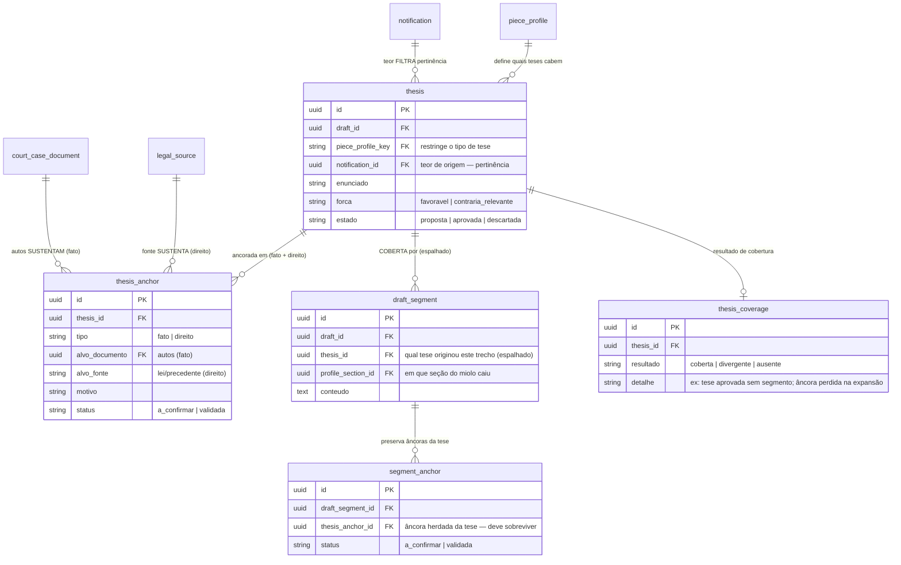

# ERD — Tipos de Peça (perfis de geração)

> **Escopo.** Destila em modelo de dados o *Modelo de Perfis de Peça* (template base + perfis por tipo + regras de conformidade). Modela o **catálogo que o gerador consulta** — a planta de cada tipo de peça, não a peça gerada (a Minuta e o canvas têm ERD próprio).
> **Princípio.** Composição, não duplicação: `base_skeleton` (moldura invariante) + `piece_profile` (miolo + regras por tipo) + `format_profile` (aparência), combinados na geração. Perfis e regras são **dados versionados** — a lei muda sem tocar no gerador.
> **Vocabulário.** Peça em construção = Minuta (`draft`); tipo = `piece_profile`. Termos de domínio em PT; identificadores em EN.

---

## 1. Modelo de dados

---

## 2. Notas de modelagem

- **`base_skeleton` é 1 (poucos)**, referenciado por muitos perfis. A moldura invariante (endereçamento → preâmbulo → ⟦miolo⟧ → pedidos → fecho) não se repete por tipo; só o miolo varia. `slots` guarda os pontos fixos e o ponto de extensão.
- **`profile_section` é o miolo por tipo, ordenado.** A `ordem` pode ser imposta por lei (na contestação, preliminares antes do mérito). `origem` separa o que a IA *redige* (argumentativa) do que preenche por dados (moldura); `aceita_teses` marca onde o esqueleto argumentativo entra.
- **`compliance_rule` é catálogo global; `profile_rule` e `section_rule` são os vínculos.** A mesma regra (ex.: `vedacao_inovacao`) é definida uma vez e reusada por quantos perfis precisarem — vínculo N:N via `profile_rule`. Uma regra pode ainda ser amarrada a uma **seção** específica (`section_rule`), não só ao perfil.
- **`severidade` tem três valores**, não dois: `bloqueante` (trava o protocolo), `aviso`, e `feedback` (não verificável automaticamente — validada por feedback do usuário, como `fidelidade_sem_vies`). `profile_rule.override_severidade` permite um perfil endurecer/afrouxar a severidade de uma regra herdada.
- **`verificacao`** diz *como* a regra é checada: `deterministica` (ex.: valor da causa presente), `por_ia_ancorada` (ex.: cada fato da inicial foi impugnado — precisa da IA sobre a peça de referência), `feedback_usuario` (viés).
- **`matter` é o eixo transversal.** Cível/trabalhista/penal mudam miolo e nomenclatura — o `piece_profile` é indexado por matéria, então "contestação cível" e "contestação trabalhista" são perfis distintos sob a mesma família (resolve a questão em aberto que vinha se arrastando).
- **`format_profile` é separado do conteúdo** e ligado ao perfil só como *default*; o override real por tribunal/escritório se aplica na exportação (não na redação). Não há tabela de feriados aqui — formatação ≠ cálculo.
- **`piece_profile_version` versiona o perfil inteiro.** Como a lei muda, um `snapshot` congela seções+regras vigentes numa data — uma peça gerada em março é auditável contra o perfil daquele momento, não o de hoje.

---

## 4. A tese como contrato entre autos/teor e peça

O modelo acima descreve a *planta* (o perfil). Falta o elo que os documentos de geração tratam solto: **de onde a tese tira sustentação, e como a peça é obrigada a honrá-la.** A tese é um contrato — assinado na entrada (ancorada nos autos, filtrada pelo teor) e cobrado na saída (cada tese aprovada vira texto que preserva suas âncoras).

### 4.1 Entrada — como autos e teor viram tese

Autos e teor entram **de formas diferentes**, e as duas condições são necessárias:

- **Teor da intimação → pertinência.** O teor traz a providência ("contestar"), e isso restringe *quais tipos de tese cabem* (contestar pede defesa, não ataque). É o filtro: `thesis.notification_id` + `piece_profile_key` juntos definem o espaço de teses admissíveis. Tese que não responde ao teor é impertinente.
- **Autos → sustentação.** Cada tese se ancora em fatos que **estão nos autos** (`thesis_anchor.tipo = fato` → `court_case_document`) e em direito verificável (`tipo = direito` → `legal_source`). A âncora resolve *contra os autos*, não contra o nada. Tese sem lastro nos autos é invenção.

Uma tese só é legítima se satisfaz as duas: **pertinente ao teor e sustentada pelos autos.**

### 4.2 Saída — como a peça respeita a tese (meta verificada, não lei)

Respeitar a tese é **verificável**, por três mecanismos do mais forte ao mais fraco:

1. **Rastreabilidade estrutural.** Cada `draft_segment` carrega a `thesis_id` que o originou (modelo espalhado). Permite perguntar "esta tese virou texto?". Tese aprovada sem nenhum segmento → a peça não a honrou.
2. **Preservação de âncoras.** As âncoras nascem na tese (`thesis_anchor`) e devem sobreviver na expansão (`segment_anchor` aponta de volta para elas). Se o texto fala de caso fortuito mas perdeu a citação do art. 393 que a tese trazia, a peça diluiu a tese.
3. **Conformidade cruzada.** As `compliance_rule` verificam a tese contra a peça — a `vedacao_inovacao` compara teses do recurso com as da instância anterior. Só é possível porque a tese é entidade rastreável.

**A postura (caminho do meio):** a IA **pode** fundir ou omitir uma tese fraca — mas isso não passa em silêncio nem trava a geração. O resultado vira `thesis_coverage`:

| `resultado` | significa | o que acontece |
|---|---|---|
| `coberta` | tese aprovada tem segmento(s) que preservam suas âncoras | ok |
| `divergente` | tese aprovada foi fundida/alterada, ou perdeu uma âncora | **sinaliza ao advogado** (mesmo `divergente` do mapa de cobertura) — ele decide |
| `ausente` | tese aprovada sem nenhum segmento na peça | sinaliza como não honrada |

A tese é **meta verificada**, não lei absoluta: a peça é gerada mesmo com divergências, mas a revisão as expõe no mapa de cobertura para o advogado aceitar (a fusão foi boa) ou corrigir (a tese sumiu indevidamente). É o mesmo estado `divergente` que o mockup da checklist já mostrava — agora com origem no contrato tese↔peça.

---

## 5. Como a geração consome o modelo

Não é comportamento novo — é o que os documentos de geração já descreveram, agora com as entidades:

1. `assessoria.esbocar_minuta` recebe `piece_profile.key` (+ matéria) → carrega o perfil e suas `profile_section` (origem `argumentativa`) → a IA propõe as **teses** nas seções que `aceita_teses`.
2. A moldura (`origem = moldura`) é preenchida por dados (identificação, partes, responsável) — pouca variação.
3. `assessoria.revisar_minuta` roda as `compliance_rule` do perfil (via `profile_rule` + `section_rule`) → devolve resultado por severidade, alimentando o checklist "Revisão antes de assinar". Uma `bloqueante` não cumprida trava o "Protocolar" do Bloco 2.
4. **Verifica a cobertura das teses** (§4.2): para cada tese aprovada, checa se há `draft_segment` que preserva suas âncoras → grava `thesis_coverage`. Divergências e ausências entram no mapa de cobertura do canvas, não travam a geração.
5. Na exportação, aplica-se o `format_profile` (default do perfil, ou override do tribunal).

---

## 6. Perfis-semente (v1 do catálogo)

Os três já detalhados no Modelo de Perfis, como linhas do catálogo:

| `piece_profile` | polo | seções do miolo (ordem) | regras-chave |
|---|---|---|---|
| `peticao_inicial` | ativo | fatos → direito → pedidos | `pedido_certo`, `valor_causa` |
| `contestacao` | passivo | preliminares → prejudiciais → impugnação específica → mérito → pedidos → provas | `impugnacao_especifica`, `preliminares_antes_merito`, `eventualidade` |
| `apelacao` | — | cabimento/tempestividade → síntese → razões de reforma → prequestionamento → pedido | `vedacao_inovacao`, `dialeticidade` |

As demais famílias (réplica, contrarrazões, agravo, embargos) entram como novos `piece_profile` com o mesmo `base_skeleton` — cadastro de dados, não código.

---

## 7. Questões em aberto

1. **Matéria como eixo vs. perfis distintos.** O modelo indexa por `matter`, tratando "contestação cível" e "trabalhista" como perfis distintos. Alternativa: um perfil com variações por matéria. A escolha atual (perfis distintos) é mais simples de versionar; confirmar que não gera duplicação excessiva.
2. **Customização por escritório.** Um tenant pode ajustar um perfil (ordem de seções, severidade de uma regra)? Se sim, precisa de uma camada `tenant_profile_override` sobre o catálogo global — decidir se v1 tem isso ou só o catálogo padrão.
3. **Granularidade da `section_rule`.** Vincular regra a seção (não só a perfil) é útil para localizar o erro no checklist ("faltou X na seção Y"), mas exige que a revisão saiba mapear resultado→seção. Vale o custo na v1?
4. **Override de formatação.** O `format_profile` por tribunal é seleção manual do escritório ou o sistema infere pelo tribunal da Tramitação? A segunda é mais mágica, mas erra em comarcas sem regra própria.
