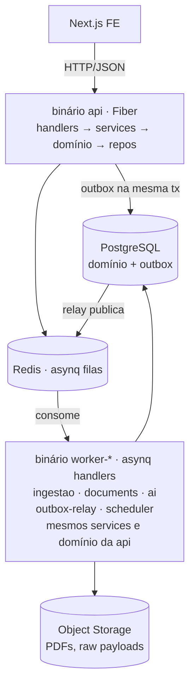
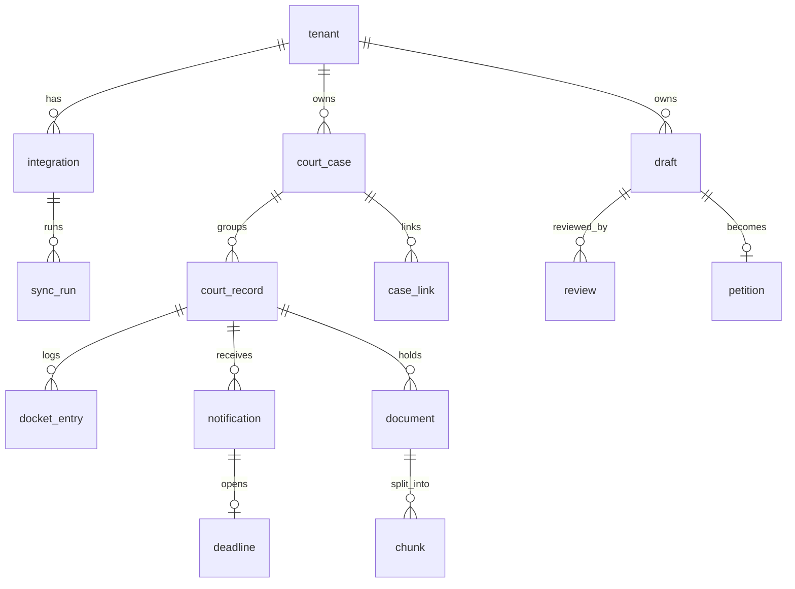

# Fundação — PRD + ERD

> Camada zero do projeto: stack, arquitetura de componentes, estrutura de pastas, Clean Architecture, bibliotecas por necessidade e telemetria.
> Os deep dives por componente (Ingestão, Consolidação, Assessoria) vêm em documentos próprios e assumem esta fundação.
>
> **Stack fixada:** Go (Fiber, sqlc), Next.js, PostgreSQL, asynq + Redis, OTEL → New Relic. Monólito modular, workers como binários separados, Clean Architecture.

> **Nota de nomenclatura:** o DDL abaixo foi escrito antes da decisão de padronizar identificadores em **inglês**. A versão canônica e atual do schema, em inglês, está em `erd-modelo-de-dados.md` — use-o como fonte de verdade. Este documento permanece válido para os conceitos (necessidades, arquitetura de componentes); os nomes de tabela aqui são a versão antiga.

---

# PARTE I — PRD DA FUNDAÇÃO

O PRD aqui não descreve features de produto — descreve o que a **plataforma técnica** precisa oferecer para que as três camadas de aplicação sejam construídas sem retrabalho. Cada necessidade é numerada e o ERD (Parte II) responde a ela.

## N1 — Modelo de domínio persistente e evolutivo

A plataforma precisa persistir o modelo canônico (`Processo`, `Tramitacao`, `Movimento`, etc.) de forma que:
- o schema seja a fonte de verdade, versionado e migrado de forma controlada
- entidades novas (Risco na v2, MNI na v2) entrem sem reescrever o que existe
- `tenantId` isole dados entre escritórios em toda tabela que o usuário toca

## N2 — Event-driven confiável sem perder nem duplicar evento

O domínio é event-driven. A plataforma precisa garantir:
- que gravar um fato de domínio e publicá-lo sejam **atômicos** (não pode gravar e falhar ao publicar, nem o contrário)
- que todo consumidor seja idempotente (entrega at-least-once)
- ordem por agregado, nunca global

Isto é o **transactional outbox**. Com asynq (que não tem outbox nativo, diferente do BullMQ), o padrão é construído explicitamente — ver N-ASYNC.

## N-ASYNC — Processamento assíncrono

Jobs de ingestão, extração de documento e revisão por LLM rodam fora do request. A plataforma precisa de:
- enfileiramento durável com retry e backoff
- filas separadas por tipo de trabalho (um job de OCR não trava a ingestão)
- agendamento (o scheduler que consulta quem venceu)
- dead-letter para o que falha além do limite

## N3 — API HTTP para o frontend

O Next.js consome uma API. Precisa de:
- rotas versionadas, validação de entrada, serialização consistente
- autenticação e contexto de tenant em toda rota
- erros padronizados (o front trata um formato único)

## N4 — Autenticação e autorização

- identidade do usuário e do tenant
- sessão/token no front
- autorização por tenant (nunca ver dado de outro escritório) e, no futuro, por papel

## N5 — Acesso a dados type-safe

Queries devem ser verificadas em tempo de compilação, sem ORM mágico que esconde SQL. O domínio não conhece o banco — repositórios são interface no domínio, implementação na infra.

## N6 — Validação

Entrada de API e comandos de domínio validados de forma declarativa, com mensagens que o front exibe.

## N7 — Observabilidade completa

Traces, métricas e logs estruturados, correlacionados, exportados via OTEL para o New Relic. Um request ou um job precisa ser rastreável ponta a ponta, incluindo o hop assíncrono (o trace não pode morrer quando o trabalho entra na fila).

## N8 — Storage de objetos

PDFs (autos e uploads) e payloads brutos. Write-once, read-rarely, com lifecycle.

## N9 — Configuração e segredos

Config por ambiente, segredos fora do código e fora do banco em claro. (Na v0, o Secrets Manager pesado do MNI está cortado — mas a plataforma de config existe.)

## N10 — Frontend estruturado

Next.js com camadas claras, data fetching consistente, estado de servidor separado de estado de UI, componentes de domínio separados de primitivos.

---

# PARTE II — ERD E ARQUITETURA (a solução)

## Visão de componentes

Monólito modular: **um** módulo de domínio compilado em **vários binários**. O mesmo código de domínio roda no processo de API e nos workers — muda só o entrypoint.



**Binários da v0:**

| Binário | Papel |
|---|---|
| `api` | HTTP para o front (Fiber) |
| `worker-ingestao` | jobs de DataJud e DJEN |
| `worker-documents` | extração de texto, OCR, chunking |
| `worker-ai` | revisão por LLM |
| `worker-outbox-relay` | lê a tabela outbox e publica no asynq |
| `scheduler` | tick que enfileira sincronizações vencidas |

Todos importam o mesmo `internal/` — a lógica não se duplica.

---

## ERD — o núcleo persistente

O modelo completo, em inglês, está em `erd-modelo-de-dados.md` (fonte de verdade). Abaixo o relacionamento das entidades da **v0** + as duas tabelas de **infra** (outbox, processed_event):



Infra (não-domínio, sem relação de FK forte): `outbox` (fatos a publicar), `processed_event` (idempotência dos consumidores).

### DDL essencial (Postgres)

Só as colunas que carregam decisão. Tipos e índices completos vão no deep dive de cada camada.

```sql
CREATE TABLE tenant (
  id          uuid PRIMARY KEY DEFAULT gen_random_uuid(),
  nome        text NOT NULL,
  created_at  timestamptz NOT NULL DEFAULT now()
);

CREATE TABLE integracao (
  id             uuid PRIMARY KEY DEFAULT gen_random_uuid(),
  tenant_id      uuid NOT NULL REFERENCES tenant(id),
  source         text NOT NULL,           -- DATAJUD | DJEN | UPLOAD
  scope          jsonb NOT NULL,          -- { oab: [], cpfCnpj: [] }
  credential_ref text,                    -- ponteiro; null na v0
  status         text NOT NULL DEFAULT 'ACTIVE',
  UNIQUE (tenant_id, source)
);

CREATE TABLE processo (
  id                    uuid PRIMARY KEY DEFAULT gen_random_uuid(),
  tenant_id             uuid NOT NULL REFERENCES tenant(id),
  label                 text,
  primary_tramitacao_id uuid,
  merged_into_id        uuid REFERENCES processo(id),
  created_at            timestamptz NOT NULL DEFAULT now()
);
CREATE INDEX ON processo (tenant_id);

CREATE TABLE tramitacao (
  id            uuid PRIMARY KEY DEFAULT gen_random_uuid(),
  tenant_id     uuid NOT NULL REFERENCES tenant(id),
  processo_id   uuid NOT NULL REFERENCES processo(id),
  numero_cnj    text NOT NULL,            -- sem máscara
  grau          text NOT NULL,            -- G1|G2|JE|SUPERIOR|DESCONHECIDO
  tribunal      text NOT NULL,
  classe        text,
  assunto       text,
  valor_causa   numeric(15,2),
  sigilo        text NOT NULL DEFAULT 'PUBLIC',
  lifecycle     text NOT NULL DEFAULT 'ACTIVE',
  completeness  real NOT NULL DEFAULT 0,
  sync_policy   jsonb NOT NULL DEFAULT '{}',
  next_sync_at  timestamptz,
  last_synced_at jsonb NOT NULL DEFAULT '{}',
  UNIQUE (tenant_id, numero_cnj, grau)
);
CREATE INDEX ON tramitacao (next_sync_at) WHERE lifecycle = 'ACTIVE';
CREATE INDEX ON tramitacao (tenant_id, processo_id);

CREATE TABLE movimento (
  id            uuid PRIMARY KEY DEFAULT gen_random_uuid(),
  tramitacao_id uuid NOT NULL REFERENCES tramitacao(id),
  hash          text NOT NULL,
  ocorrido_em   timestamptz NOT NULL,     -- cálculo de domínio
  observado_em  timestamptz NOT NULL,     -- ordem e idempotência
  fonte         text NOT NULL,
  fidelity      int NOT NULL,
  codigo_tpu    int,
  complementos  jsonb,
  texto         text NOT NULL,
  retratado_em  timestamptz,
  UNIQUE (tramitacao_id, hash)
);
CREATE INDEX ON movimento (tramitacao_id, ocorrido_em);

CREATE TABLE intimacao (
  id                uuid PRIMARY KEY DEFAULT gen_random_uuid(),
  tenant_id         uuid NOT NULL REFERENCES tenant(id),
  processo_id       uuid NOT NULL REFERENCES processo(id),
  tramitacao_id     uuid NOT NULL REFERENCES tramitacao(id),
  hash              text NOT NULL,
  disponibilizado_em date NOT NULL,
  publicado_em       date NOT NULL,       -- derivado
  prazo_inicio_em    date NOT NULL,       -- derivado
  teor              text NOT NULL,
  fonte             text NOT NULL,
  UNIQUE (tenant_id, processo_id, hash)   -- dedup no Processo
);

CREATE TABLE prazo (
  id                 uuid PRIMARY KEY DEFAULT gen_random_uuid(),
  tramitacao_id      uuid NOT NULL REFERENCES tramitacao(id),
  intimacao_id       uuid NOT NULL UNIQUE REFERENCES intimacao(id),
  inicio             date NOT NULL,
  fim                date NOT NULL,
  dias               int NOT NULL,
  contagem           text NOT NULL,       -- UTEIS | CORRIDOS
  dobro              boolean NOT NULL DEFAULT false,
  feriados_aplicados jsonb NOT NULL DEFAULT '[]',
  status             text NOT NULL DEFAULT 'ABERTO'
);

CREATE TABLE case_link (
  id               uuid PRIMARY KEY DEFAULT gen_random_uuid(),
  tenant_id        uuid NOT NULL REFERENCES tenant(id),
  from_tramitacao_id uuid NOT NULL REFERENCES tramitacao(id),
  to_tramitacao_id   uuid NOT NULL REFERENCES tramitacao(id),
  tipo             text NOT NULL,
  confidence       text NOT NULL,         -- v0: só DETERMINISTIC
  fonte            text,
  evidencia        text NOT NULL,
  confirmado_por   uuid,
  confirmado_em    timestamptz,
  UNIQUE (from_tramitacao_id, to_tramitacao_id, tipo)
);

CREATE TABLE documento (
  id             uuid PRIMARY KEY DEFAULT gen_random_uuid(),
  tenant_id      uuid NOT NULL REFERENCES tenant(id),
  tramitacao_id  uuid REFERENCES tramitacao(id),   -- null em upload
  tipo_documento text NOT NULL,
  origem         text NOT NULL,           -- TRIBUNAL | UPLOAD
  storage_key    text,
  paginas        int,
  tem_camada_texto boolean NOT NULL DEFAULT false
);

CREATE TABLE chunk (
  id           uuid PRIMARY KEY DEFAULT gen_random_uuid(),
  documento_id uuid NOT NULL REFERENCES documento(id),
  pagina       int NOT NULL,
  texto        text NOT NULL,
  embedding    vector(1536)
);
CREATE INDEX ON chunk (documento_id, pagina);

CREATE TABLE minuta (
  id          uuid PRIMARY KEY DEFAULT gen_random_uuid(),
  tenant_id   uuid NOT NULL REFERENCES tenant(id),
  processo_id uuid REFERENCES processo(id),  -- opcional
  tipo_peca   text NOT NULL,
  status      text NOT NULL DEFAULT 'RASCUNHO',
  storage_key text NOT NULL
);

CREATE TABLE review_result (
  id            uuid PRIMARY KEY DEFAULT gen_random_uuid(),
  minuta_id     uuid NOT NULL REFERENCES minuta(id),
  findings      jsonb NOT NULL,
  cobertura     jsonb NOT NULL,            -- { verificada, naoVerificada }
  model_version text NOT NULL,
  rules_version text NOT NULL,
  criado_em     timestamptz NOT NULL DEFAULT now()
);

CREATE TABLE peticao (
  id                  uuid PRIMARY KEY DEFAULT gen_random_uuid(),
  minuta_id           uuid NOT NULL UNIQUE REFERENCES minuta(id),
  tramitacao_id       uuid NOT NULL REFERENCES tramitacao(id),
  protocolada_em      timestamptz NOT NULL,
  recibo              jsonb NOT NULL,
  resultado_observado text                 -- nasce aqui, preenchido depois
);

CREATE TABLE sync_run (
  id                uuid PRIMARY KEY DEFAULT gen_random_uuid(),
  tramitacao_id     uuid REFERENCES tramitacao(id),
  integracao_id     uuid NOT NULL REFERENCES integracao(id),
  connector_id      text NOT NULL,
  connector_version text NOT NULL,
  started_at        timestamptz NOT NULL,
  finished_at       timestamptz,
  status            text NOT NULL,
  itens_novos       int NOT NULL DEFAULT 0,
  itens_dedup       int NOT NULL DEFAULT 0,
  raw_payload_refs  jsonb NOT NULL DEFAULT '[]',
  error             jsonb
);

-- INFRA: transactional outbox
CREATE TABLE outbox (
  id             bigserial PRIMARY KEY,
  aggregate_type text NOT NULL,
  aggregate_id   uuid NOT NULL,
  type           text NOT NULL,
  payload        jsonb NOT NULL,
  idempotency_key text,
  created_at     timestamptz NOT NULL DEFAULT now(),
  published_at   timestamptz
);
CREATE INDEX ON outbox (published_at, id) WHERE published_at IS NULL;

-- INFRA: idempotência do consumidor
CREATE TABLE processed_event (
  consumer     text NOT NULL,
  event_id     text NOT NULL,
  processed_at timestamptz NOT NULL DEFAULT now(),
  PRIMARY KEY (consumer, event_id)
);
```

### Como o ERD responde ao PRD

| Necessidade | Resposta no ERD/arquitetura |
|---|---|
| N1 modelo evolutivo | schema versionado por migration; `tenant_id` em toda tabela de usuário |
| N2 event-driven confiável | `outbox` na mesma transação; `processed_event` para idempotência; `aggregate_id` ordena |
| N-ASYNC | asynq + Redis; `worker-outbox-relay` lê `outbox` e publica |
| N7 observabilidade | `sync_run` audita ingestão; trace atravessa o outbox via campo no payload |

---

## Estrutura de pastas — Backend (Go, Clean Architecture)

Clean Arch com a regra de dependência apontando para dentro: `domain` não importa nada de infra.

```
/cmd                          entrypoints — um por binário
  /api/main.go
  /worker-ingestao/main.go
  /worker-documents/main.go
  /worker-ai/main.go
  /worker-outbox-relay/main.go
  /scheduler/main.go

/internal
  /domain                     ← núcleo. ZERO dependência externa.
    /processo                 entidades, invariantes, eventos do agregado
      processo.go
      tramitacao.go
      movimento.go
      events.go
      repository.go           INTERFACE (implementada na infra)
    /assessoria
      minuta.go
      review.go
      repository.go
    /shared
      id.go, tenant.go, errors.go

  /app                        ← use cases (application services)
    /ingestao
      sync_tramitacao.go      orquestra: connector → parser → repo → outbox
    /consolidacao
      reconcile.go
      link_deterministic.go
    /assessoria
      review_minuta.go
    ports.go                  interfaces que o app precisa (Connector, LLM, Storage)

  /infra                      ← implementações. Depende de domain/app.
    /postgres
      /sqlc                   código gerado pelo sqlc
      processo_repo.go        implementa domain/processo.Repository
      outbox.go
      tx.go                   Unit of Work — a tx que abraça domínio + outbox
    /asynq
      client.go, server.go
      tasks.go                definição dos tipos de job
    /connectors
      datajud.go, djen.go
    /parser
      datajud_parser.go, djen_parser.go
    /llm
      anthropic.go            implementa app.LLM
    /storage
      s3.go
    /telemetry
      otel.go                 setup de tracer, meter, logger

  /transport                  ← entrada HTTP
    /http
      /handlers
      /middleware             auth, tenant, request-id, recover
      router.go               Fiber
      dto.go                  request/response, validação
      errors.go               formato único de erro

/migrations                   SQL versionado (goose ou similar)
/pkg                          utilitários genuinamente reutilizáveis
```

**As quatro camadas e a regra de dependência:**

```
transport ──▶ app ──▶ domain ◀── infra
                        ▲
            (infra implementa interfaces que domain define)
```

- `domain` não sabe que Postgres, Fiber ou asynq existem
- `app` conhece `domain` e define **ports** (interfaces) para o que precisa do mundo externo
- `infra` implementa os ports; é trocável (sqlc→outro, S3→R2) sem tocar em domínio
- `transport` traduz HTTP em chamadas de use case

## Estrutura de pastas — Frontend (Next.js)

```
/app                          App Router
  /(auth)/login
  /(app)
    /carteira                 lista de Processos
    /processo/[id]            a Pasta
    /revisao                  upload + ReviewResult
  layout.tsx

/src
  /features                   por domínio, não por tipo de arquivo
    /carteira
      /components
      /hooks
      api.ts                  chamadas à API desta feature
      types.ts
    /revisao
    /processo
  /components/ui              primitivos (design system)
  /lib
    /api                      cliente HTTP, interceptors, tratamento de erro
    /auth
    telemetry.ts              OTEL web → mesmo backend de traces
  /server                     server actions / route handlers se houver BFF
```

**Separações que importam no front:**

- **estado de servidor** (dados da API) via TanStack Query — cache, revalidação, loading/error padronizados — **separado** de estado de UI (useState/context)
- **features** isoladas: `carteira` não importa de `revisao`
- **`components/ui`** são primitivos burros; componentes de domínio vivem na feature

---

## Bibliotecas por necessidade

### Backend (Go)

| Necessidade | Biblioteca | Nota |
|---|---|---|
| HTTP | **Fiber** | router e middleware |
| Acesso a dados | **sqlc** | gera Go type-safe a partir de SQL puro |
| Driver Postgres | **pgx** | sqlc gera para pgx; pooling nativo |
| Migrations | **goose** | SQL versionado, up/down |
| Filas | **asynq** | jobs sobre Redis, retry, scheduler, dead-letter |
| Validação | **go-playground/validator** | tags declarativas nos DTOs |
| Config | **viper** ou env struct + **envconfig** | config por ambiente |
| Auth | **JWT** (golang-jwt) + middleware próprio | tenant claim no token |
| Log estruturado | **slog** (stdlib) | com handler que injeta trace_id |
| Telemetria | **OpenTelemetry-Go** | traces + metrics + logs, exporter OTLP |
| UUID | **google/uuid** | v7 para ordenação temporal em `event_id` |
| Vetor | **pgvector-go** | embeddings no Postgres |

### Frontend (Next.js)

| Necessidade | Biblioteca |
|---|---|
| Framework | Next.js (App Router) |
| Estado de servidor | TanStack Query |
| Formulário + validação | React Hook Form + Zod |
| UI | Tailwind + shadcn/ui |
| HTTP | fetch tipado / ky, com interceptor de auth e erro |
| Auth | Auth.js (NextAuth) ou sessão via cookie do backend |
| Telemetria web | OpenTelemetry JS |

---

## Telemetria — OTEL → New Relic

Três sinais, um pipeline, correlacionados por `trace_id`. Exporta OTLP; o New Relic é o backend OTLP (troca de destino é variável de ambiente, sem mudar código — o valor de padronizar em OTEL).

```
api / workers
   │  OpenTelemetry SDK (traces, metrics, logs)
   ▼
OTLP exporter ──▶ OTel Collector ──▶ New Relic (OTLP endpoint)
                     (opcional na v0; pode exportar direto)
```

### Traces

- middleware Fiber abre o span raiz de cada request; `trace_id` no contexto
- **o trace atravessa o hop assíncrono:** ao enfileirar um job, injeta o trace context no payload do asynq; o worker extrai e continua o mesmo trace. Sem isso, a revisão que começou num request HTTP e terminou num worker vira dois traces desconexos — e você perde justamente a visão ponta a ponta.
- spans em: handler, use case, repositório (query SQL), chamada de connector, chamada de LLM

### Métricas

- RED por rota (Rate, Errors, Duration)
- por fila asynq: profundidade, latência de processamento, taxa de falha, tamanho da DLQ
- de negócio: tramitações em grau `DESCONHECIDO`, lag `observado_em - ocorrido_em` por fonte, custo de token por revisão
- do outbox: idade do evento não publicado (alerta se o relay travar)

### Logs

- **slog** estruturado (JSON), com `trace_id` e `span_id` injetados por um handler custom — assim log e trace se cruzam no New Relic
- nível por ambiente; nunca logar credencial, teor de intimação sigilosa, ou PII além do necessário
- log de erro sempre com o `event_id`/`idempotency_key` quando for consumidor de evento

### O princípio

Padronizar em OTEL agora, apontar para New Relic depois, é o que a stack te dá de graça: **o código instrumenta uma vez; o destino é config.** Se um dia trocar New Relic por outro backend OTLP, nenhuma linha de instrumentação muda.

---

# Anexo — decisões que a stack força

| Decisão | Porque |
|---|---|
| Outbox explícito | asynq não tem outbox nativo (diferente do BullMQ). O padrão N2 é construído à mão: tabela `outbox` + `worker-outbox-relay` com `FOR UPDATE SKIP LOCKED`. |
| sqlc, não ORM | queries type-safe verificadas em compile-time; domínio fica limpo de detalhe de ORM. O custo: escrever SQL — aceitável e até desejável aqui. |
| Monólito modular | um `internal/` compartilhado, vários `cmd/`. Simples de operar na v0, e a separação em serviços depois é mudar entrypoint, não reescrever. |
| Trace no payload do job | única forma de manter trace ponta a ponta com fila no meio. Decidir no dia 1 — retrofitar é doloroso. |
| `processed_event` | asynq garante at-least-once, não exactly-once. Idempotência é responsabilidade da aplicação. |
